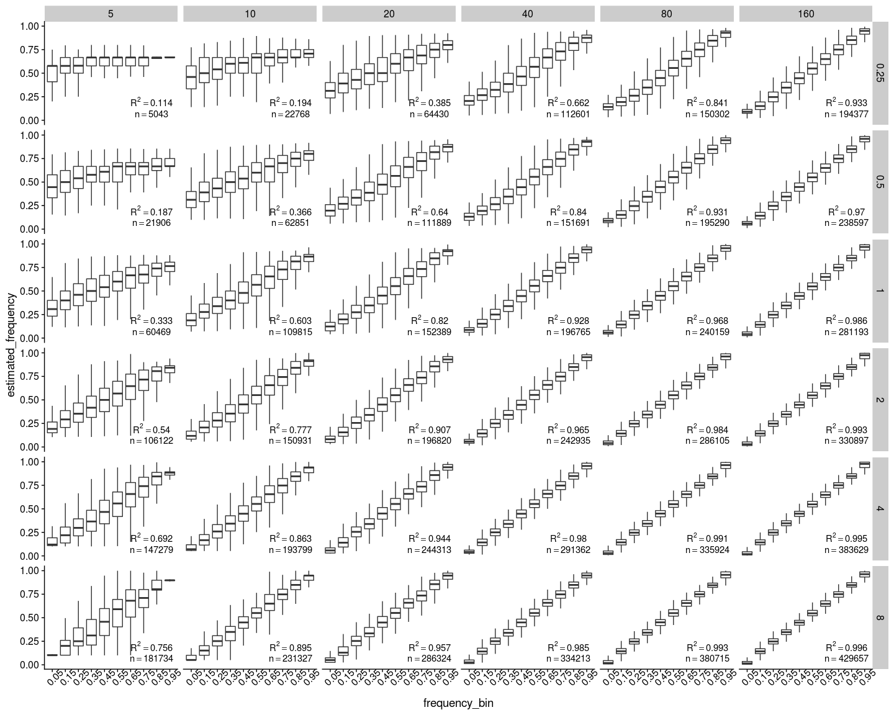

Data analysis with neutral simulation
================

``` r
library(tidyverse)
library(cowplot)
```

Read in the ancestral states
----------------------------

``` r
ancestral <- read_csv("../sim/rep_1/ancestral_new.fasta")[[1]] %>%
  str_split(pattern="") %>%
  .[[1]] %>%
  bind_cols(ancestral=., position=1:30000000)
```

Read mutation and substitution file
-----------------------------------

``` r
## Read in the mutation file outputted by SLiM
mutations <- read_delim("../sim/rep_1/mutations.txt", delim = " ", col_names = F) %>%
  select(7:13) %>%
  transmute(position=X7+1, frequency=X12/2000, base=X13) %>%
  arrange(position) %>%
  left_join(ancestral, by="position")
## Read in the substitutions file outputted by SLiM
## This is necessary because mutations can happen again after one fixation, so frequencies from the mutation file do not always reflect the true derived allele frequency
substitutions <- read_delim("../sim/rep_1/substitutions.txt", delim = " ", skip=2, col_names = F) %>%
  transmute(position=X4+1, base=X10, frequency=1, generation=X9) %>%
  group_by(position) %>%
  filter(generation==max(generation)) %>%
  ungroup() %>%
  arrange(position) %>%
  left_join(ancestral, by="position") %>%
  filter(base!=ancestral)
```

Data wrangling with the mutation file
-------------------------------------

The following steps are necessary because there are complications such as back mutations and triallelic loci in the mutation file

``` r
## First, add up all the frequencies for mutations at the same position and base. These are the mutations that arised at different times, but they are effectively the same. 
grouped_by_base <- mutations %>%
  group_by(position, base, ancestral) %>%
  summarize(frequency=sum(frequency)) %>%
  ungroup()
## Then, record any duplicated positions
duplicated_positions <- grouped_by_base %>%
  group_by(position) %>%
  filter(n()>1) %>%
  .$position
## Final wrangling
mutations_final <- grouped_by_base %>%
  # Remove all non-back mutations if the site has already been fixed, because they all count as derived
  filter(!(base!=ancestral & position %in% substitutions$position)) %>%
  # Remove all back mutation if the site hasn't been fixed already
  filter(!((base == ancestral) & (position %in% duplicated_positions) & !(position %in% substitutions$position))) %>%
  # Remove all back mutations if they are the only mutation that occurred in its position
  # This can happen because a first mutation could have arisen in this position, and before it went lost, the back mutation arose
  filter(!((base == ancestral) & !(position %in% duplicated_positions) & !(position %in% substitutions$position))) %>%
  # For the rest of the back mutations, get the derived allele frequency by substracting the back mutation frequency from 1
  mutate(frequency=ifelse(base==ancestral, 1-frequency, frequency)) %>%
  mutate(base=ifelse(base==ancestral, "N", base)) %>%
  # For loci with more than two derived alleles, add up the derived allele frequency
  group_by(position, ancestral) %>%
  summarise(base=paste0(unique(base), collapse = ""), frequency=sum(frequency)) %>%
  ungroup() %>%
  # Removed any site where the ancestral allele is fixed or lost
  filter(frequency>0, frequency<1)
## Check the result from the wrangling
group_by(mutations_final, position) %>%
  filter(position %in% duplicated_positions) %>%
  head()
```

    ## # A tibble: 6 x 4
    ## # Groups:   position [6]
    ##   position ancestral base  frequency
    ##      <dbl> <chr>     <chr>     <dbl>
    ## 1     3126 G         AC       0.0025
    ## 2     5941 T         AG       0.0135
    ## 3    42589 C         GT       0.0145
    ## 4    44162 C         AG       0.99  
    ## 5    59168 G         AC       0.138 
    ## 6    60497 C         AT       0.0065

``` r
group_by(mutations_final, position) %>%
  filter(base =="N") %>%
  head()
```

    ## # A tibble: 6 x 4
    ## # Groups:   position [6]
    ##   position ancestral base  frequency
    ##      <dbl> <chr>     <chr>     <dbl>
    ## 1      150 G         N         0.998
    ## 2    23619 C         N         1.000
    ## 3    97580 A         N         0.982
    ## 4   112480 C         N         0.998
    ## 5   181676 G         N         1.000
    ## 6   215077 C         N         0.994

Plot the true site frequency spectrum
-------------------------------------

``` r
ggplot(mutations_final, aes(x=frequency)) +
  geom_histogram(bins=101) +
  theme_cowplot()
```


Read maf estimation
-------------------

``` r
maf <- read_tsv("../sim/rep_1/bam_list_50_1x.mafs.gz") %>%
  mutate(estimated_frequency=knownEM) %>%
  select(position, major, minor, anc, estimated_frequency, nInd) %>%
  arrange(position)
sfs <- scan("../sim/rep_1/bam_list_50_1x.sfs") %>%
  enframe(name = frequency) %>%
  mutate(frequency=0:100) 
```

Plot the estimated site frequency spectrum
------------------------------------------

``` r
ggplot(sfs, aes(x=frequency, y=value)) +
  geom_bar(stat = "identity") +
  theme_cowplot()
```


Join mutation and maf files
---------------------------

``` r
joined_frequency <- inner_join(mutations_final, maf, by="position") %>%
  select(-ancestral)
false_negatives <- anti_join(mutations_final, maf, by="position")
false_positives <- anti_join(maf, mutations_final, by="position")
arrange(false_negatives, abs(0.5-frequency))
```

    ## # A tibble: 382,719 x 4
    ##    position ancestral base  frequency
    ##       <dbl> <chr>     <chr>     <dbl>
    ##  1 13688018 T         G         0.307
    ##  2 21803017 C         G         0.298
    ##  3 11066589 T         C         0.290
    ##  4  1296170 T         G         0.284
    ##  5 11432447 C         A         0.283
    ##  6 17159022 T         C         0.276
    ##  7 13777827 T         C         0.274
    ##  8  8313891 C         T         0.272
    ##  9 25851336 A         T         0.27 
    ## 10  1896820 C         T         0.264
    ## # … with 382,709 more rows

Plot estimated allele frequency vs. true allele frequency
---------------------------------------------------------

``` r
joined_frequency %>%
  ggplot(aes(x=frequency, y=estimated_frequency)) +
  geom_point(alpha=0.1, size=0.2) +
  geom_smooth(method="lm", color="red", size=1, se = F) +
  theme_cowplot()
```


Plot error vs. true allele frequency
------------------------------------

``` r
joined_frequency %>%
  mutate(error=frequency-estimated_frequency) %>%
  ggplot(aes(x=frequency, y=error)) +
  geom_point(alpha=0.1, size=0.2) +
  geom_smooth(method="lm", color="red", size=1, se = F) +
  theme_cowplot()
```


Plot true vs. observed allele frequency spectrum
------------------------------------------------

``` r
transmute(maf, frequency=estimated_frequency, type="observed") %>%
  bind_rows(transmute(mutations, frequency=frequency, type="real")) %>%
  ggplot(aes(x=frequency, color=type)) +
  geom_density() +
  theme_cowplot()
```


Check the SNPs with highest error
---------------------------------

``` r
joined_frequency %>%
  mutate(error=frequency-estimated_frequency) %>%
  arrange(desc(abs(error))) %>%
  head()
```

    ## # A tibble: 6 x 9
    ##   position base  frequency major minor anc   estimated_freque…  nInd  error
    ##      <dbl> <chr>     <dbl> <chr> <chr> <chr>             <dbl> <dbl>  <dbl>
    ## 1 25543259 T         0.304 A     T     A                 0.682    23 -0.378
    ## 2 25984545 T         0.232 C     T     C                 0.579    32 -0.347
    ## 3 25696331 C         0.386 T     C     T                 0.725    22 -0.339
    ## 4 19179335 G         0.492 C     G     C                 0.159    28  0.333
    ## 5 11576620 G         0.288 T     G     T                 0.611    28 -0.322
    ## 6  7580209 C         0.769 A     C     A                 0.447    22  0.322

True frequency distribution of false negatives
----------------------------------------------

``` r
ggplot(false_negatives, aes(x=frequency)) +
  geom_histogram() +
  theme_cowplot()
```



Esimated frequency distribution of false positives
--------------------------------------------------

``` r
ggplot(false_positives, aes(x=estimated_frequency)) +
  geom_histogram() +
  theme_cowplot()
```


