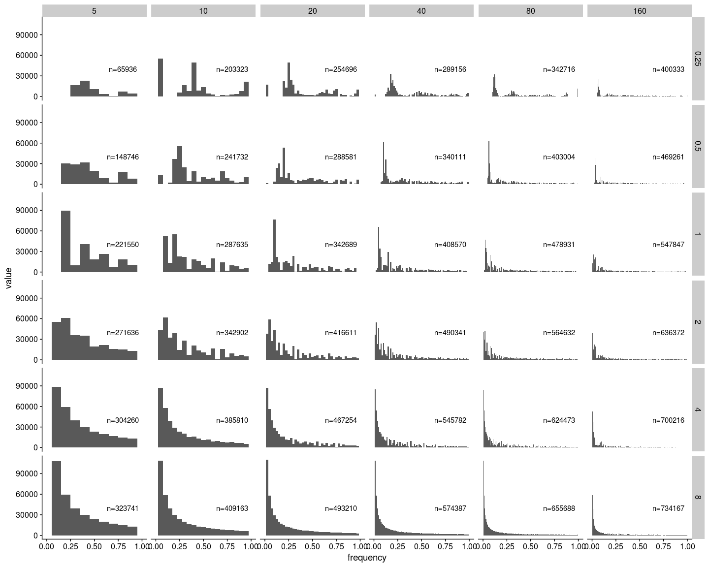
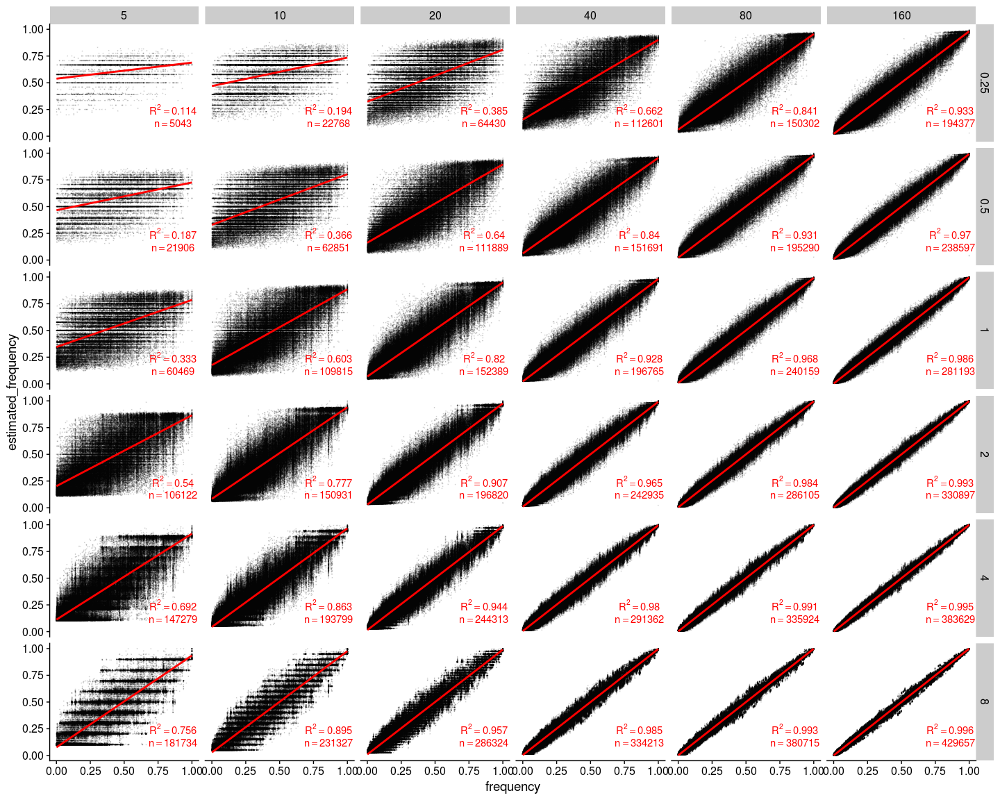
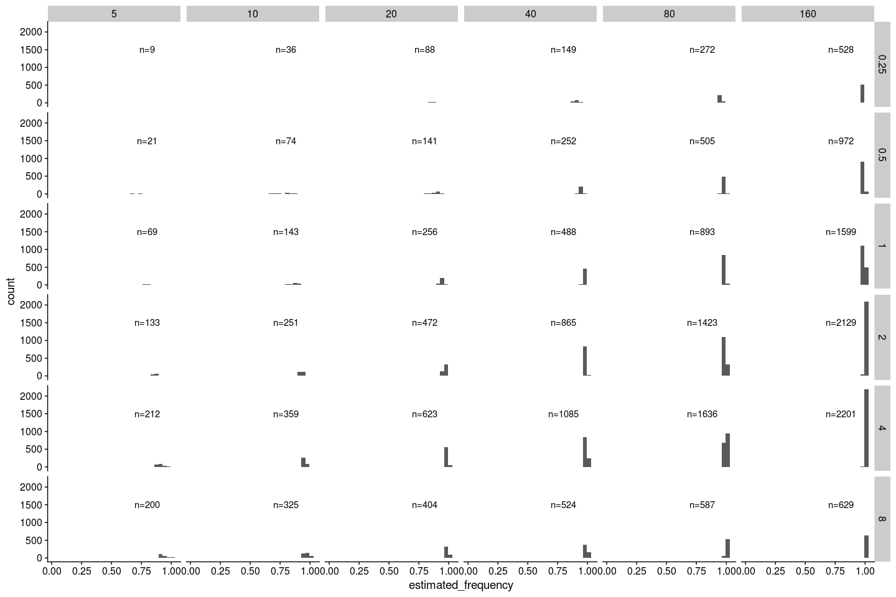

Data analysis with neutral simulation
================

-   [Define some functions](#define-some-functions)
-   [Data wrangling with SLiM output](#data-wrangling-with-slim-output)
    -   [Read in the ancestral states](#read-in-the-ancestral-states)
    -   [Read mutation and substitution file](#read-mutation-and-substitution-file)
    -   [Data wrangling with the mutation file](#data-wrangling-with-the-mutation-file)
    -   [Plot the true site frequency spectrum](#plot-the-true-site-frequency-spectrum)
-   [ANGSD results](#angsd-results)
    -   [Read maf estimation and join mutation and maf files](#read-maf-estimation-and-join-mutation-and-maf-files)
    -   [Plot the estimated site frequency spectrum](#plot-the-estimated-site-frequency-spectrum)
    -   [Plot the estimated allele frequency distribution](#plot-the-estimated-allele-frequency-distribution)
    -   [Plot estimated allele frequency vs. true allele frequency (this includes the false positives but not the false negatives)](#plot-estimated-allele-frequency-vs.-true-allele-frequency-this-includes-the-false-positives-but-not-the-false-negatives)
    -   [Plot estimated allele frequency vs. true allele frequency in bins (this includes the false positives but not the false negatives)](#plot-estimated-allele-frequency-vs.-true-allele-frequency-in-bins-this-includes-the-false-positives-but-not-the-false-negatives)
    -   [Plot error vs. true allele frequency in bins](#plot-error-vs.-true-allele-frequency-in-bins)
    -   [Check the SNPs with highest error](#check-the-snps-with-highest-error)
    -   [True frequency distribution of false negatives](#true-frequency-distribution-of-false-negatives)
    -   [Esimated frequency distribution of false positives](#esimated-frequency-distribution-of-false-positives)
    -   [Read windowed thetas estimated by `realSFS`](#read-windowed-thetas-estimated-by-realsfs)
    -   [real theta values with the entire population](#real-theta-values-with-the-entire-population)
    -   [thetas estimated from the estimated allele frequencies (not from `realSFS`)](#thetas-estimated-from-the-estimated-allele-frequencies-not-from-realsfs)
    -   [thetas estimated from `realSFS`](#thetas-estimated-from-realsfs)
    -   [Plot Watterson's estimator and Tajima's estimator of theta and Tajima's D in 10,000bp fixed windows](#plot-wattersons-estimator-and-tajimas-estimator-of-theta-and-tajimas-d-in-10000bp-fixed-windows)
-   [Compare individual barcoding with Pool-seq](#compare-individual-barcoding-with-pool-seq)
    -   [Get minor allele frequencies estimated from Pool-seq](#get-minor-allele-frequencies-estimated-from-pool-seq)
    -   [Plot estimated allele frequency vs. true allele frequency (this includes the false positives but not the false negatives)](#plot-estimated-allele-frequency-vs.-true-allele-frequency-this-includes-the-false-positives-but-not-the-false-negatives-1)
    -   [Plot estimated allele frequency vs. true allele frequency in bins (this includes the false positives but not the false negatives)](#plot-estimated-allele-frequency-vs.-true-allele-frequency-in-bins-this-includes-the-false-positives-but-not-the-false-negatives-1)
    -   [Plot absolute values of error vs. true allele frequency in bins (this includes the false positives but not the false negatives)](#plot-absolute-values-of-error-vs.-true-allele-frequency-in-bins-this-includes-the-false-positives-but-not-the-false-negatives)

``` r
library(tidyverse)
library(cowplot)
library(knitr)
```

Define some functions
=====================

``` r
summarise_by_design <- function(joined_frequency_table){
  joined_frequency_table %>%
  mutate(error_squared=error^2) %>%
  group_by(coverage, sample_size) %>%
  summarise(r_squared=paste0("R^2==", round(summary(lm(estimated_frequency~frequency))$r.squared,3)), 
            n=paste0("n==",n()), 
            root_mean_error_squared=paste0("RMSE==", round(sqrt(mean(error_squared)), 3)))
}
plot_frequency <- function(joined_frequency_table, joined_summary_table){
  joined_frequency_table %>%
    ggplot(aes(x=frequency, y=estimated_frequency)) +
    geom_point(alpha=0.1, size=0.1) +
    geom_smooth(method="lm", color="red", size=1, se = F) +
    geom_text(data = joined_summary_table, x = 0.86, y = 0.25, aes(label=r_squared), color = 'red',  parse = TRUE) +
    geom_text(data = joined_summary_table, x = 0.86, y = 0.12, aes(label=n), color = 'red',  parse = TRUE) +
    facet_grid(coverage~sample_size) +
    theme_cowplot()
}
plot_frequency_in_bins <- function(joined_frequency_table, joined_summary_table){
  joined_frequency_table %>%
    ggplot(aes(x=frequency_bin, y=estimated_frequency)) +
    geom_boxplot(outlier.shape = NA) +
    geom_text(data = joined_summary_table, x = 8.6, y = 0.2, aes(label=r_squared), color = 'black',  parse = TRUE) +
    geom_text(data = joined_summary_table, x = 8.6, y = 0.07, aes(label=n), color = 'black',  parse = TRUE) +
    scale_x_discrete(labels=seq(0.05, 0.95, 0.1))  +
    facet_grid(coverage~sample_size) +
    theme_cowplot() +
    theme(axis.text.x = element_text(angle=45))
}
plot_error_in_bins <- function(joined_frequency_table, joined_summary_table){
  joined_frequency_table %>%
    ggplot(aes(x=frequency_bin, y=abs(error))) +
    geom_boxplot(outlier.shape = NA) +
    geom_text(data = joined_summary_table, x = 8, y = 0.9, aes(label=root_mean_error_squared), color = 'black',  parse = TRUE) +
    geom_text(data = joined_summary_table, x = 8, y = 0.77, aes(label=n), color = 'black',  parse = TRUE) +
    facet_grid(coverage~sample_size) +
    scale_x_discrete(labels=seq(0.05, 0.95, 0.1))  +
    theme_cowplot() +
    theme(axis.text.x = element_text(angle=45))
}
count_to_maf <- function(ancestral_allele, totA, totC, totG, totT){
  if(ancestral_allele == "A"){
    minor_allele_count <- max(totC, totG, totT)
  } else if(ancestral_allele == "C"){
    minor_allele_count <- max(totA, totG, totT)
  } else if(ancestral_allele == "G"){
    minor_allele_count <- max(totA, totC, totT)
  } else if(ancestral_allele == "T"){
    minor_allele_count <- max(totA, totC, totG)
  }
  maf <- minor_allele_count/sum(totA, totC, totG, totT)
  return(maf)
}
```

Data wrangling with SLiM output
===============================

Read in the ancestral states
----------------------------

``` r
ancestral <- read_csv("../neutral_sim/rep_1/slim/ancestral.fasta")[[1]] %>%
  str_split(pattern="") %>%
  .[[1]] %>%
  bind_cols(ancestral=., position=1:30000000)
```

Read mutation and substitution file
-----------------------------------

``` r
## Read in the mutation file outputted by SLiM
mutations <- read_delim("../neutral_sim/rep_1/slim/mutations.txt", delim = " ", col_names = F) %>%
  transmute(type=X6, position=X7+1, base=X13, frequency=X12/2000) %>%
  left_join(ancestral, by="position") %>%
  group_by(type, position, ancestral, base) %>%
  summarise(frequency=sum(frequency)) %>%
  ungroup()
## Read in the substitutions file outputted by SLiM
## This is necessary because mutations can happen again after one fixation, so frequencies from the mutation file do not always reflect the true derived allele frequency
substitutions <- read_delim("../neutral_sim/rep_1/slim/substitutions.txt", delim = " ", skip=2, col_names = F) %>%
  transmute(type=X3, position=X4+1, base=X10, generation=X9) %>%
  group_by(type, position) %>%
  filter(generation==max(generation)) %>%
  ungroup() %>%
  left_join(ancestral, by="position") %>%
  select(-generation) %>%
  filter(base!=ancestral) %>%
  arrange(position)
```

Data wrangling with the mutation file
-------------------------------------

The following steps are necessary because there are complications such as back mutations and triallelic loci in the mutation file

``` r
## Join mutations and substitutions in a temp table
mutations_final_temp <-  mutations %>%
  spread(key = base, value=frequency) %>%
  full_join(substitutions, by=c("position", "type", "ancestral")) %>%
  arrange(position) %>%
  mutate(base=ifelse(is.na(base), ancestral, base)) %>%
  mutate_all(~replace(., is.na(.), 0)) %>%
  mutate(frequency=1-`A` -`C` -`G` -`T`)
## More wrangling
mutations_final <- mutations_final_temp[1:7] %>%
  gather(key=base, value=frequency, 4:7) %>%
  bind_rows(mutations_final_temp[c(1:3, 8:9)]) %>%
  mutate(frequency=ifelse(base==ancestral, 0, frequency)) %>%
  group_by(type, position, ancestral) %>%
  filter(frequency!=0) %>%
  summarise(frequency=sum(frequency), base=paste0(base, collapse = "")) %>%
  ungroup() %>%
  filter(frequency!=1)
```

Plot the true site frequency spectrum
-------------------------------------

``` r
n_mutations <- dim(mutations_final)[1]
ggplot(mutations_final, aes(x=frequency)) +
  geom_histogram(bins=201) +
  annotate("text", x=0.8, y=150000, label=paste0("n=", n_mutations)) +
  theme_cowplot()
```


ANGSD results
=============

Read maf estimation and join mutation and maf files
---------------------------------------------------

``` r
i=1
for (coverage in c(0.25,0.5,1,2,4,8)){
  for (sample_size in c(5,10,20,40, 80, 160)){
    ## read in estimated maf
    maf <- read_tsv(paste0("../neutral_sim/rep_1/angsd/bam_list_", sample_size, "_", coverage, "x.mafs.gz")) %>%
      mutate(estimated_frequency=knownEM) %>%
      select(position, major, minor, anc, estimated_frequency, nInd) %>%
      arrange(position)
    ## join estimated maf with true snps and only keep the snps that exist in estimated maf
    joined_frequency <- right_join(mutations_final, maf, by="position") %>%
      select(-ancestral) %>%
      mutate(coverage=coverage, sample_size=sample_size, frequency=ifelse(is.na(frequency), 1, frequency))
    ## find false negatives
    false_negatives <- anti_join(mutations_final, maf, by="position") %>%
      mutate(coverage=coverage, sample_size=sample_size)
    ## find false positives
    false_positives <- anti_join(maf, mutations_final, by="position") %>%
      mutate(coverage=coverage, sample_size=sample_size)
    ## read in estimated sfs
    sfs <- scan(paste0("../neutral_sim/rep_1/angsd/bam_list_", sample_size, "_", coverage, "x.sfs")) %>%
      enframe(name = frequency) %>%
      mutate(frequency=(0:(sample_size*2))/(sample_size*2), coverage=coverage, sample_size=sample_size)
    ## compile the final files for plotting
    if (i==1){
      joined_frequency_final <- joined_frequency
      false_negatives_final <- false_negatives
      false_positives_final <- false_positives
      sfs_final <- sfs
    } else {
      joined_frequency_final <- bind_rows(joined_frequency_final, joined_frequency)
      false_negatives_final <- bind_rows(false_negatives_final, false_negatives)
      false_positives_final <- bind_rows(false_positives_final, false_positives)
      sfs_final <- bind_rows(sfs_final, sfs)
    }
    i=i+1
  }
}
write_tsv(joined_frequency_final, "../neutral_sim/rep_1/angsd/joined_frequency_final.tsv")
write_tsv(false_negatives_final, "../neutral_sim/rep_1/angsd/false_negatives_final.tsv")
write_tsv(false_positives_final, "../neutral_sim/rep_1/angsd/false_positives_final.tsv")
write_tsv(sfs_final, "../neutral_sim/rep_1/angsd/sfs_final.tsv")
```

``` r
joined_frequency_final <- read_tsv("../neutral_sim/rep_1/angsd/joined_frequency_final.tsv") %>%
  mutate(frequency_bin = cut(frequency, breaks = 0:10/10), error=estimated_frequency-frequency)
false_negatives_final <- read_tsv("../neutral_sim/rep_1/angsd/false_negatives_final.tsv")
false_positives_final <- read_tsv("../neutral_sim/rep_1/angsd/false_positives_final.tsv")
sfs_final <- read_tsv("../neutral_sim/rep_1/angsd/sfs_final.tsv")
```

Plot the estimated site frequency spectrum
------------------------------------------

These are obtained from `realSFS`.

``` r
sfs_final_sum <- filter(sfs_final, frequency>0, frequency<1) %>%
  group_by(coverage, sample_size) %>%
  summarise(n=sum(value))

filter(sfs_final, frequency>0, frequency<1) %>%
  group_by(coverage, sample_size) %>%
  ggplot(aes(x=frequency, y=value)) +
  geom_point(size=0.5) +
  geom_line() +
  geom_text(data=sfs_final_sum, x=0.8, y=40000, aes(label=paste0("n=",round(n,0)))) +
  facet_grid(coverage~sample_size) +
  theme_cowplot()
```


``` r
filter(sfs_final, frequency>0, frequency<1) %>%
  ggplot(aes(x=frequency, y=value)) +
  geom_col(aes(width = 0.5/sample_size)) +
  geom_text(data=sfs_final_sum, x=0.8, y=40000, aes(label=paste0("n=",round(n,0)))) +
  facet_grid(coverage~sample_size) +
  theme_cowplot()
```



Plot the estimated allele frequency distribution
------------------------------------------------

These are the histogram of estimated allele frequencies

``` r
joined_summary <- summarise_by_design(joined_frequency_final)

joined_frequency_final %>%
  ggplot(aes(x=estimated_frequency)) +
  geom_histogram() +
  geom_text(data=joined_summary, x=0.8, y=20000, aes(label=n), parse=T) +
  facet_grid(coverage~sample_size, scales ="free_y") +
  theme_cowplot()
```


Plot estimated allele frequency vs. true allele frequency (this includes the false positives but not the false negatives)
-------------------------------------------------------------------------------------------------------------------------

``` r
plot_frequency(joined_frequency_final, joined_summary)
```



At low coverage and low sample size, the noise in estimation is quite high. This is because of a non-existent nInd filter and a low minDepth filter. Removing these sites will remove some of these noises but will further reduce the amount of data.

``` r
joined_frequency_final_nInd_4 <- filter(joined_frequency_final, nInd>=4)
joined_summary_nInd_4 <- summarise_by_design(joined_frequency_final)
plot_frequency(joined_frequency_final_nInd_4, joined_summary_nInd_4)
```


Plot estimated allele frequency vs. true allele frequency in bins (this includes the false positives but not the false negatives)
---------------------------------------------------------------------------------------------------------------------------------

``` r
plot_frequency_in_bins(joined_frequency_final, joined_summary)
```


Plot error vs. true allele frequency in bins
--------------------------------------------

``` r
plot_error_in_bins(joined_frequency_final, joined_summary)
```


Check the SNPs with highest error
---------------------------------

``` r
filter(joined_frequency_final, coverage==8, sample_size==160) %>%
  mutate(error=frequency-estimated_frequency) %>%
  arrange(desc(abs(error))) %>%
  head(n=20)
```

    ## # A tibble: 20 x 13
    ##    type  position frequency base  major minor anc   estimated_frequ…  nInd
    ##    <chr>    <dbl>     <dbl> <chr> <chr> <chr> <chr>            <dbl> <dbl>
    ##  1 m1    24757910     0.526 C     A     C     A                0.633   159
    ##  2 m1    24762719     0.526 A     C     A     C                0.633   160
    ##  3 m1    24762731     0.526 G     A     G     A                0.631   160
    ##  4 m1    24760780     0.474 G     C     G     C                0.371   160
    ##  5 m1    24758068     0.526 T     G     T     G                0.628   160
    ##  6 m1    24761596     0.526 T     G     T     G                0.628   160
    ##  7 m1    24757978     0.526 T     C     T     C                0.627   160
    ##  8 m1    24761154     0.526 G     T     G     T                0.627   160
    ##  9 m1    24761026     0.526 T     C     T     C                0.627   160
    ## 10 m1    24761017     0.474 G     C     G     C                0.374   160
    ## 11 m1    24762576     0.474 T     C     T     C                0.374   160
    ## 12 m1    24762888     0.474 A     T     A     T                0.375   160
    ## 13 m1    24761046     0.474 C     T     C     T                0.375   160
    ## 14 m1    24762008     0.474 C     A     C     A                0.375   160
    ## 15 m1    24762957     0.526 T     C     T     C                0.624   160
    ## 16 m1    24763170     0.522 T     A     T     A                0.619   160
    ## 17 m1    24756684     0.474 A     C     A     C                0.377   159
    ## 18 m1    24763352     0.478 C     A     C     A                0.381   160
    ## 19 m1    24760349     0.526 C     T     C     T                0.623   160
    ## 20 m1    24761076     0.526 C     T     C     T                0.623   160
    ## # … with 4 more variables: coverage <dbl>, sample_size <dbl>,
    ## #   frequency_bin <fct>, error <dbl>

True frequency distribution of false negatives
----------------------------------------------

``` r
false_negatives_final_count <- count(false_negatives_final, coverage, sample_size)
ggplot(false_negatives_final, aes(x=frequency)) +
  geom_histogram() +
  geom_text(data=false_negatives_final_count, x=0.3, y=200000, aes(label=paste0("n=", n))) +
  facet_grid(coverage~sample_size) +
  theme_cowplot()
```


Esimated frequency distribution of false positives
--------------------------------------------------

``` r
false_positives_final_count <- count(false_positives_final, coverage, sample_size)
ggplot(false_positives_final, aes(x=estimated_frequency)) +
  geom_histogram() +
  geom_text(data=false_positives_final_count, x=0.8, y=1500, aes(label=paste0("n=", n))) +
  facet_grid(coverage~sample_size) +
  theme_cowplot()
```



Read windowed thetas estimated by `realSFS`
-------------------------------------------

``` r
i=1
for (coverage in c(0.25,0.5,1,2,4,8)){
  for (sample_size in c(5,10,20,40, 80, 160)){
    ## read in estimated maf
    thetas <- read_tsv(paste0("../neutral_sim/rep_1/angsd/bam_list_", sample_size, "_", coverage, "x.thetas.idx.pestPG")) %>%
      transmute(position=WinCenter, theta_w=tW/nSites, theta_t=tP/nSites, tajima_d=Tajima) %>%
      mutate(coverage=coverage, sample_size=sample_size) %>%
      gather(key=summary_stats, value=value, 2:4)
    average_thetas <- read_tsv(paste0("../neutral_sim/rep_1/angsd/bam_list_", sample_size, "_", coverage, "x.average_thetas.idx.pestPG")) %>%
      transmute(theta_w=tW/nSites, theta_t=tP/nSites, tajima_d=Tajima) %>%
      mutate(coverage=coverage, sample_size=sample_size)
    ## compile the final files for plotting
    if (i==1){
      thetas_final <- thetas
      average_thetas_final <- average_thetas
    } else {
      thetas_final <- bind_rows(thetas_final, thetas)
      average_thetas_final <- bind_rows(average_thetas_final, average_thetas)
    }
    i=i+1
  }
}
```

real theta values with the entire population
--------------------------------------------

``` r
real_theta_t <- sum(2*mutations_final$frequency*(1-mutations_final$frequency))/30000000
real_theta_w <- dim(mutations_final)[1]/(30000000*sum(1/(1:999)))
real_tajima_d <- real_theta_t-real_theta_w
tibble(real_theta_t=round(real_theta_t, 5), real_theta_w=round(real_theta_w, 5)) %>%
  kable()
```

|  real\_theta\_t|  real\_theta\_w|
|---------------:|---------------:|
|         0.00241|         0.00264|

thetas estimated from the estimated allele frequencies (not from `realSFS`)
---------------------------------------------------------------------------

Tajima's estimator

``` r
group_by(joined_frequency_final, coverage, sample_size) %>%
  summarise(theta_t=round(sum(2*estimated_frequency*(1-estimated_frequency))/30000000,5)) %>%
  ungroup() %>%
  spread(key = sample_size, value = theta_t) %>%
  kable()
```

|  coverage|        5|       10|       20|       40|       80|      160|
|---------:|--------:|--------:|--------:|--------:|--------:|--------:|
|      0.25|  0.00008|  0.00034|  0.00093|  0.00152|  0.00185|  0.00210|
|      0.50|  0.00033|  0.00091|  0.00151|  0.00186|  0.00210|  0.00224|
|      1.00|  0.00088|  0.00148|  0.00185|  0.00210|  0.00224|  0.00230|
|      2.00|  0.00143|  0.00183|  0.00209|  0.00223|  0.00230|  0.00234|
|      4.00|  0.00179|  0.00207|  0.00223|  0.00231|  0.00234|  0.00236|
|      8.00|  0.00201|  0.00220|  0.00230|  0.00235|  0.00237|  0.00237|

Watterson's estimator

``` r
group_by(joined_frequency_final, coverage, sample_size) %>%
  summarise(theta_w=round(n()/30000000/sum(1/(1:(unique(sample_size)-1))), 5)) %>%
  spread(key = sample_size, value = theta_w) %>%
  kable()
```

|  coverage|        5|       10|       20|       40|       80|      160|
|---------:|--------:|--------:|--------:|--------:|--------:|--------:|
|      0.25|  0.00008|  0.00027|  0.00061|  0.00088|  0.00101|  0.00115|
|      0.50|  0.00035|  0.00074|  0.00105|  0.00119|  0.00131|  0.00141|
|      1.00|  0.00097|  0.00129|  0.00143|  0.00154|  0.00162|  0.00166|
|      2.00|  0.00170|  0.00178|  0.00185|  0.00190|  0.00193|  0.00195|
|      4.00|  0.00236|  0.00228|  0.00230|  0.00228|  0.00226|  0.00226|
|      8.00|  0.00291|  0.00273|  0.00269|  0.00262|  0.00256|  0.00254|

thetas estimated from `realSFS`
-------------------------------

Tajima's estimator

``` r
select(average_thetas_final, theta_t, coverage, sample_size) %>%
  spread(key = sample_size, value=theta_t) %>%
  kable()
```

|  coverage|          5|         10|         20|         40|         80|        160|
|---------:|----------:|----------:|----------:|----------:|----------:|----------:|
|      0.25|  0.0015662|  0.0016898|  0.0018505|  0.0020342|  0.0021798|  0.0022721|
|      0.50|  0.0016706|  0.0018448|  0.0020416|  0.0021909|  0.0022782|  0.0023243|
|      1.00|  0.0018609|  0.0020519|  0.0022033|  0.0022887|  0.0023335|  0.0023569|
|      2.00|  0.0020727|  0.0022106|  0.0023012|  0.0023450|  0.0023670|  0.0023782|
|      4.00|  0.0022303|  0.0023078|  0.0023607|  0.0023799|  0.0023877|  0.0023889|
|      8.00|  0.0023189|  0.0023593|  0.0023952|  0.0024009|  0.0023990|  0.0023960|

Watterson's estimator

``` r
select(average_thetas_final, theta_w, coverage, sample_size) %>%
  spread(key = sample_size, value=theta_w) %>%
  kable()
```

|  coverage|          5|         10|         20|         40|         80|        160|
|---------:|----------:|----------:|----------:|----------:|----------:|----------:|
|      0.25|  0.0012116|  0.0012162|  0.0010533|  0.0011123|  0.0011836|  0.0012411|
|      0.50|  0.0012829|  0.0012259|  0.0012706|  0.0013467|  0.0014101|  0.0014541|
|      1.00|  0.0014777|  0.0015099|  0.0015911|  0.0016441|  0.0016801|  0.0017079|
|      2.00|  0.0018566|  0.0018917|  0.0019652|  0.0019831|  0.0019938|  0.0019732|
|      4.00|  0.0021340|  0.0021587|  0.0022277|  0.0022230|  0.0022177|  0.0022236|
|      8.00|  0.0022951|  0.0023055|  0.0023670|  0.0023521|  0.0023417|  0.0023431|

Plot Watterson's estimator and Tajima's estimator of theta and Tajima's D in 10,000bp fixed windows
---------------------------------------------------------------------------------------------------

``` r
filter(thetas_final, summary_stats !="tajima_d") %>%
  ggplot(aes(x=position, y=value, color=summary_stats)) +
  geom_line(size=0.2) +
  # geom_text(data=false_positives_final_count, x=0.8, y=1500, aes(label=paste0("n=", n))) +
  facet_grid(coverage~sample_size) +
  theme_cowplot()
```


``` r
filter(thetas_final, summary_stats =="tajima_d") %>%
  ggplot(aes(x=position, y=value, color=summary_stats)) +
  geom_line(size=0.2) +
  geom_hline(yintercept = 0, color="black") +
  # geom_text(data=false_positives_final_count, x=0.8, y=1500, aes(label=paste0("n=", n))) +
  facet_grid(coverage~sample_size) +
  theme_cowplot()
```


I will annonate each figure with the chromosome average statistics later on.

Compare individual barcoding with Pool-seq
==========================================

I assumed equal sequencing output from all individuals in this step. This is highly unlikely when no individual barcode is given, but it represents the best case scenario for Pool-seq.

A better way to do this is to merge all the 20x bam files from all individuals, and subsample from this huge merged bam file. This can be costly computationally, but can still be feasible if we want to go with it.

I used the same set of SNPs obtained from ANGSD and calculated allele frequency based on total allele count across the population. This is to make the results from the two methods more comparable. In reality, however, the SNP calling result will be different if no individual barcode is provided.

Get minor allele frequencies estimated from Pool-seq
----------------------------------------------------

``` r
i=1
for (coverage in c(0.25,0.5,1,2,4,8)){
  for (sample_size in c(5,10,20,40, 80, 160)){
    ## read in allele count
    allele_count <- read_tsv(paste0("../neutral_sim/rep_1/angsd/bam_list_", sample_size, "_", coverage, "x.pos.gz")) %>%
      bind_cols(read_tsv(paste0("../neutral_sim/rep_1/angsd/bam_list_", sample_size, "_", coverage, "x.counts.gz"))) %>%
      mutate(ancestral_allele = ancestral$ancestral[pos]) %>%
    ## turn allele count into maf
      rowwise() %>%
      mutate(maf = count_to_maf(ancestral_allele, totA, totC, totG, totT), position=pos) %>%
      ungroup()
    ## join estimated maf with true snps and only keep the snps that exist in estimated maf
    joined_frequency <- right_join(mutations_final, allele_count, by="position") %>%
      select(-ancestral) %>%
      mutate(coverage=coverage, sample_size=sample_size, frequency=ifelse(is.na(frequency), 1, frequency))
    ## compile the final files for plotting
    if (i==1){
      joined_frequency_final <- joined_frequency
    } else {
      joined_frequency_final <- bind_rows(joined_frequency_final, joined_frequency)
    }
    i=i+1
  }
}
write_tsv(joined_frequency_final, "../neutral_sim/rep_1/angsd/joined_frequency_final_poolseq.tsv")
```

``` r
joined_frequency_final <- read_tsv("../neutral_sim/rep_1/angsd/joined_frequency_final_poolseq.tsv") %>%
  mutate(estimated_frequency=maf, frequency_bin = cut(frequency, breaks = 0:10/10), error=estimated_frequency-frequency) 
joined_summary <- summarise_by_design(joined_frequency_final)
```

Plot estimated allele frequency vs. true allele frequency (this includes the false positives but not the false negatives)
-------------------------------------------------------------------------------------------------------------------------

``` r
plot_frequency(joined_frequency_final, joined_summary)
```


Plot estimated allele frequency vs. true allele frequency in bins (this includes the false positives but not the false negatives)
---------------------------------------------------------------------------------------------------------------------------------

``` r
plot_frequency_in_bins(joined_frequency_final, joined_summary)
```


Plot absolute values of error vs. true allele frequency in bins (this includes the false positives but not the false negatives)
-------------------------------------------------------------------------------------------------------------------------------

``` r
plot_error_in_bins(joined_frequency_final, joined_summary)
```


