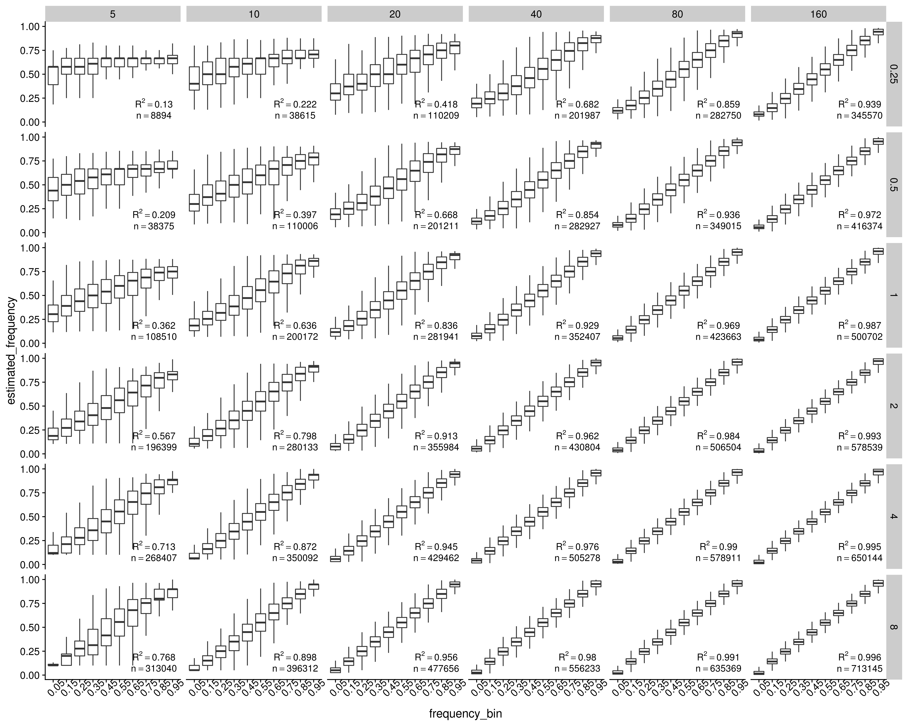
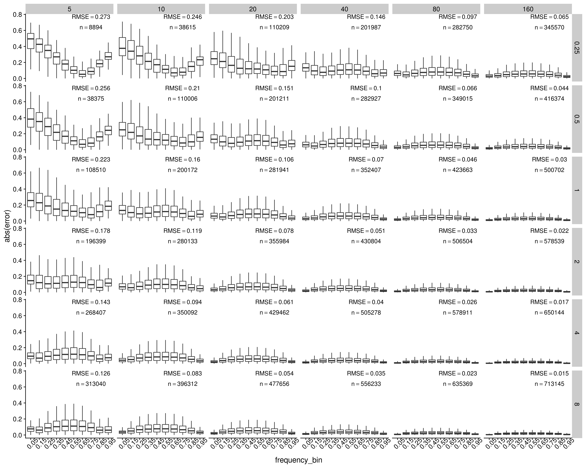
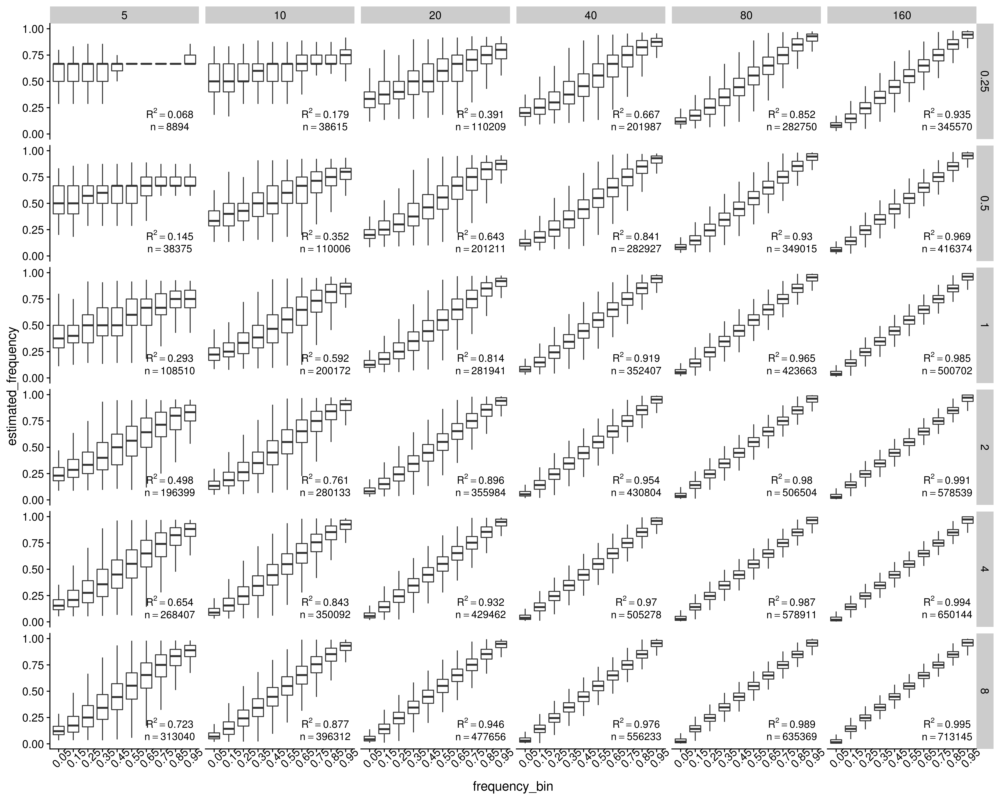
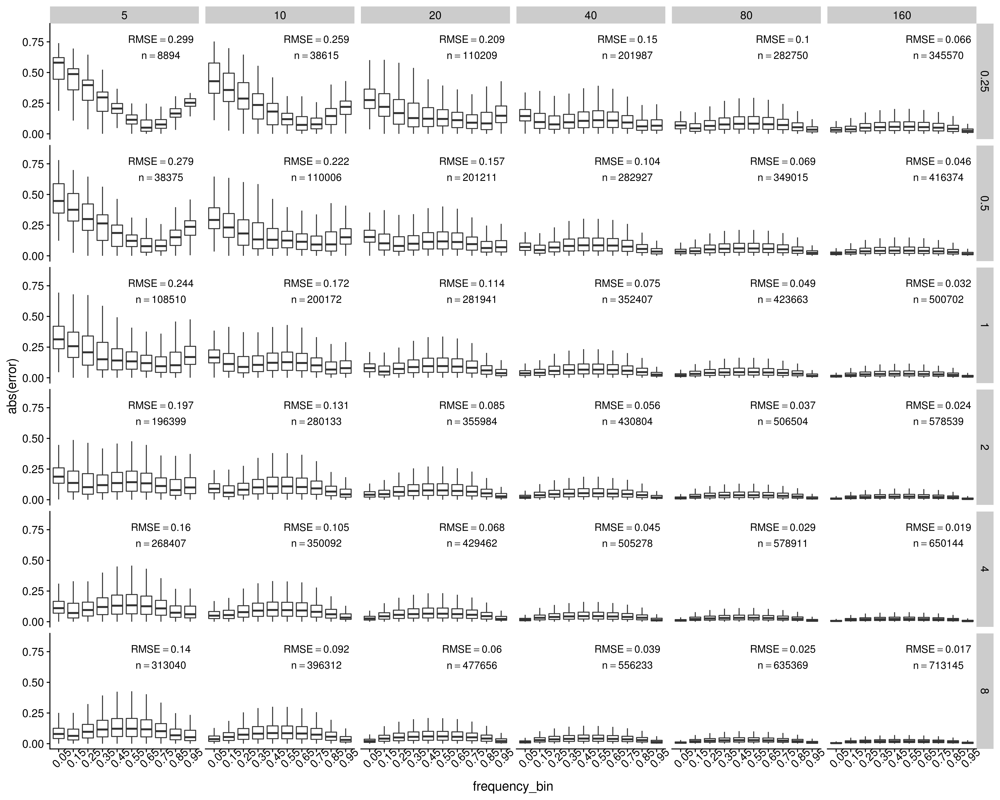

```{r setup, include=FALSE}
knitr::opts_chunk$set(echo = TRUE)
```

```{r eval=T, warning=F, message=F}
library(tidyverse)
library(cowplot)
library(knitr)
```

# Define some functions

```{r eval=T, warning=F, message=F}
summarise_by_design <- function(joined_frequency_table){
  joined_frequency_table %>%
  mutate(error_squared=error^2) %>%
  group_by(coverage, sample_size) %>%
  summarise(r_squared=paste0("R^2==", round(summary(lm(estimated_frequency~frequency))$r.squared,3)), 
            n=paste0("n==",n()), 
            root_mean_error_squared=paste0("RMSE==", round(sqrt(mean(error_squared)), 3)))
}
plot_frequency <- function(joined_frequency_table, joined_summary_table){
  joined_frequency_table %>%
    ggplot(aes(x=frequency, y=estimated_frequency)) +
    geom_point(alpha=0.1, size=0.1) +
    geom_smooth(method="lm", color="red", size=1, se = F) +
    geom_text(data = joined_summary_table, x = 0.86, y = 0.25, aes(label=r_squared), color = 'red',  parse = TRUE) +
    geom_text(data = joined_summary_table, x = 0.86, y = 0.12, aes(label=n), color = 'red',  parse = TRUE) +
    facet_grid(coverage~sample_size) +
    theme_cowplot()
}
plot_frequency_in_bins <- function(joined_frequency_table, joined_summary_table){
  joined_frequency_table %>%
    ggplot(aes(x=frequency_bin, y=estimated_frequency)) +
    geom_boxplot(outlier.shape = NA) +
    geom_text(data = joined_summary_table, x = 8.6, y = 0.2, aes(label=r_squared), color = 'black',  parse = TRUE) +
    geom_text(data = joined_summary_table, x = 8.6, y = 0.07, aes(label=n), color = 'black',  parse = TRUE) +
    scale_x_discrete(labels=seq(0.05, 0.95, 0.1))  +
    facet_grid(coverage~sample_size) +
    theme_cowplot() +
    theme(axis.text.x = element_text(angle=45))
}
plot_error_in_bins <- function(joined_frequency_table, joined_summary_table){
  joined_frequency_table %>%
    ggplot(aes(x=frequency_bin, y=abs(error))) +
    geom_boxplot(outlier.shape = NA) +
    geom_text(data = joined_summary_table, x = 8, y = 0.77, aes(label=root_mean_error_squared), color = 'black',  parse = TRUE) +
    geom_text(data = joined_summary_table, x = 8, y = 0.64, aes(label=n), color = 'black',  parse = TRUE) +
    facet_grid(coverage~sample_size) +
    scale_x_discrete(labels=seq(0.05, 0.95, 0.1))  +
    theme_cowplot() +
    theme(axis.text.x = element_text(angle=45))
}
count_to_maf <- function(ancestral_allele, totA, totC, totG, totT){
  if(ancestral_allele == "A"){
    minor_allele_count <- max(totC, totG, totT)
  } else if(ancestral_allele == "C"){
    minor_allele_count <- max(totA, totG, totT)
  } else if(ancestral_allele == "G"){
    minor_allele_count <- max(totA, totC, totT)
  } else if(ancestral_allele == "T"){
    minor_allele_count <- max(totA, totC, totG)
  }
  maf <- minor_allele_count/sum(totA, totC, totG, totT)
  return(maf)
}
```

# Data wrangling with SLiM output

## Read in the ancestral states

```{r eval=T, warning=F, message=F}
ancestral <- read_csv("../neutral_sim/rep_1/slim/ancestral.fasta")[[1]] %>%
  str_split(pattern="") %>%
  .[[1]] %>%
  bind_cols(ancestral=., position=1:30000000)
```

## Read mutation and substitution file

```{r eval=T, warning=F, message=F}
## Read in the mutation file outputted by SLiM
mutations <- read_delim("../neutral_sim/rep_1/slim/mutations.txt", delim = " ", col_names = F) %>%
  transmute(type=X6, position=X7+1, base=X13, frequency=X12/2000) %>%
  left_join(ancestral, by="position") %>%
  group_by(type, position, ancestral, base) %>%
  summarise(frequency=sum(frequency)) %>%
  ungroup()
## Read in the substitutions file outputted by SLiM
## This is necessary because mutations can happen again after one fixation, so frequencies from the mutation file do not always reflect the true derived allele frequency
substitutions <- read_delim("../neutral_sim/rep_1/slim/substitutions.txt", delim = " ", skip=2, col_names = F) %>%
  transmute(type=X3, position=X4+1, base=X10, generation=X9) %>%
  group_by(type, position) %>%
  filter(generation==max(generation)) %>%
  ungroup() %>%
  left_join(ancestral, by="position") %>%
  select(-generation) %>%
  filter(base!=ancestral) %>%
  arrange(position)
```

## Data wrangling with the mutation file

The following steps are necessary because there are complications such as back mutations and triallelic loci in the mutation file

```{r eval=T, warning=F, message=F}
## Join mutations and substitutions in a temp table
mutations_final_temp_1 <-  mutations %>%
  spread(key = base, value=frequency) %>%
  full_join(substitutions, by=c("position", "type", "ancestral")) %>%
  arrange(position) %>%
  mutate(base=ifelse(is.na(base), ancestral, base)) %>%
  mutate_all(~replace(., is.na(.), 0)) %>%
  mutate(frequency=1-`A` -`C` -`G` -`T`)
## More wrangling
mutations_final_temp_2 <- mutations_final_temp_1[1:7] %>%
  gather(key=base, value=frequency, 4:7) %>%
  bind_rows(mutations_final_temp_1[c(1:3, 8:9)]) %>%
  mutate(frequency=ifelse(base==ancestral, 0, frequency)) %>%
  group_by(type, position, ancestral) %>%
  filter(frequency!=0) %>%
  summarise(frequency=sum(frequency), base=paste0(base, collapse = "")) %>%
  ungroup() 
mutations_final <- mutations_final_temp_2 %>%
  filter(frequency!=1)
substitutions_pos <- mutations_final_temp_2 %>%
  filter(frequency==1) %>%
  .$position %>%
  c(., substitutions$position) %>%
  unique()
```

## Plot the true site frequency spectrum

```{r eval=T, warning=F, message=F, fig.height=8, fig.width=10}
n_mutations <- dim(mutations_final)[1]
ggplot(mutations_final, aes(x=frequency)) +
  geom_histogram(bins=201) +
  annotate("text", x=0.8, y=150000, label=paste0("n=", n_mutations)) +
  theme_cowplot()
```

# ANGSD results

## Read maf estimation and join mutation and maf files

```{r eval=F, warning=F, message=F}
i=1
for (coverage in c(0.25,0.5,1,2,4,8)){
  for (sample_size in c(5,10,20,40, 80, 160)){
    ## read in estimated maf
    maf <- read_tsv(paste0("../neutral_sim/rep_1/angsd_gatk/bam_list_", sample_size, "_", coverage, "x.mafs.gz")) %>%
      mutate(estimated_frequency=knownEM) %>%
      select(position, major, minor, anc, estimated_frequency, nInd) %>%
      arrange(position)
    ## join estimated maf with true snps and only keep the snps that exist in estimated maf
    joined_frequency <- right_join(mutations_final, maf, by="position") %>%
      select(-ancestral) %>%
      mutate(coverage=coverage, sample_size=sample_size, 
             frequency=ifelse(is.na(frequency) & !(position %in% substitutions_pos), 0, frequency),
             frequency=ifelse(is.na(frequency) & position %in% substitutions_pos, 1, frequency))
    ## find false negatives
    false_negatives <- anti_join(mutations_final, maf, by="position") %>%
      mutate(coverage=coverage, sample_size=sample_size)
    ## find false positives
    false_positives <- anti_join(maf, mutations_final, by="position") %>%
      mutate(coverage=coverage, sample_size=sample_size)
    ## read in estimated sfs
    sfs <- scan(paste0("../neutral_sim/rep_1/angsd_gatk/bam_list_", sample_size, "_", coverage, "x.sfs")) %>%
      enframe(name = frequency) %>%
      mutate(frequency=(0:(sample_size*2))/(sample_size*2), coverage=coverage, sample_size=sample_size)
    ## compile the final files for plotting
    if (i==1){
      joined_frequency_final <- joined_frequency
      false_negatives_final <- false_negatives
      false_positives_final <- false_positives
      sfs_final <- sfs
    } else {
      joined_frequency_final <- bind_rows(joined_frequency_final, joined_frequency)
      false_negatives_final <- bind_rows(false_negatives_final, false_negatives)
      false_positives_final <- bind_rows(false_positives_final, false_positives)
      sfs_final <- bind_rows(sfs_final, sfs)
    }
    i=i+1
  }
}
write_tsv(joined_frequency_final, "../neutral_sim/rep_1/angsd_gatk/joined_frequency_final.tsv")
write_tsv(false_negatives_final, "../neutral_sim/rep_1/angsd_gatk/false_negatives_final.tsv")
write_tsv(false_positives_final, "../neutral_sim/rep_1/angsd_gatk/false_positives_final.tsv")
write_tsv(sfs_final, "../neutral_sim/rep_1/angsd_gatk/sfs_final.tsv")
filter(joined_frequency_final, is.na(frequency_bin))
```

```{r eval=T, warning=F, message=F}
joined_frequency_final <- read_tsv("../neutral_sim/rep_1/angsd_gatk/joined_frequency_final.tsv") %>%
  mutate(frequency_bin = cut(frequency, breaks = 0:10/10, include.lowest = T), error=estimated_frequency-frequency)
false_negatives_final <- read_tsv("../neutral_sim/rep_1/angsd_gatk/false_negatives_final.tsv")
false_positives_final <- read_tsv("../neutral_sim/rep_1/angsd_gatk/false_positives_final.tsv")
sfs_final <- read_tsv("../neutral_sim/rep_1/angsd_gatk/sfs_final.tsv")
```

## Plot the estimated site frequency spectrum

These are obtained from `realSFS`.

```{r eval=T, warning=F, message=F, fig.height=12, fig.width=15}
sfs_final_sum <- filter(sfs_final, frequency>0, frequency<1) %>%
  group_by(coverage, sample_size) %>%
  summarise(n=sum(value))

filter(sfs_final, frequency>0, frequency<1) %>%
  group_by(coverage, sample_size) %>%
  ggplot(aes(x=frequency, y=value)) +
  geom_point(size=0.5) +
  geom_line() +
  geom_text(data=sfs_final_sum, x=0.8, y=40000, aes(label=paste0("n=",round(n,0)))) +
  facet_grid(coverage~sample_size) +
  theme_cowplot()

filter(sfs_final, frequency>0, frequency<1) %>%
  ggplot(aes(x=frequency, y=value)) +
  geom_col(aes(width = 0.5/sample_size)) +
  geom_text(data=sfs_final_sum, x=0.8, y=40000, aes(label=paste0("n=",round(n,0)))) +
  facet_grid(coverage~sample_size) +
  theme_cowplot()
```

Note that the SFS appears more smooth when sample size is lower given the same average coverage. This makes sense because the variance in coverage is higher (e.g. more sites with >2n coverage) when the sample size is lower.

## Plot the estimated allele frequency distribution

These are the histogram of estimated allele frequencies

```{r eval=T, warning=F, message=F, fig.height=12, fig.width=15}
joined_summary <- summarise_by_design(joined_frequency_final)

joined_frequency_final %>%
  ggplot(aes(x=estimated_frequency)) +
  geom_histogram() +
  geom_text(data=joined_summary, x=0.8, y=20000, aes(label=n), parse=T) +
  facet_grid(coverage~sample_size, scales ="free_y") +
  theme_cowplot()
```

## Plot estimated allele frequency vs. true allele frequency (this includes the false positives but not the false negatives)

```{r eval=F, warning=F, message=F, fig.height=12, fig.width=15}
estimated_vs_true_frequency <- plot_frequency(joined_frequency_final, joined_summary)
ggsave("../figures/neutral_estimated_vs_true_frequency_gatk.png", estimated_vs_true_frequency, height = 12, width=15, units = "in")
```

```{r}
include_graphics("../figures/neutral_estimated_vs_true_frequency_gatk.png")
```

## Plot estimated allele frequency vs. true allele frequency in bins (this includes the false positives but not the false negatives)

```{r eval=F, warning=F, message=F, fig.height=12, fig.width=15}
estimated_vs_true_frequency_bin <- plot_frequency_in_bins(joined_frequency_final, joined_summary)
ggsave("../figures/neutral_estimated_vs_true_frequency_bin_gatk.png", estimated_vs_true_frequency_bin, height = 12, width=15, units = "in")
```

```{r}

```

## Plot error vs. true allele frequency in bins

```{r eval=F, warning=F, message=F, fig.height=12, fig.width=15}
error_vs_true_frequency_bin <- plot_error_in_bins(joined_frequency_final, joined_summary)
ggsave("../figures/neutral_error_vs_true_frequency_bin_gatk.png", error_vs_true_frequency_bin, height = 12, width=15, units = "in")
```

```{r}

```

## Check the SNPs with highest error

```{r eval=T, warning=F, message=F}
filter(joined_frequency_final, coverage==8, sample_size==160) %>%
  mutate(error=frequency-estimated_frequency) %>%
  arrange(desc(abs(error))) %>%
  head(n=20)
```

## True frequency distribution of false negatives

```{r eval=T, warning=F, message=F, fig.height=10, fig.width=15}
false_negatives_final_count <- count(false_negatives_final, coverage, sample_size)
ggplot(false_negatives_final, aes(x=frequency)) +
  geom_histogram() +
  geom_text(data=false_negatives_final_count, x=0.3, y=200000, aes(label=paste0("n=", n))) +
  facet_grid(coverage~sample_size) +
  theme_cowplot()
```

## Esimated frequency distribution of false positives

```{r eval=T, warning=F, message=F, fig.height=10, fig.width=15}
false_positives_final_count <- count(false_positives_final, coverage, sample_size)
ggplot(false_positives_final, aes(x=estimated_frequency)) +
  geom_histogram() +
  geom_text(data=false_positives_final_count, x=0.8, y=1500, aes(label=paste0("n=", n))) +
  facet_grid(coverage~sample_size) +
  theme_cowplot()
```


## Read windowed thetas estimated by `realSFS`

```{r eval=T, warning=F, message=F}
i=1
for (coverage in c(0.25,0.5,1,2,4,8)){
  for (sample_size in c(5,10,20,40, 80, 160)){
    ## read in estimated maf
    thetas <- read_tsv(paste0("../neutral_sim/rep_1/angsd_gatk/bam_list_", sample_size, "_", coverage, "x.thetas.idx.pestPG")) %>%
      transmute(position=WinCenter, theta_w=tW/nSites, theta_t=tP/nSites, tajima_d=Tajima) %>%
      mutate(coverage=coverage, sample_size=sample_size) %>%
      gather(key=summary_stats, value=value, 2:4)
    average_thetas <- read_tsv(paste0("../neutral_sim/rep_1/angsd_gatk/bam_list_", sample_size, "_", coverage, "x.average_thetas.idx.pestPG")) %>%
      transmute(theta_w=tW/nSites, theta_t=tP/nSites, tajima_d=Tajima) %>%
      mutate(coverage=coverage, sample_size=sample_size)
    ## compile the final files for plotting
    if (i==1){
      thetas_final <- thetas
      average_thetas_final <- average_thetas
    } else {
      thetas_final <- bind_rows(thetas_final, thetas)
      average_thetas_final <- bind_rows(average_thetas_final, average_thetas)
    }
    i=i+1
  }
}
```

## real theta values with the entire population

```{r eval=T, warning=F, message=F}
real_theta_t <- sum(2*mutations_final$frequency*(1-mutations_final$frequency))/30000000
real_theta_w <- dim(mutations_final)[1]/(30000000*sum(1/(1:1999)))
real_tajima_d <- real_theta_t-real_theta_w
tibble(real_theta_t=round(real_theta_t, 5), real_theta_w=round(real_theta_w, 5)) %>%
  kable()
```

## thetas estimated from `realSFS`

Tajima's estimator

```{r eval=T, warning=F, message=F}
select(average_thetas_final, theta_t, coverage, sample_size) %>%
  spread(key = sample_size, value=theta_t) %>%
  kable()
```

Watterson's estimator

```{r eval=T, warning=F, message=F}
select(average_thetas_final, theta_w, coverage, sample_size) %>%
  spread(key = sample_size, value=theta_w) %>%
  kable()
```


## Plot Watterson's estimator and Tajima's estimator of theta and Tajima's D in 10,000bp fixed windows

```{r eval=T, warning=F, message=F, fig.height=10, fig.width=15}
filter(thetas_final, summary_stats !="tajima_d") %>%
  ggplot(aes(x=position, y=value, color=summary_stats)) +
  geom_line(size=0.2) +
  # geom_text(data=false_positives_final_count, x=0.8, y=1500, aes(label=paste0("n=", n))) +
  facet_grid(coverage~sample_size) +
  theme_cowplot()
filter(thetas_final, summary_stats =="tajima_d") %>%
  ggplot(aes(x=position, y=value, color=summary_stats)) +
  geom_line(size=0.2) +
  geom_hline(yintercept = 0, color="black") +
  # geom_text(data=false_positives_final_count, x=0.8, y=1500, aes(label=paste0("n=", n))) +
  facet_grid(coverage~sample_size) +
  theme_cowplot()
```

I will annonate each figure with the chromosome average statistics later on.

## Compare GATK model with SamTools model

```{r, fig.height=8, fig.width=15}
samtools_thetas <- read_tsv("../neutral_sim/rep_1/angsd/thetas.tsv")
thetas_combined <- mutate(thetas_final, model="GATK") %>%
  bind_rows(mutate(samtools_thetas, model="Samtools"))
thetas_combined %>%
  filter(summary_stats != "tajima_d") %>%
  ggplot(aes(x=summary_stats, y=value, fill=model)) +
  geom_hline(yintercept=0.004, color = "red", size = 1, linetype=1) +
  geom_boxplot(outlier.alpha = 0, width=0.6) +
  scale_fill_manual(values = c("#005493", "#FFB900"), guide = guide_legend(reverse = TRUE)) +
  facet_grid(coverage ~ sample_size) +
  scale_y_continuous(breaks=(1:3)/500, limits = c(0.0016, 0.0062)) +
  ylab("estimated value in 10kb windows") +
  coord_flip() +
  theme_cowplot() +
  theme(strip.text = element_text(size=20),
        axis.text.x = element_text(angle=0),
        panel.border = element_rect(colour = "black", fill=NA, size=1)) 

thetas_combined %>%
  filter(summary_stats == "tajima_d") %>%
  ggplot(aes(x=summary_stats, y=value, fill=model)) +
  geom_hline(yintercept=0, color = "red", size = 1, linetype=1) +
  geom_boxplot(outlier.alpha = 0, width=0.6) +
  scale_fill_manual(values = c("#005493", "#FFB900"), guide = guide_legend(reverse = TRUE)) +
  ylab("estimated value in 10kb windows") +
  facet_grid(coverage ~ sample_size) +
  coord_flip() +
  theme_cowplot() +
  theme(strip.text = element_text(size=20),
        axis.text.x = element_text(angle=0),
        panel.border = element_rect(colour = "black", fill=NA, size=1))
## For presentations
thetas_combined %>%
  filter(summary_stats == "theta_t", 
         sample_size %in% c(10, 20, 40, 80), 
         coverage %in% c(1, 2, 4, 8)) %>%
  ggplot(aes(x=model, y=value, fill=model)) +
  geom_hline(yintercept=0.004, color = "red", size = 1, linetype=1) +
  geom_boxplot(outlier.alpha = 0, width=0.6) +
  scale_fill_manual(values = c("#005493", "#FFB900"), guide = guide_legend(reverse = TRUE)) +
  facet_grid(coverage ~ sample_size) +
  scale_y_continuous(breaks=(1:3)/500, limits = c(0.0016, 0.0062)) +
  ylab("Estimated value in 10kb windows") +
  xlab("Genotype likelihood model") +
  coord_flip() +
  theme_cowplot() +
  theme(text = element_text(size=20),
        axis.text.x = element_text(angle=0),
        panel.border = element_rect(colour = "black", fill=NA, size=1),
        legend.position = "none") 
thetas_combined %>%
  filter(summary_stats == "theta_w", 
         sample_size %in% c(10, 20, 40, 80), 
         coverage %in% c(1, 2, 4, 8)) %>%
  ggplot(aes(x=model, y=value, fill=model)) +
  geom_hline(yintercept=0.004, color = "red", size = 1, linetype=1) +
  geom_boxplot(outlier.alpha = 0, width=0.6) +
  scale_fill_manual(values = c("#005493", "#FFB900"), guide = guide_legend(reverse = TRUE)) +
  facet_grid(coverage ~ sample_size) +
  scale_y_continuous(breaks=(1:3)/500, limits = c(0.0016, 0.0062)) +
  ylab("Estimated value in 10kb windows") +
  xlab("Genotype likelihood model") +
  coord_flip() +
  theme_cowplot() +
  theme(text = element_text(size=20),
        axis.text.x = element_text(angle=0),
        panel.border = element_rect(colour = "black", fill=NA, size=1),
        legend.position = "none") 

```

# Compare individual barcoding with Pool-seq

I assumed equal sequencing output from all individuals in this step. This is highly unlikely when no individual barcode is given, but it represents the best case scenario for Pool-seq.

A better way to do this is to merge all the 20x bam files from all individuals, and subsample from this huge merged bam file. This can be costly computationally, but can still be feasible if we want to go with it. 

I used the same set of SNPs obtained from ANGSD and calculated allele frequency based on total allele count across the population. This is to make the results from the two methods more comparable. In reality, however, the SNP calling result will be different if no individual barcode is provided. 

## Get minor allele frequencies estimated from Pool-seq

```{r eval=F, warning=F, message=F}
i=1
for (coverage in c(0.25,0.5,1,2,4,8)){
  for (sample_size in c(5,10,20,40, 80, 160)){
    ## read in allele count
    allele_count <- read_tsv(paste0("../neutral_sim/rep_1/angsd_gatk/bam_list_", sample_size, "_", coverage, "x.pos.gz")) %>%
      bind_cols(read_tsv(paste0("../neutral_sim/rep_1/angsd_gatk/bam_list_", sample_size, "_", coverage, "x.counts.gz"))) %>%
      mutate(ancestral_allele = ancestral$ancestral[pos]) %>%
    ## turn allele count into maf
      rowwise() %>%
      mutate(maf = count_to_maf(ancestral_allele, totA, totC, totG, totT), position=pos) %>%
      ungroup()
    ## join estimated maf with true snps and only keep the snps that exist in estimated maf
    joined_frequency <- right_join(mutations_final, allele_count, by="position") %>%
      select(-ancestral) %>%
      mutate(coverage=coverage, sample_size=sample_size, 
             frequency=ifelse(is.na(frequency) & !(position %in% substitutions_pos), 0, frequency),
             frequency=ifelse(is.na(frequency) & position %in% substitutions_pos, 1, frequency))
    ## compile the final files for plotting
    if (i==1){
      joined_frequency_final <- joined_frequency
    } else {
      joined_frequency_final <- bind_rows(joined_frequency_final, joined_frequency)
    }
    i=i+1
  }
}
write_tsv(joined_frequency_final, "../neutral_sim/rep_1/angsd_gatk/joined_frequency_final_poolseq_gatk.tsv")
```

```{r eval=F, warning=F, message=F}
joined_frequency_final <- read_tsv("../neutral_sim/rep_1/angsd_gatk/joined_frequency_final_poolseq_gatk.tsv") %>%
  mutate(estimated_frequency=maf, frequency_bin = cut(frequency, breaks = 0:10/10, include.lowest = T), error=estimated_frequency-frequency) 
joined_summary <- summarise_by_design(joined_frequency_final)
```

## Plot estimated allele frequency vs. true allele frequency (this includes the false positives but not the false negatives)

```{r eval=F, warning=F, message=F, fig.height=12, fig.width=15}
estimated_vs_true_frequency_pool <- plot_frequency(joined_frequency_final, joined_summary)
ggsave("../figures/neutral_estimated_vs_true_frequency_pool_gatk.png", estimated_vs_true_frequency_pool, height = 12, width=15, units = "in")
```

```{r eval=T}
include_graphics("../figures/neutral_estimated_vs_true_frequency_pool_gatk.png")
```


## Plot estimated allele frequency vs. true allele frequency in bins (this includes the false positives but not the false negatives)

```{r eval=F, warning=F, message=F, fig.height=12, fig.width=15}
estimated_vs_true_frequency_pool_bin <- plot_frequency_in_bins(joined_frequency_final, joined_summary)
ggsave("../figures/neutral_estimated_vs_true_frequency_pool_bin_gatk.png", estimated_vs_true_frequency_pool_bin, height = 12, width=15, units = "in")
```

```{r eval=T}

```

## Plot absolute values of error vs. true allele frequency in bins (this includes the false positives but not the false negatives)

```{r eval=F, warning=F, message=F, fig.height=12, fig.width=15}
error_vs_true_frequency_pool_bin <- plot_error_in_bins(joined_frequency_final, joined_summary)
ggsave("../figures/neutral_error_vs_true_frequency_pool_bin_gatk.png", error_vs_true_frequency_pool_bin, height = 12, width=15, units = "in")
```

```{r eval=T}

```

# LD estimation

## Estimate LD and LD decay with ngsLD

```{bash eval=FALSE}
nohup bash /workdir/lcwgs-simulation/shell_scripts/run_ngsld_gatk.sh > /workdir/lcwgs-simulation/nohups/run_ngsld_gatk.nohup &
nohup bash /workdir/lcwgs-simulation/shell_scripts/ld_decay_gatk.sh > /workdir/lcwgs-simulation/nohups/ld_decay_gatk.nohup &
```

## When fitting an LD decay model to the estimated LD result

```{r eval=TRUE, fig.width = 16, fig.height = 10, message=FALSE}
library(tidyverse)
get_ld <- function(c, n) {
  return(((10+c) / ((2+c)*(11+c)))*(1+((3+c)*(12+12*c+c^2))/(n*(2+c)*(11+c))))
}
for (sample_size in c(5, 10, 20, 40, 80, 160)) {
  estimated_decay_rate <- read_delim(str_c("/workdir/lcwgs-simulation/neutral_sim/rep_1/angsd_gatk/ld_decay_", sample_size, ".out"), skip = 3, col_names = FALSE, delim = " ", n_max = 6)[1:6,] %>%
    transmute(decay_rate = X4, decay_rate_l = X8, decay_rate_u = X7) %>%
    mutate(coverage = c(0.25, 0.5, 1, 2, 4, 8), sample_size = sample_size)
  if (sample_size == 5) {
    estimated_decay_rate_final <- estimated_decay_rate
  } else {
    estimated_decay_rate_final <- bind_rows(estimated_decay_rate_final, estimated_decay_rate)
  }
}
ld_for_plotting <- estimated_decay_rate_final %>%
  type_convert(col_types = cols(decay_rate_l = col_double(),
                                decay_rate_u = col_double())) %>%
  crossing(tibble(position=(0:100)*50)) %>%
  mutate(estimated_ld = get_ld(decay_rate*position, sample_size),
         estimated_ld_l = get_ld(decay_rate_l*position, sample_size),
         estimated_ld_u = get_ld(decay_rate_u*position, sample_size),
         true_ld = get_ld(4*1000*250e-8*position, sample_size))
estimated_ne <- estimated_decay_rate_final %>%
  mutate(ne = decay_rate / 4 / 2.5e-8)
ld_for_plotting %>%
  ggplot(aes(x=position/1000)) +
  geom_line(aes(y=true_ld), color = "red", size=1.5, alpha=0.8) +
  geom_line(aes(y=estimated_ld), color = "blue", ) +
  geom_line(aes(y=estimated_ld_l), color = "blue", linetype="dashed") +
  geom_line(aes(y=estimated_ld_u), color = "blue", linetype="dashed") +
  geom_text(data = estimated_ne, aes(label=str_c("Ne =", format(round(ne), big.mark = ","))), x = 4, y = 0.5) +
  facet_grid(coverage ~ sample_size) +
  ggtitle("Fitted linkage decay model using ngsLD with the GATK genotype likelihood model") +
  cowplot::theme_cowplot() +
  labs(x = "physical distance (in kb)", y = "r-squared") +
  theme(title = element_text(size=15), 
        strip.text = element_text(size=20),
        axis.text.x = element_text(angle=0),
        panel.border = element_rect(colour = "black", fill=NA, size=1)) 
```

## Average r-squared per position vs. Theoretical expectation

```{r eval=FALSE}
i=1
for (sample_size in c(5, 10, 20, 40, 80, 160)) {
  print(sample_size)
  for (coverage in c(0.25, 0.5, 1, 2, 4, 8)) {
    estimated_ld <- read_tsv(str_c("../neutral_sim/rep_1/angsd_gatk/bam_list_", sample_size, "_", coverage, "x.ld"), col_names =FALSE) %>%
      transmute(position=X5, ld=X9) %>%
      group_by(position) %>%
      summarise(mean_ld=mean(ld), ld_l=quantile(ld, 0.25), ld_u=quantile(ld, 0.75)) %>%
      mutate(sample_size = sample_size, coverage = coverage)
    if(i==1){
      estimated_ld_final <- estimated_ld
    } else {
      estimated_ld_final <- bind_rows(estimated_ld_final, estimated_ld)
    }
    i <- i + 1
  }
}
write_tsv(estimated_ld_final, "../neutral_sim/rep_1/angsd_gatk/mean_ld_per_position.tsv")
```

```{r eval=TRUE, fig.width = 16, fig.height = 10, message=FALSE}
estimated_ld <- read_tsv("../neutral_sim/rep_1/angsd_gatk/mean_ld_per_position.tsv")
estimated_ld %>%
  #filter(sample_size > 5 | coverage > 0.25) %>%
  mutate(c = 4*1000*250e-8*position,
         expected_ld = ((10+c) / ((2+c)*(11+c)))*(1+((3+c)*(12+12*c+c^2))/(sample_size*(2+c)*(11+c)))
         ) %>%
  ggplot(aes(x = position/1000)) +
  geom_ribbon(aes(ymax = ld_u, ymin=ld_l), fill="blue", alpha=0.1) +
  geom_line(aes(y = expected_ld), color = "red", size = 1.5) +
  geom_line(aes(y = mean_ld), size=0.8, color="blue", alpha=0.8) +
  facet_grid(coverage ~ sample_size) +
  ggtitle("Linkage disequilibrium estimated using ngsLD with the GATK genotype likelihood model") +
  cowplot::theme_cowplot() +
  labs(x = "physical distance (in kb)", y = "r-squared") +
  theme(strip.text = element_text(size=20),
        axis.text.x = element_text(angle=0),
        panel.border = element_rect(colour = "black", fill=NA, size=1)) 
```