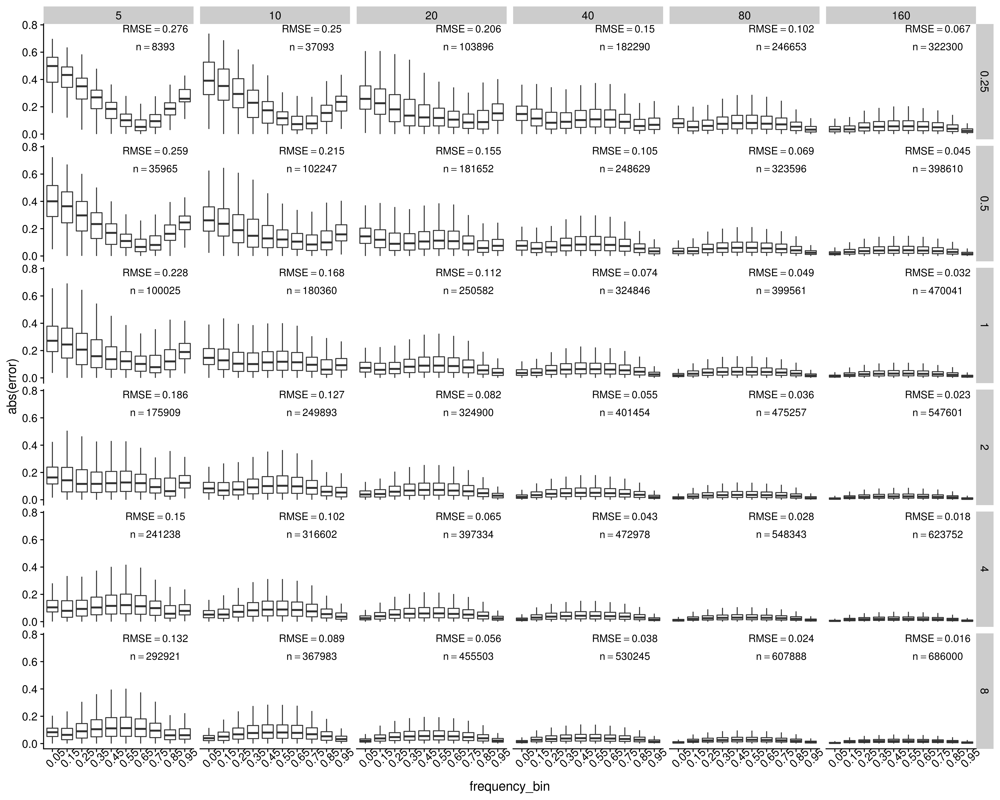
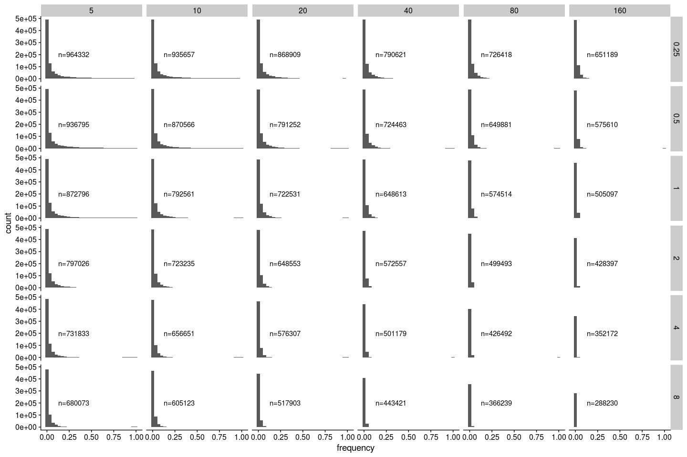
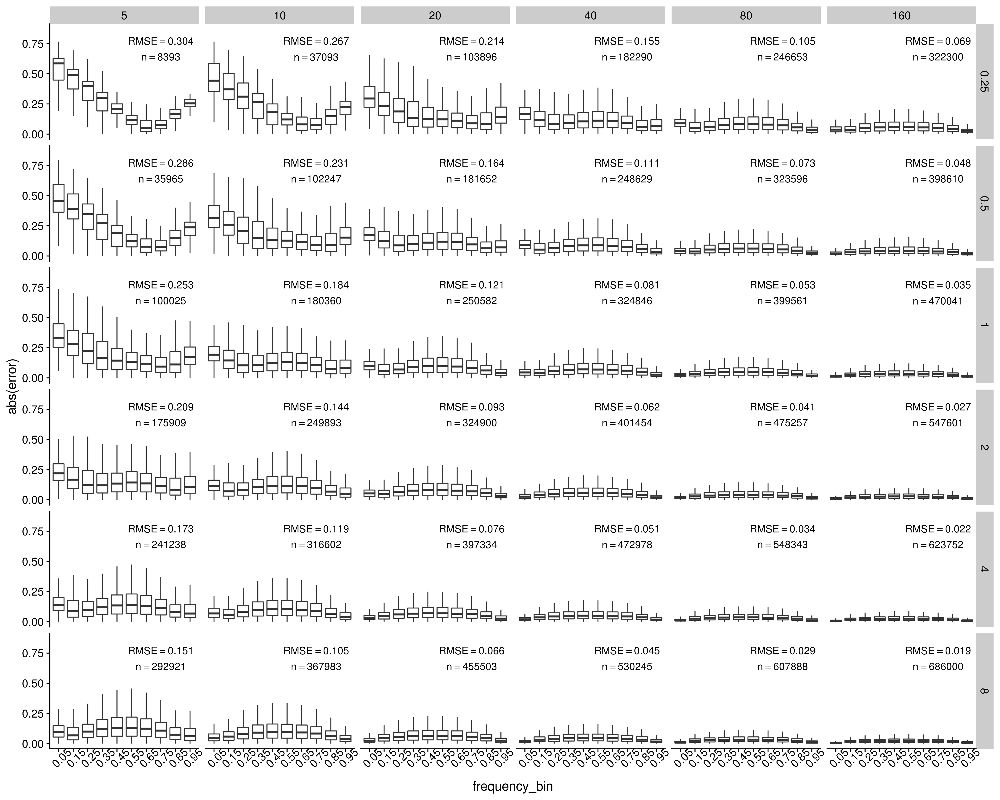

Data analysis with neutral simulation, with uneven input across individuals
================

-   [Define some functions](#define-some-functions)
-   [Data wrangling with SLiM output](#data-wrangling-with-slim-output)
    -   [Read in the ancestral states](#read-in-the-ancestral-states)
    -   [Read mutation and substitution file](#read-mutation-and-substitution-file)
    -   [Data wrangling with the mutation file](#data-wrangling-with-the-mutation-file)
-   [ANGSD results](#angsd-results)
    -   [Read maf estimation and join mutation and maf files](#read-maf-estimation-and-join-mutation-and-maf-files)
    -   [Plot the estimated allele frequency distribution](#plot-the-estimated-allele-frequency-distribution)
    -   [Plot estimated allele frequency vs. true allele frequency (this includes the false positives but not the false negatives)](#plot-estimated-allele-frequency-vs.-true-allele-frequency-this-includes-the-false-positives-but-not-the-false-negatives)
    -   [Plot estimated allele frequency vs. true allele frequency in bins (this includes the false positives but not the false negatives)](#plot-estimated-allele-frequency-vs.-true-allele-frequency-in-bins-this-includes-the-false-positives-but-not-the-false-negatives)
    -   [Plot error vs. true allele frequency in bins](#plot-error-vs.-true-allele-frequency-in-bins)
    -   [Check the SNPs with highest error](#check-the-snps-with-highest-error)
    -   [True frequency distribution of false negatives](#true-frequency-distribution-of-false-negatives)
    -   [Esimated frequency distribution of false positives](#esimated-frequency-distribution-of-false-positives)
-   [Compare individual barcoding with Pool-seq](#compare-individual-barcoding-with-pool-seq)
    -   [Get minor allele frequencies estimated from Pool-seq](#get-minor-allele-frequencies-estimated-from-pool-seq)
    -   [Plot estimated allele frequency vs. true allele frequency (this includes the false positives but not the false negatives)](#plot-estimated-allele-frequency-vs.-true-allele-frequency-this-includes-the-false-positives-but-not-the-false-negatives-1)
    -   [Plot estimated allele frequency vs. true allele frequency in bins (this includes the false positives but not the false negatives)](#plot-estimated-allele-frequency-vs.-true-allele-frequency-in-bins-this-includes-the-false-positives-but-not-the-false-negatives-1)
    -   [Plot absolute values of error vs. true allele frequency in bins (this includes the false positives but not the false negatives)](#plot-absolute-values-of-error-vs.-true-allele-frequency-in-bins-this-includes-the-false-positives-but-not-the-false-negatives)

``` r
library(tidyverse)
library(cowplot)
library(knitr)
```

Define some functions
=====================

``` r
summarise_by_design <- function(joined_frequency_table){
  joined_frequency_table %>%
  mutate(error_squared=error^2) %>%
  group_by(coverage, sample_size) %>%
  summarise(r_squared=paste0("R^2==", round(summary(lm(estimated_frequency~frequency))$r.squared,3)), 
            n=paste0("n==",n()), 
            root_mean_error_squared=paste0("RMSE==", round(sqrt(mean(error_squared)), 3)))
}
plot_frequency <- function(joined_frequency_table, joined_summary_table){
  joined_frequency_table %>%
    ggplot(aes(x=frequency, y=estimated_frequency)) +
    geom_point(alpha=0.1, size=0.1) +
    geom_smooth(method="lm", color="red", size=1, se = F) +
    geom_text(data = joined_summary_table, x = 0.86, y = 0.25, aes(label=r_squared), color = 'red',  parse = TRUE) +
    geom_text(data = joined_summary_table, x = 0.86, y = 0.12, aes(label=n), color = 'red',  parse = TRUE) +
    facet_grid(coverage~sample_size) +
    theme_cowplot()
}
plot_frequency_in_bins <- function(joined_frequency_table, joined_summary_table){
  joined_frequency_table %>%
    ggplot(aes(x=frequency_bin, y=estimated_frequency)) +
    geom_boxplot(outlier.shape = NA) +
    geom_text(data = joined_summary_table, x = 8.6, y = 0.2, aes(label=r_squared), color = 'black',  parse = TRUE) +
    geom_text(data = joined_summary_table, x = 8.6, y = 0.07, aes(label=n), color = 'black',  parse = TRUE) +
    scale_x_discrete(labels=seq(0.05, 0.95, 0.1))  +
    facet_grid(coverage~sample_size) +
    theme_cowplot() +
    theme(axis.text.x = element_text(angle=45))
}
plot_error_in_bins <- function(joined_frequency_table, joined_summary_table){
  joined_frequency_table %>%
    ggplot(aes(x=frequency_bin, y=abs(error))) +
    geom_boxplot(outlier.shape = NA) +
    geom_text(data = joined_summary_table, x = 8, y = 0.9, aes(label=root_mean_error_squared), color = 'black',  parse = TRUE) +
    geom_text(data = joined_summary_table, x = 8, y = 0.77, aes(label=n), color = 'black',  parse = TRUE) +
    facet_grid(coverage~sample_size) +
    scale_x_discrete(labels=seq(0.05, 0.95, 0.1))  +
    theme_cowplot() +
    theme(axis.text.x = element_text(angle=45))
}
count_to_maf <- function(ancestral_allele, totA, totC, totG, totT){
  if(ancestral_allele == "A"){
    minor_allele_count <- max(totC, totG, totT)
  } else if(ancestral_allele == "C"){
    minor_allele_count <- max(totA, totG, totT)
  } else if(ancestral_allele == "G"){
    minor_allele_count <- max(totA, totC, totT)
  } else if(ancestral_allele == "T"){
    minor_allele_count <- max(totA, totC, totG)
  }
  maf <- minor_allele_count/sum(totA, totC, totG, totT)
  return(maf)
}
```

Data wrangling with SLiM output
===============================

Read in the ancestral states
----------------------------

``` r
ancestral <- read_csv("../neutral_sim_uneven_input/rep_1/slim/ancestral.fasta")[[1]] %>%
  str_split(pattern="") %>%
  .[[1]] %>%
  bind_cols(ancestral=., position=1:30000000)
```

Read mutation and substitution file
-----------------------------------

``` r
## Read in the mutation file outputted by SLiM
mutations <- read_delim("../neutral_sim_uneven_input/rep_1/slim/mutations.txt", delim = " ", col_names = F) %>%
  transmute(type=X6, position=X7+1, base=X13, frequency=X12/2000) %>%
  left_join(ancestral, by="position") %>%
  group_by(type, position, ancestral, base) %>%
  summarise(frequency=sum(frequency)) %>%
  ungroup()
## Read in the substitutions file outputted by SLiM
## This is necessary because mutations can happen again after one fixation, so frequencies from the mutation file do not always reflect the true derived allele frequency
substitutions <- read_delim("../neutral_sim_uneven_input/rep_1/slim/substitutions.txt", delim = " ", skip=2, col_names = F) %>%
  transmute(type=X3, position=X4+1, base=X10, generation=X9) %>%
  group_by(type, position) %>%
  filter(generation==max(generation)) %>%
  ungroup() %>%
  left_join(ancestral, by="position") %>%
  select(-generation) %>%
  filter(base!=ancestral) %>%
  arrange(position)
```

Data wrangling with the mutation file
-------------------------------------

The following steps are necessary because there are complications such as back mutations and triallelic loci in the mutation file

``` r
## Join mutations and substitutions in a temp table
mutations_final_temp <-  mutations %>%
  spread(key = base, value=frequency) %>%
  full_join(substitutions, by=c("position", "type", "ancestral")) %>%
  arrange(position) %>%
  mutate(base=ifelse(is.na(base), ancestral, base)) %>%
  mutate_all(~replace(., is.na(.), 0)) %>%
  mutate(frequency=1-`A` -`C` -`G` -`T`)
## More wrangling
mutations_final <- mutations_final_temp[1:7] %>%
  gather(key=base, value=frequency, 4:7) %>%
  bind_rows(mutations_final_temp[c(1:3, 8:9)]) %>%
  mutate(frequency=ifelse(base==ancestral, 0, frequency)) %>%
  group_by(type, position, ancestral) %>%
  filter(frequency!=0) %>%
  summarise(frequency=sum(frequency), base=paste0(base, collapse = "")) %>%
  ungroup() %>%
  filter(frequency!=1)
```

ANGSD results
=============

Read maf estimation and join mutation and maf files
---------------------------------------------------

``` r
i=1
for (coverage in c(0.25,0.5,1,2,4,8)){
  for (sample_size in c(5,10,20,40, 80, 160)){
    ## read in estimated maf
    maf <- read_tsv(paste0("../neutral_sim_uneven_input/rep_1/angsd/bam_list_", sample_size, "_", coverage, "x.mafs.gz")) %>%
      mutate(estimated_frequency=knownEM) %>%
      select(position, major, minor, anc, estimated_frequency, nInd) %>%
      arrange(position)
    ## join estimated maf with true snps and only keep the snps that exist in estimated maf
    joined_frequency <- right_join(mutations_final, maf, by="position") %>%
      select(-ancestral) %>%
      mutate(coverage=coverage, sample_size=sample_size, frequency=ifelse(is.na(frequency), 1, frequency))
    ## find false negatives
    false_negatives <- anti_join(mutations_final, maf, by="position") %>%
      mutate(coverage=coverage, sample_size=sample_size)
    ## find false positives
    false_positives <- anti_join(maf, mutations_final, by="position") %>%
      mutate(coverage=coverage, sample_size=sample_size)
    ## compile the final files for plotting
    if (i==1){
      joined_frequency_final <- joined_frequency
      false_negatives_final <- false_negatives
      false_positives_final <- false_positives
    } else {
      joined_frequency_final <- bind_rows(joined_frequency_final, joined_frequency)
      false_negatives_final <- bind_rows(false_negatives_final, false_negatives)
      false_positives_final <- bind_rows(false_positives_final, false_positives)
    }
    i=i+1
  }
}
write_tsv(joined_frequency_final, "../neutral_sim_uneven_input/rep_1/angsd/joined_frequency_final.tsv")
write_tsv(false_negatives_final, "../neutral_sim_uneven_input/rep_1/angsd/false_negatives_final.tsv")
write_tsv(false_positives_final, "../neutral_sim_uneven_input/rep_1/angsd/false_positives_final.tsv")
```

``` r
joined_frequency_final <- read_tsv("../neutral_sim_uneven_input/rep_1/angsd/joined_frequency_final.tsv") %>%
  mutate(frequency_bin = cut(frequency, breaks = 0:10/10), error=estimated_frequency-frequency)
false_negatives_final <- read_tsv("../neutral_sim_uneven_input/rep_1/angsd/false_negatives_final.tsv")
false_positives_final <- read_tsv("../neutral_sim_uneven_input/rep_1/angsd/false_positives_final.tsv")
```

Plot the estimated allele frequency distribution
------------------------------------------------

These are the histogram of estimated allele frequencies

``` r
joined_summary <- summarise_by_design(joined_frequency_final)

joined_frequency_final %>%
  ggplot(aes(x=estimated_frequency)) +
  geom_histogram() +
  geom_text(data=joined_summary, x=0.8, y=20000, aes(label=n), parse=T) +
  facet_grid(coverage~sample_size, scales ="free_y") +
  theme_cowplot()
```


Plot estimated allele frequency vs. true allele frequency (this includes the false positives but not the false negatives)
-------------------------------------------------------------------------------------------------------------------------

``` r
estimated_vs_true_frequency <- plot_frequency(joined_frequency_final, joined_summary)
ggsave("../figures/neutral_uneven_input_estimated_vs_true_frequency.png", estimated_vs_true_frequency, height = 12, width=15, units = "in")
```

``` r
include_graphics("../figures/neutral_uneven_input_estimated_vs_true_frequency.png")
```


Plot estimated allele frequency vs. true allele frequency in bins (this includes the false positives but not the false negatives)
---------------------------------------------------------------------------------------------------------------------------------

``` r
estimated_vs_true_frequency_bin <- plot_frequency_in_bins(joined_frequency_final, joined_summary)
ggsave("../figures/neutral_uneven_input_estimated_vs_true_frequency_bin.png", estimated_vs_true_frequency_bin, height = 12, width=15, units = "in")
```

``` r

```


Plot error vs. true allele frequency in bins
--------------------------------------------

``` r
error_vs_true_frequency_bin <- plot_error_in_bins(joined_frequency_final, joined_summary)
ggsave("../figures/neutral_uneven_input_error_vs_true_frequency_bin.png", error_vs_true_frequency_bin, height = 12, width=15, units = "in")
```

``` r

```


Check the SNPs with highest error
---------------------------------

``` r
filter(joined_frequency_final, coverage==8, sample_size==160) %>%
  mutate(error=estimated_frequency-frequency) %>%
  arrange(desc(abs(error))) %>%
  head(n=20)
```

    ## # A tibble: 20 x 13
    ##    type  position frequency base  major minor anc   estimated_frequ…  nInd
    ##    <chr>    <dbl>     <dbl> <chr> <chr> <chr> <chr>            <dbl> <dbl>
    ##  1 m1    23704228     0.683 C     G     C     G                0.560   157
    ##  2 m1    24354179     0.494 T     C     T     C                0.610   155
    ##  3 m1    28110618     0.36  T     G     T     G                0.467   156
    ##  4 m1     9314108     0.608 T     G     T     G                0.714   157
    ##  5 m1    24595214     0.376 G     C     G     C                0.271   160
    ##  6 m1    19794246     0.567 A     G     A     G                0.671   156
    ##  7 m1    29611160     0.384 A     T     A     T                0.488   155
    ##  8 m1    24353696     0.561 T     G     T     G                0.665   154
    ##  9 m1           6     0.674 T     C     T     C                0.778    27
    ## 10 m1    23543799     0.352 C     A     C     A                0.249   156
    ## 11 m1    13085188     0.434 C     T     C     T                0.536   156
    ## 12 m1    23705057     0.464 T     G     T     G                0.361   157
    ## 13 m1    26068129     0.651 G     A     G     A                0.549   154
    ## 14 m1     8721212     0.672 A     C     A     C                0.773   157
    ## 15 m1     1442975     0.548 C     T     C     T                0.649   159
    ## 16 m1     1572463     0.424 G     A     G     A                0.524   157
    ## 17 m1    15849236     0.654 G     A     G     A                0.554   159
    ## 18 m1    15849280     0.346 G     T     G     T                0.446   157
    ## 19 m1    24595222     0.379 G     T     G     T                0.281   160
    ## 20 m1    19814972     0.572 A     G     A     G                0.474   156
    ## # … with 4 more variables: coverage <dbl>, sample_size <dbl>,
    ## #   frequency_bin <fct>, error <dbl>

True frequency distribution of false negatives
----------------------------------------------

``` r
false_negatives_final_count <- count(false_negatives_final, coverage, sample_size)
ggplot(false_negatives_final, aes(x=frequency)) +
  geom_histogram() +
  geom_text(data=false_negatives_final_count, x=0.3, y=200000, aes(label=paste0("n=", n))) +
  facet_grid(coverage~sample_size) +
  theme_cowplot()
```



Esimated frequency distribution of false positives
--------------------------------------------------

``` r
false_positives_final_count <- count(false_positives_final, coverage, sample_size)
ggplot(false_positives_final, aes(x=estimated_frequency)) +
  geom_histogram() +
  geom_text(data=false_positives_final_count, x=0.8, y=1500, aes(label=paste0("n=", n))) +
  facet_grid(coverage~sample_size) +
  theme_cowplot()
```


Compare individual barcoding with Pool-seq
==========================================

I used the same set of SNPs obtained from ANGSD and calculated allele frequency based on total allele count across the population. This is to make the results from the two methods more comparable. In reality, however, the SNP calling result will be different if no individual barcode is provided.

Get minor allele frequencies estimated from Pool-seq
----------------------------------------------------

``` r
i=1
for (coverage in c(0.25,0.5,1,2,4,8)){
  for (sample_size in c(5,10,20,40, 80, 160)){
    ## read in allele count
    allele_count <- read_tsv(paste0("../neutral_sim_uneven_input/rep_1/angsd/bam_list_", sample_size, "_", coverage, "x.pos.gz")) %>%
      bind_cols(read_tsv(paste0("../neutral_sim_uneven_input/rep_1/angsd/bam_list_", sample_size, "_", coverage, "x.counts.gz"))) %>%
      mutate(ancestral_allele = ancestral$ancestral[pos]) %>%
    ## turn allele count into maf
      rowwise() %>%
      mutate(maf = count_to_maf(ancestral_allele, totA, totC, totG, totT), position=pos) %>%
      ungroup()
    ## join estimated maf with true snps and only keep the snps that exist in estimated maf
    joined_frequency <- right_join(mutations_final, allele_count, by="position") %>%
      select(-ancestral) %>%
      mutate(coverage=coverage, sample_size=sample_size, frequency=ifelse(is.na(frequency), 1, frequency))
    ## compile the final files for plotting
    if (i==1){
      joined_frequency_final <- joined_frequency
    } else {
      joined_frequency_final <- bind_rows(joined_frequency_final, joined_frequency)
    }
    i=i+1
  }
}
write_tsv(joined_frequency_final, "../neutral_sim_uneven_input/rep_1/angsd/joined_frequency_final_poolseq.tsv")
```

``` r
joined_frequency_final <- read_tsv("../neutral_sim_uneven_input/rep_1/angsd/joined_frequency_final_poolseq.tsv") %>%
  mutate(estimated_frequency=maf, frequency_bin = cut(frequency, breaks = 0:10/10), error=estimated_frequency-frequency) 
joined_summary <- summarise_by_design(joined_frequency_final)
```

Plot estimated allele frequency vs. true allele frequency (this includes the false positives but not the false negatives)
-------------------------------------------------------------------------------------------------------------------------

``` r
estimated_vs_true_frequency_pool <- plot_frequency(joined_frequency_final, joined_summary)
ggsave("../figures/neutral_uneven_input_estimated_vs_true_frequency_pool.png", estimated_vs_true_frequency_pool, height = 12, width=15, units = "in")
```

``` r
include_graphics("../figures/neutral_uneven_input_estimated_vs_true_frequency_pool.png")
```


Plot estimated allele frequency vs. true allele frequency in bins (this includes the false positives but not the false negatives)
---------------------------------------------------------------------------------------------------------------------------------

``` r
estimated_vs_true_frequency_pool_bin <- plot_frequency_in_bins(joined_frequency_final, joined_summary)
ggsave("../figures/neutral_uneven_input_estimated_vs_true_frequency_pool_bin.png", estimated_vs_true_frequency_pool_bin, height = 12, width=15, units = "in")
```

``` r

```


Plot absolute values of error vs. true allele frequency in bins (this includes the false positives but not the false negatives)
-------------------------------------------------------------------------------------------------------------------------------

``` r
error_vs_true_frequency_pool_bin <- plot_error_in_bins(joined_frequency_final, joined_summary)
ggsave("../figures/neutral_uneven_input_error_vs_true_frequency_pool_bin.png", error_vs_true_frequency_pool_bin, height = 12, width=15, units = "in")
```

``` r

```


