Data analysis with simulation of spatial populations with lower
migration rate
================

  - [PCA with true genotypes](#pca-with-true-genotypes)
  - [PCA with PCAngsd](#pca-with-pcangsd)
      - [Generate PCA tables](#generate-pca-tables)
      - [Plot PCA](#plot-pca)
      - [Plot PCA centroid](#plot-pca-centroid)
      - [Plot DAPC](#plot-dapc)
      - [Plot DAPC centroid](#plot-dapc-centroid)
  - [PCA with covMat](#pca-with-covmat)
      - [Plot PCA](#plot-pca-1)
      - [Plot PCA centroid](#plot-pca-centroid-1)
      - [Plot DAPC](#plot-dapc-1)
      - [Plot DAPC centroid](#plot-dapc-centroid-1)
  - [PCoA with ibsMat](#pcoa-with-ibsmat)
      - [Plot PCoA](#plot-pcoa)
      - [Plot PCoA centroid](#plot-pcoa-centroid)
      - [Plot DAPC](#plot-dapc-2)
      - [Plot DAPC centroid](#plot-dapc-centroid-2)

``` r
library(tidyverse)
library(cowplot)
library(knitr)
library(RcppCNPy)
library(scales)
library(ggrepel)
library(MASS)
```

## PCA with true genotypes

``` bash
nohup /programs/plink-2.00/plink2 --pca --vcf /workdir/lcwgs-simulation/spatial_pop_sim_lower_m/rep_1/slim/sample_genotypes.vcf --out /workdir/lcwgs-simulation/spatial_pop_sim_lower_m/rep_1/slim/sample_genotypes \
> /workdir/lcwgs-simulation/nohups/spatial_pop_sim_lower_m_pca_with_vcf.nohup &
```

``` r
eigen_vec <- read_tsv("../spatial_pop_sim_lower_m/rep_1/slim/sample_genotypes.eigenvec") %>%
  transmute(pc1 = PC1, pc2 = PC2, pop = str_c("p", (ceiling(1:1440/160))), ind = rep(1:160, 9))
eigen_vec %>%
  filter(ind<=80) %>%
  ggplot(aes(x=-pc1, y=pc2, color=pop)) +
  geom_point() +
  theme_cowplot()
```

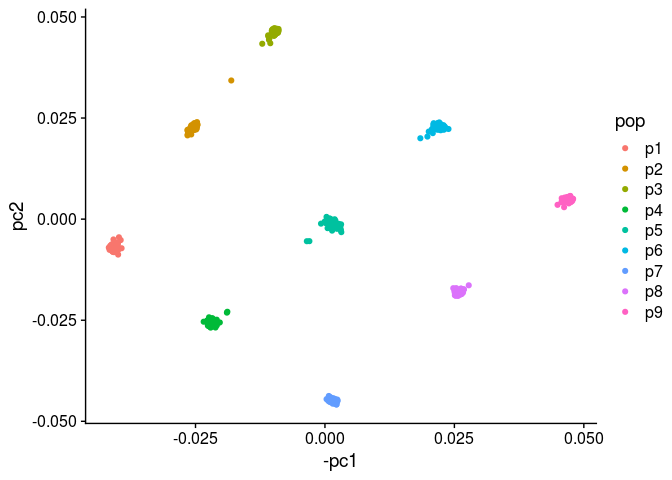<!-- -->

## PCA with PCAngsd

### Generate PCA tables

``` r
i=1
for (coverage in c(0.125,0.25,0.5,1,2,4)){
  for (sample_size in c(5,10,20,40,80)){
    pop_label <- read_lines(paste0("../spatial_pop_sim_lower_m/rep_1/sample_lists/bam_list_",sample_size,"_",coverage,"x.txt")) %>%
      str_extract('p[1-9]')
    ## Read covariance matrix
    cov_matrix <- npyLoad(paste0("../spatial_pop_sim_lower_m/rep_1/angsd/pcagnsd_bam_list_",sample_size,"_",coverage,"x.cov.npy")) %>%
      as.matrix()
    ## Perform eigen decomposition
    e <- eigen(cov_matrix)
    e_value<-e$values
    x_variance<-e_value[1]/sum(e_value)*100
    y_variance<-e_value[2]/sum(e_value)*100
    e_vector <- as.data.frame(e$vectors)[,1:5]
    pca_table <- bind_cols(pop_label=pop_label, e_vector) %>%
      transmute(population=pop_label, PC1=rescale(V1, c(-1, 1)), PC2=rescale(V2, c(-1, 1)), PC3=rescale(V3, c(-1, 1)), PC4=rescale(V4, c(-1, 1)), PC5=rescale(V5, c(-1, 1)), coverage=coverage, sample_size=sample_size)
    ## Perform DAPC
    fit <- lda(population ~ ., data=pca_table[,1:(5+1)], na.action="na.omit", CV=F, output = "Scatterplot")
    plda <- predict(object = fit,
                  newdata = pca_table[,1:(5+1)])
    prop.lda <- fit$svd^2/sum(fit$svd^2)
    dapc_table <- data.frame(group = pca_table[,1], lda = plda$x) %>%
      transmute(population=group, LD1=rescale(lda.LD1,c(-1,1)), LD2=rescale(lda.LD2, c(-1,1)), coverage=coverage, sample_size=sample_size)
    ## Bind PCA tables and DAPC tables for all sample size and coverage combinations
    if (i==1){
      pca_table_final <- pca_table
      dapc_table_final <- dapc_table
    } else {
      pca_table_final <- bind_rows(pca_table_final,pca_table)
      dapc_table_final <- bind_rows(dapc_table_final,dapc_table)
    }
    i=i+1
  }
}
## Get mean PC values per population
pca_table_final_per_pop <- group_by(pca_table_final, population, coverage, sample_size) %>%
  summarise(PC1_mean=mean(PC1), PC2_mean=mean(PC2), PC3_mean=mean(PC3), PC1_sd=sd(PC1), PC2_sd=sd(PC2), PC3_sd=sd(PC3)) %>%
  ungroup() %>%
  group_by(coverage, sample_size) %>%
  mutate(PC1_mean=rescale(PC1_mean, c(-1,1)), PC2_mean=rescale(PC2_mean, c(-1,1)), PC3_mean=rescale(PC3_mean, c(-1,1)))
## Get mean LD values per population
dapc_table_final_per_pop <- group_by(dapc_table_final, population, coverage, sample_size) %>%
  summarise(LD1_mean=mean(LD1), LD2_mean=mean(LD2), LD1_sd=sd(LD1), LD2_sd=sd(LD2)) %>%
  ungroup() %>%
  group_by(coverage, sample_size) %>%
  mutate(LD1_mean=rescale(LD1_mean, c(-1,1)), LD2_mean=rescale(LD2_mean, c(-1,1)))
```

### Plot PCA

#### PC1 vs. PC2

``` r
pca_table_final_summary <- group_by(pca_table_final, population, coverage, sample_size) %>%
  summarise(pc1_mean = mean(PC1), pc2_mean = mean(PC2)) %>%
  ungroup() %>%
  pivot_wider(names_from = population, values_from = c(pc1_mean, pc2_mean)) %>%
  transmute(coverage = coverage, sample_size = sample_size, invert_pc1 = pc1_mean_p1 > pc1_mean_p9, invert_pc2 = pc2_mean_p3 < pc2_mean_p7)
## Flip PC1 and PC2 axes when needed 
pca_table_final_flipped <- left_join(pca_table_final, pca_table_final_summary, 
                                     by=c("coverage", "sample_size")) %>%
  mutate(PC1 = ifelse(invert_pc1==TRUE, -PC1, PC1),
         PC2 = ifelse(invert_pc2==TRUE, -PC2, PC2))
ggplot(pca_table_final_flipped,aes(x=PC1, y=PC2, color=population)) +
  geom_point() +
  scale_color_viridis_d() +
  facet_grid(coverage~sample_size, scales="free") +
  theme_cowplot() +
  theme(text = element_text(size=20),
        panel.grid = element_blank(),
        axis.text = element_blank(),
        axis.ticks = element_blank(),
        axis.line = element_blank(),
        panel.border = element_rect(colour = "black", fill=NA, size=1),
        legend.position="none")
```

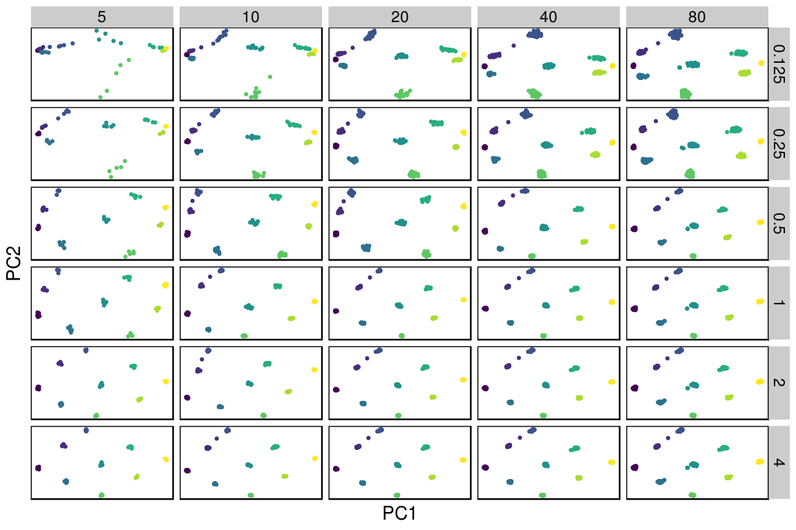<!-- -->

### Plot PCA centroid

#### PC1 vs. PC2

``` r
set.seed(1)
ggplot(pca_table_final_per_pop, aes(x=PC1_mean, y=PC2_mean, color=population, label=population)) +
  geom_point() +
  geom_label_repel(size=3) +
  facet_grid(coverage~sample_size, scales="free") +
  ylim(c(-1.2, 1.2)) +
  xlim(c(-1.2, 1.2)) +
  theme_bw() +
  theme(panel.grid = element_blank(),
        axis.text = element_blank(),
        axis.ticks = element_blank())
```

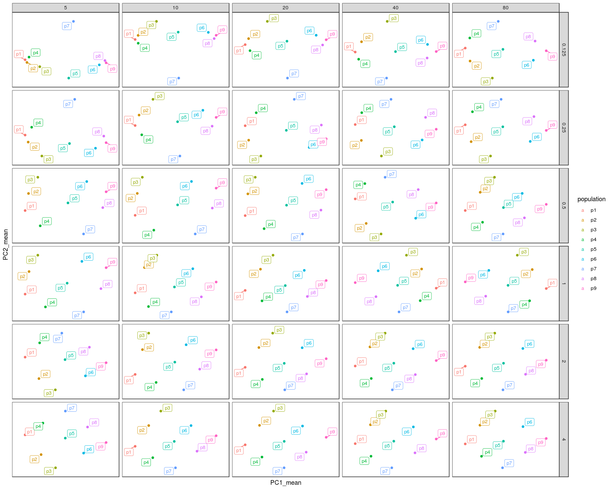<!-- -->

### Plot DAPC

``` r
ggplot(dapc_table_final,aes(x=LD1, y=LD2, color=population)) +
  geom_point() +
  facet_grid(coverage~sample_size, scales="free") +
  theme_bw() +
  theme(panel.grid = element_blank(),
        axis.text = element_blank(),
        axis.ticks = element_blank())
```

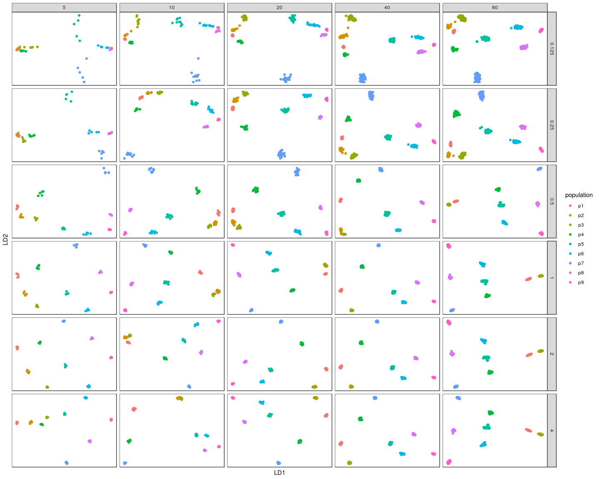<!-- -->

### Plot DAPC centroid

``` r
set.seed(1)
ggplot(dapc_table_final_per_pop, aes(x=LD1_mean, y=LD2_mean, color=population, label=population)) +
  geom_point() +
  geom_label_repel(size=3) +
  facet_grid(coverage~sample_size, scales="free") +
  ylim(c(-1.2, 1.2)) +
  xlim(c(-1.2, 1.2)) +
  theme_bw() +
  theme(panel.grid = element_blank(),
        axis.text = element_blank(),
        axis.ticks = element_blank())
```

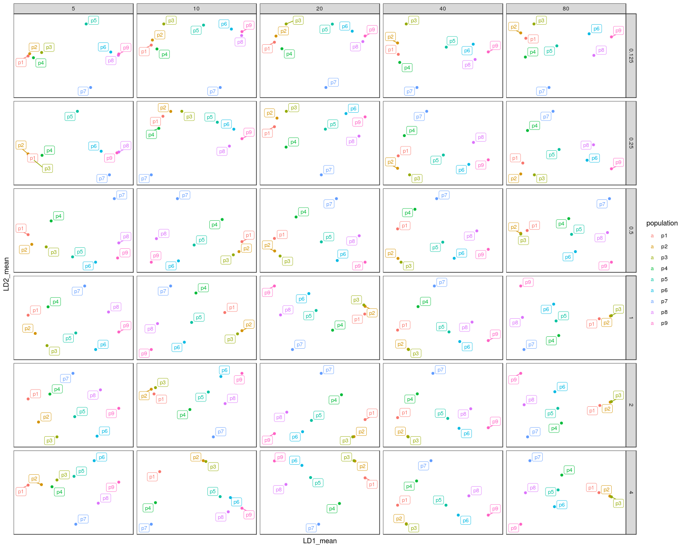<!-- -->

## PCA with covMat

``` r
i=1
for (coverage in c(0.125,0.25,0.5,1,2,4)){
  for (sample_size in c(5,10,20,40,80)){
    pop_label <- read_lines(paste0("../spatial_pop_sim_lower_m/rep_1/sample_lists/bam_list_",sample_size,"_",coverage,"x.txt")) %>%
      str_extract('p[1-9]')
    ## Read covariance matrix
    cov_matrix <- read_tsv(paste0("../spatial_pop_sim_lower_m/rep_1/angsd/bam_list_",sample_size,"_",coverage,"x.covMat"), col_names = F) %>%
      as.matrix() %>%
      .[,-(sample_size*9+1)]
    cov_matrix[is.na(cov_matrix)]<- median(cov_matrix, na.rm = T)
    ## Perform eigen decomposition
    e <- eigen(cov_matrix)
    e_value<-e$values
    x_variance<-e_value[1]/sum(e_value)*100
    y_variance<-e_value[2]/sum(e_value)*100
    e_vector <- as.data.frame(e$vectors)[,1:5]
    pca_table <- bind_cols(pop_label=pop_label, e_vector) %>%
      transmute(population=pop_label, PC1=rescale(V1, c(-1, 1)), PC2=rescale(V2, c(-1, 1)), PC3=rescale(V3, c(-1, 1)), PC4=rescale(V3, c(-1, 1)), PC5=rescale(V5, c(-1, 1)), coverage=coverage, sample_size=sample_size)
    ## Perform DAPC
    fit <- lda(population ~ ., data=pca_table[,1:(5+1)], na.action="na.omit", CV=F, output = "Scatterplot")
    plda <- predict(object = fit,
                  newdata = pca_table[,1:(5+1)])
    prop.lda <- fit$svd^2/sum(fit$svd^2)
    dapc_table <- data.frame(group = pca_table[,1], lda = plda$x) %>%
      transmute(population=group, LD1=rescale(lda.LD1,c(-1,1)), LD2=rescale(lda.LD2, c(-1,1)), coverage=coverage, sample_size=sample_size)
    ## Bind PCA tables and DAPC tables for all sample size and coverage combinations
    if (i==1){
      pca_table_final <- pca_table
      dapc_table_final <- dapc_table
    } else {
      pca_table_final <- bind_rows(pca_table_final,pca_table)
      dapc_table_final <- bind_rows(dapc_table_final,dapc_table)
    }
    i=i+1
  }
}
## Get mean PC values per population
pca_table_final_per_pop <- group_by(pca_table_final, population, coverage, sample_size) %>%
  summarise(PC1_mean=mean(PC1), PC2_mean=mean(PC2), PC3_mean=mean(PC3), PC1_sd=sd(PC1), PC2_sd=sd(PC2), PC3_sd=sd(PC3)) %>%
  ungroup() %>%
  group_by(coverage, sample_size) %>%
  mutate(PC1_mean=rescale(PC1_mean, c(-1,1)), PC2_mean=rescale(PC2_mean, c(-1,1)), PC3_mean=rescale(PC3_mean, c(-1,1)))
## Get mean LD values per population
dapc_table_final_per_pop <- group_by(dapc_table_final, population, coverage, sample_size) %>%
  summarise(LD1_mean=mean(LD1), LD2_mean=mean(LD2), LD1_sd=sd(LD1), LD2_sd=sd(LD2)) %>%
  ungroup() %>%
  group_by(coverage, sample_size) %>%
  mutate(LD1_mean=rescale(LD1_mean, c(-1,1)), LD2_mean=rescale(LD2_mean, c(-1,1)))
```

Note: there are more NAs in these covariance matrices compared to the
covariance matrices generated from PCAngsd.

### Plot PCA

#### PC1 vs. PC2

``` r
ggplot(pca_table_final,aes(x=PC1, y=PC2, color=population)) +
  geom_point() +
  facet_grid(coverage~sample_size, scales="free") +
  theme_bw() +
  theme(panel.grid = element_blank(),
        axis.text = element_blank(),
        axis.ticks = element_blank())
```

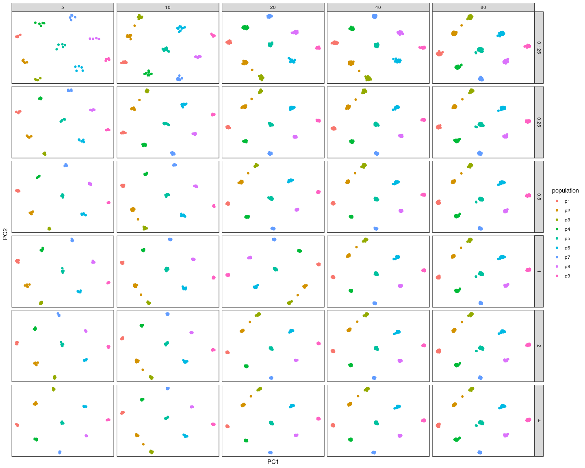<!-- -->

### Plot PCA centroid

#### PC1 vs. PC2

``` r
set.seed(1)
ggplot(pca_table_final_per_pop, aes(x=PC1_mean, y=PC2_mean, color=population, label=population)) +
  geom_point() +
  geom_label_repel(size=3) +
  facet_grid(coverage~sample_size, scales="free") +
  ylim(c(-1.2, 1.2)) +
  xlim(c(-1.2, 1.2)) +
  theme_bw() +
  theme(panel.grid = element_blank(),
        axis.text = element_blank(),
        axis.ticks = element_blank())
```

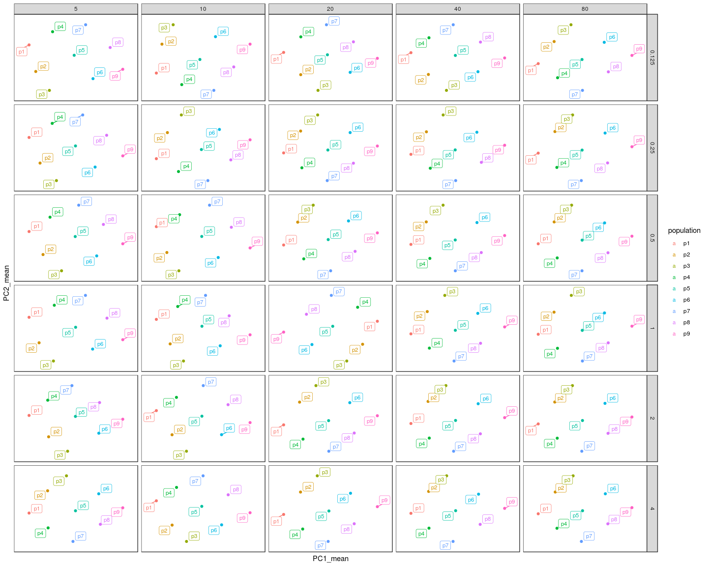<!-- -->

### Plot DAPC

``` r
ggplot(dapc_table_final,aes(x=LD1, y=LD2, color=population)) +
  geom_point() +
  facet_grid(coverage~sample_size, scales="free") +
  theme_bw() +
  theme(panel.grid = element_blank(),
        axis.text = element_blank(),
        axis.ticks = element_blank())
```

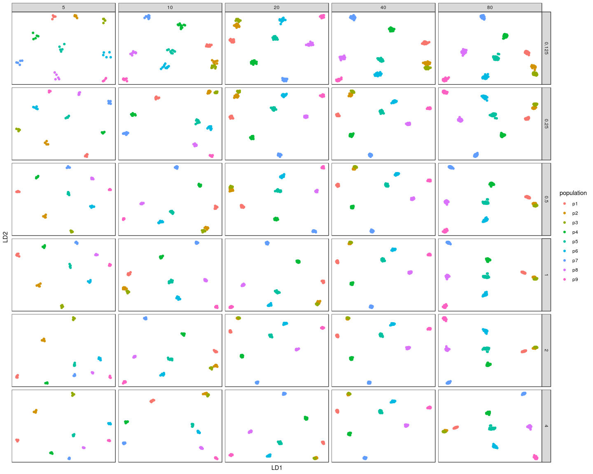<!-- -->

### Plot DAPC centroid

``` r
set.seed(1)
ggplot(dapc_table_final_per_pop, aes(x=LD1_mean, y=LD2_mean, color=population, label=population)) +
  geom_point() +
  geom_label_repel(size=3) +
  facet_grid(coverage~sample_size, scales="free") +
  ylim(c(-1.2, 1.2)) +
  xlim(c(-1.2, 1.2)) +
  theme_bw() +
  theme(panel.grid = element_blank(),
        axis.text = element_blank(),
        axis.ticks = element_blank())
```

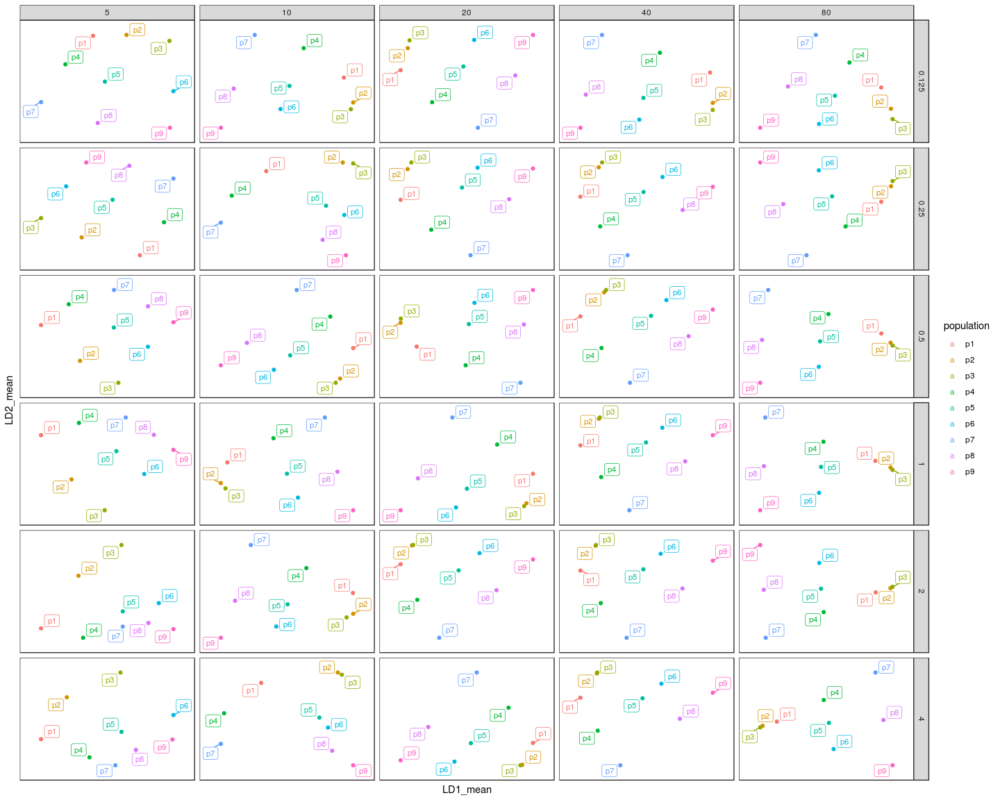<!-- -->

## PCoA with ibsMat

``` r
i=1
for (coverage in c(0.125,0.25,0.5,1,2,4)){
  for (sample_size in c(5,10,20,40,80)){
    pop_label <- read_lines(paste0("../spatial_pop_sim_lower_m/rep_1/sample_lists/bam_list_",sample_size,"_",coverage,"x.txt")) %>%
      str_extract('p[1-9]')
    ## Read covariance matrix
    dist_matrix <- read_tsv(paste0("../spatial_pop_sim_lower_m/rep_1/angsd/bam_list_",sample_size,"_",coverage,"x.ibsMat"), col_names = F) %>%
      as.matrix() %>%
      .[,-(sample_size*9+1)]
    dist_matrix[is.na(dist_matrix)] <- mean(dist_matrix, na.rm = T)
    ## Perform MDS
    mds <- cmdscale(as.dist(dist_matrix), k=5) %>%
      as.data.frame() 
    mds_table <- bind_cols(pop_label=pop_label, mds) %>%
      transmute(population=pop_label, PCo1=rescale(V1, c(-1, 1)), PCo2=rescale(V2, c(-1, 1)), PCo3=rescale(V3, c(-1, 1)), PCo4=rescale(V4, c(-1, 1)), PCo5=rescale(V5, c(-1, 1)), coverage=coverage, sample_size=sample_size)
    eigen_value <- cmdscale(as.dist(dist_matrix), k=5, eig = T)$eig
    var_explained <- round(eigen_value/sum(eigen_value)*100, 2)

    ## Perform DAPC
    fit <- lda(population ~ ., data=mds_table[,1:(5+1)], na.action="na.omit", CV=F, output = "Scatterplot")
    plda <- predict(object = fit,
                  newdata = mds_table[,1:(5+1)])
    prop.lda <- fit$svd^2/sum(fit$svd^2)
    dapc_table <- data.frame(group = mds_table[,1], lda = plda$x) %>%
      transmute(population=group, LD1=rescale(lda.LD1,c(-1,1)), LD2=rescale(lda.LD2, c(-1,1)), coverage=coverage, sample_size=sample_size)
    ## Bind PCoA tables and DAPC tables for all sample size and coverage combinations
    if (i==1){
      mds_table_final <- mds_table
      dapc_table_final <- dapc_table
    } else {
      mds_table_final <- bind_rows(mds_table_final,mds_table)
      dapc_table_final <- bind_rows(dapc_table_final,dapc_table)
    }
    i=i+1
  }
}
## Get mean PCo values per population
mds_table_final_per_pop <- group_by(mds_table_final, population, coverage, sample_size) %>%
  summarise(PCo1_mean=mean(PCo1), PCo2_mean=mean(PCo2), PCo3_mean=mean(PCo3), PCo1_sd=sd(PCo1), PCo2_sd=sd(PCo2), PCo3_sd=sd(PCo3)) %>%
  ungroup() %>%
  group_by(coverage, sample_size) %>%
  mutate(PCo1_mean=rescale(PCo1_mean, c(-1,1)), PCo2_mean=rescale(PCo2_mean, c(-1,1)), PCo3_mean=rescale(PCo3_mean, c(-1,1)))
## Get mean LD values per population
dapc_table_final_per_pop <- group_by(dapc_table_final, population, coverage, sample_size) %>%
  summarise(LD1_mean=mean(LD1), LD2_mean=mean(LD2), LD1_sd=sd(LD1), LD2_sd=sd(LD2)) %>%
  ungroup() %>%
  group_by(coverage, sample_size) %>%
  mutate(LD1_mean=rescale(LD1_mean, c(-1,1)), LD2_mean=rescale(LD2_mean, c(-1,1)))
```

### Plot PCoA

#### PCo1 vs. PCo2

``` r
ggplot(mds_table_final,aes(x=PCo1, y=PCo2, color=population)) +
  geom_point() +
  facet_grid(coverage~sample_size, scales="free") +
  theme_bw() +
  theme(panel.grid = element_blank(),
        axis.text = element_blank(),
        axis.ticks = element_blank())
```

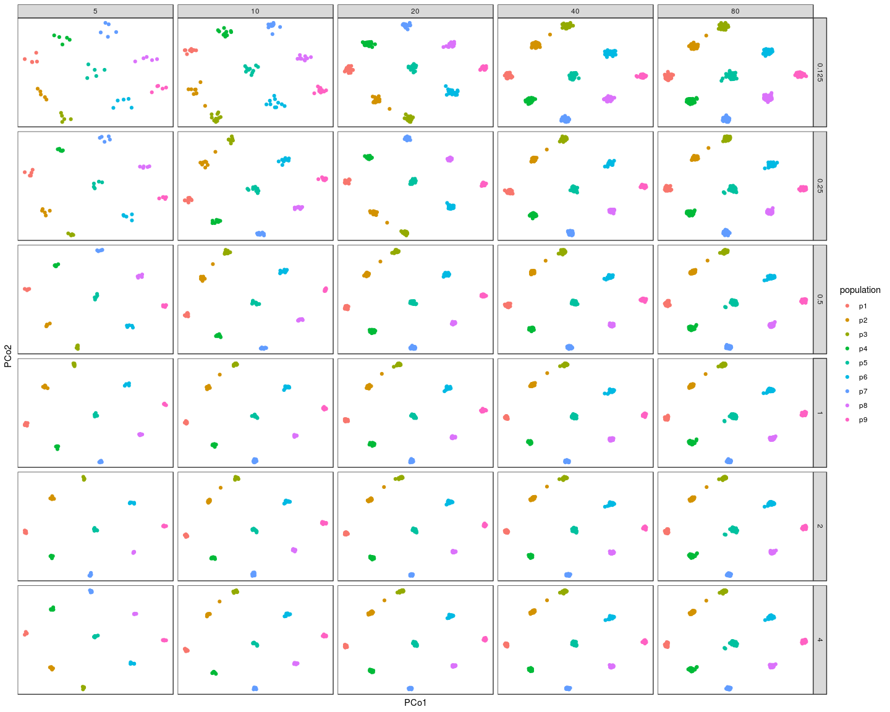<!-- -->

### Plot PCoA centroid

#### PCo1 vs. PCo2

``` r
set.seed(1)
ggplot(mds_table_final_per_pop, aes(x=PCo1_mean, y=PCo2_mean, color=population, label=population)) +
  geom_point() +
  geom_label_repel(size=3) +
  facet_grid(coverage~sample_size, scales="free") +
  ylim(c(-1.2, 1.2)) +
  xlim(c(-1.2, 1.2)) +
  theme_bw() +
  theme(panel.grid = element_blank(),
        axis.text = element_blank(),
        axis.ticks = element_blank())
```

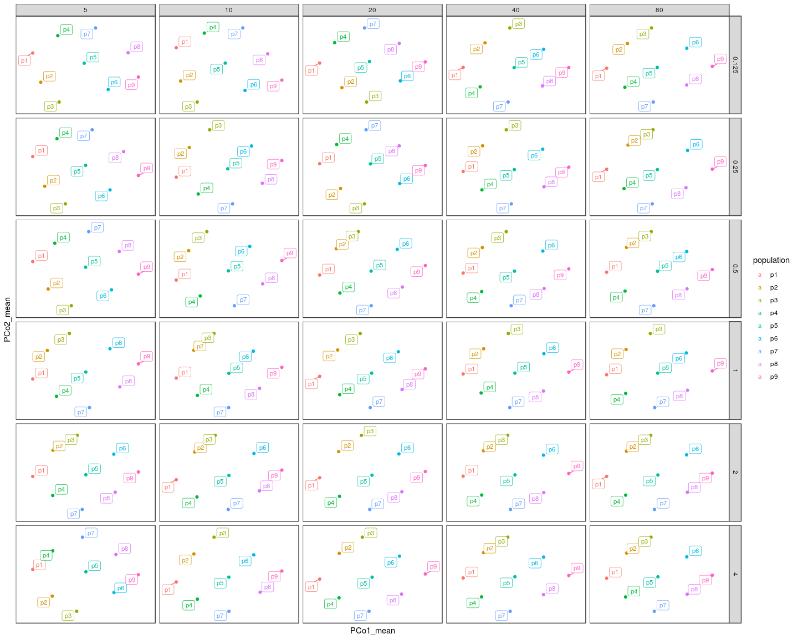<!-- -->

### Plot DAPC

``` r
ggplot(dapc_table_final,aes(x=LD1, y=LD2, color=population)) +
  geom_point() +
  facet_grid(coverage~sample_size, scales="free") +
  theme_bw() +
  theme(panel.grid = element_blank(),
        axis.text = element_blank(),
        axis.ticks = element_blank())
```

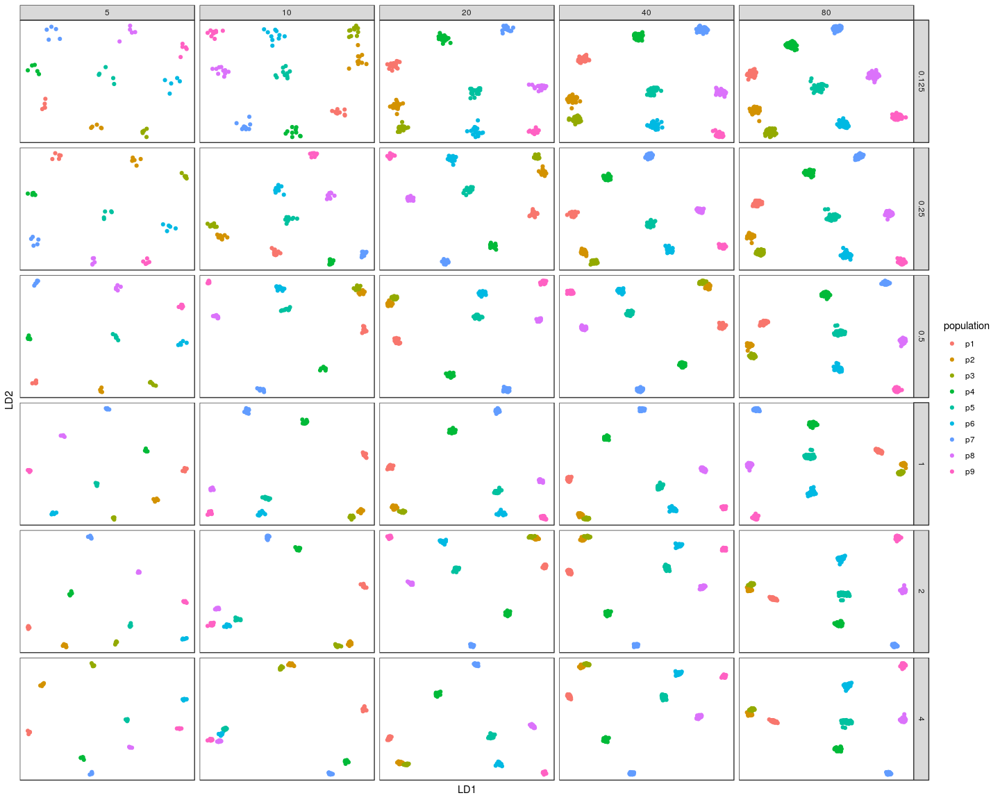<!-- -->

### Plot DAPC centroid

``` r
set.seed(1)
ggplot(dapc_table_final_per_pop, aes(x=LD1_mean, y=LD2_mean, color=population, label=population)) +
  geom_point() +
  geom_label_repel(size=3) +
  facet_grid(coverage~sample_size, scales="free") +
  ylim(c(-1.2, 1.2)) +
  xlim(c(-1.2, 1.2)) +
  theme_bw() +
  theme(panel.grid = element_blank(),
        axis.text = element_blank(),
        axis.ticks = element_blank())
```

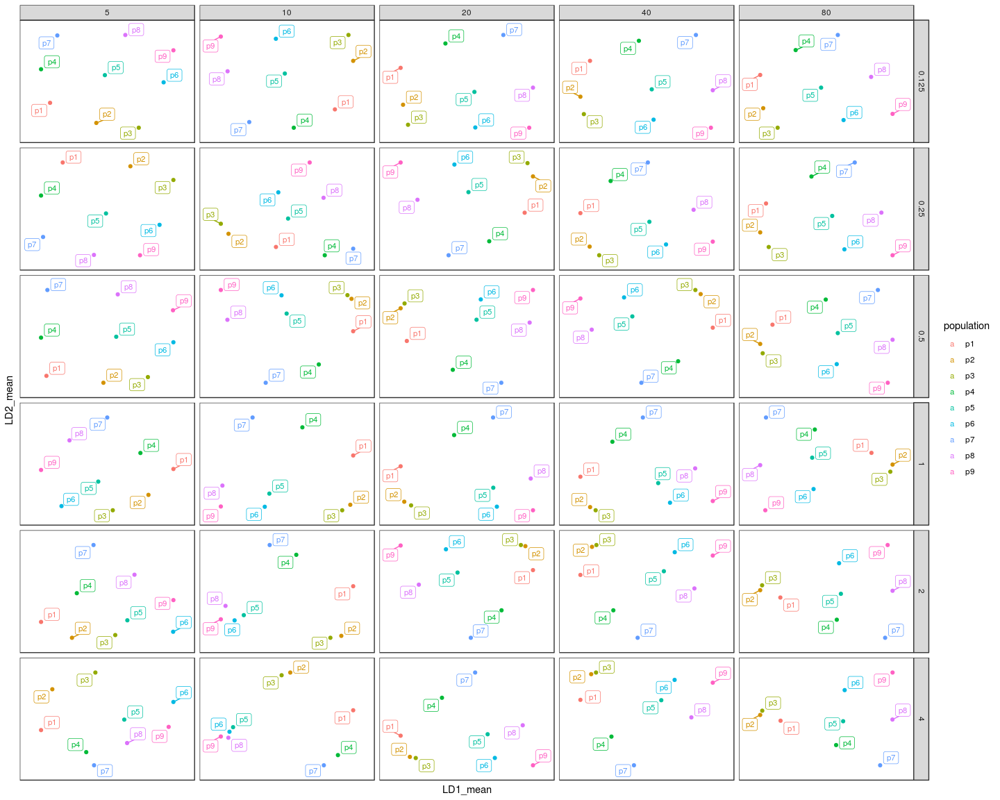<!-- -->
