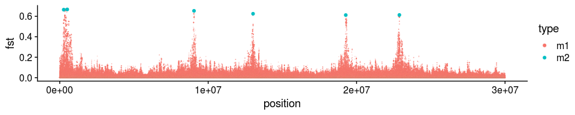
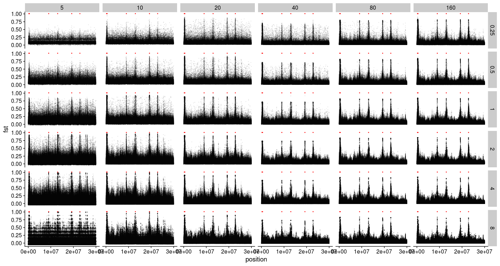
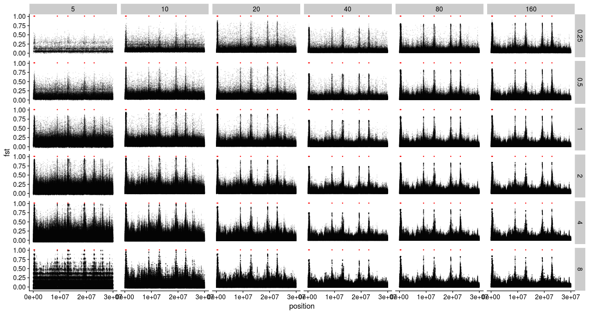
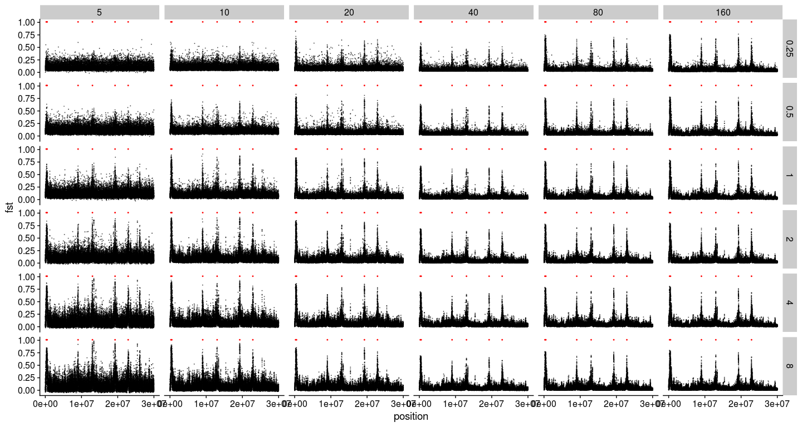

Data analysis with simulation of divergent selection on two populations
================

``` r
library(tidyverse)
library(cowplot)
library(knitr)
```

Read in the ancestral states
----------------------------

``` r
ancestral <- read_csv("../two_pop_sim/rep_1/slim/ancestral.fasta")[[1]] %>%
  str_split(pattern="") %>%
  .[[1]] %>%
  bind_cols(ancestral=., position=1:30000000)
```

Read mutation and substitution file
-----------------------------------

``` r
## Read in the mutation file outputted by SLiM
mutations <- read_delim("../two_pop_sim/rep_1/slim/mutations.txt", delim = " ", col_names = F) %>%
  transmute(population=X4, type=X6, position=X7+1, base=X13, frequency=X12/2000) %>%
  left_join(ancestral, by="position") %>%
  group_by(population, type, position, ancestral, base) %>%
  summarise(frequency=sum(frequency)) %>%
  ungroup()
## Read in the substitutions file outputted by SLiM
## This is necessary because mutations can happen again after one fixation, so frequencies from the mutation file do not always reflect the true derived allele frequency
substitutions <- read_delim("../two_pop_sim/rep_1/slim/substitutions.txt", delim = " ", skip=2, col_names = F) %>%
  transmute(type=X3, position=X4+1, base=X10, generation=X9, p1=1, p2=1) %>%
  group_by(type, position) %>%
  filter(generation==max(generation)) %>%
  ungroup() %>%
  left_join(ancestral, by="position") %>%
  select(-generation) %>%
  filter(base!=ancestral) %>%
  gather(key=population, value=frequency, 4:5) %>%
  arrange(position)
```

Data wrangling with the mutation file
-------------------------------------

The following steps are necessary because there are complications such as back mutations and triallelic loci in the mutation file

``` r
## Join mutations and substitutions in a temp table
mutations_final_temp <-  mutations %>%
  spread(key = base, value=frequency) %>%
  full_join(substitutions, by=c("position", "type", "ancestral", "population")) %>%
  arrange(position) %>%
  mutate(base=ifelse(is.na(base), ancestral, base)) %>%
  mutate_all(~replace(., is.na(.), 0)) %>%
  mutate(frequency=1-`A` -`C` -`G` -`T`)
## More wrangling
mutations_final <- mutations_final_temp[1:8] %>%
  gather(key=base, value=frequency, 5:8) %>%
  bind_rows(mutations_final_temp[c(1:4, 9:10)]) %>%
  mutate(frequency=ifelse(base==ancestral, 0, frequency)) %>%
  group_by(population, type, position, ancestral) %>%
  summarise(frequency=sum(frequency)) %>%
  ungroup() %>%
  spread(key=population, value=frequency) %>%
  mutate_all(~replace(., is.na(.), 0)) %>% 
  filter(!(p1==1 & p2==1), !(p1==0 & p2==0)) %>%
  mutate(frequency_mean = (p1 + p2)/2, h_t=2*frequency_mean*(1-frequency_mean), h_s=p1*(1-p1) + p2*(1-p2), fst=1-h_s/h_t)
```

Plot Fst
--------

``` r
mutations_final_m1 <- filter(mutations_final, type=="m1")
mutations_final_m2 <- filter(mutations_final, type=="m2")

ggplot(mutations_final_m1, aes(x=position, y=fst, color=type)) +
  geom_point(size=0.002, alpha=0.2) +
  geom_point(data=mutations_final_m2, aes(x=position, y=fst, color=type)) +
  theme_cowplot()
```



``` r
arrange(mutations_final, desc(fst)) %>%
  head()
```

    ## # A tibble: 6 x 9
    ##   type  position ancestral    p1     p2 frequency_mean   h_t   h_s   fst
    ##   <chr>    <dbl> <chr>     <dbl>  <dbl>          <dbl> <dbl> <dbl> <dbl>
    ## 1 m1      334662 T         0.912 0.0925          0.502 0.500 0.164 0.672
    ## 2 m1      334749 C         0.912 0.0925          0.502 0.500 0.164 0.672
    ## 3 m1      335051 C         0.912 0.0925          0.502 0.500 0.164 0.672
    ## 4 m1      335133 A         0.912 0.0925          0.502 0.500 0.164 0.672
    ## 5 m1      335168 T         0.912 0.0925          0.502 0.500 0.164 0.672
    ## 6 m1      335176 G         0.912 0.0925          0.502 0.500 0.164 0.672

``` r
arrange(mutations_final_m2, desc(fst))
```

    ## # A tibble: 6 x 9
    ##   type  position ancestral    p1     p2 frequency_mean   h_t   h_s   fst
    ##   <chr>    <dbl> <chr>     <dbl>  <dbl>          <dbl> <dbl> <dbl> <dbl>
    ## 1 m2      504938 G         0.907 0.09            0.498 0.500 0.166 0.667
    ## 2 m2      268156 C         0.908 0.092           0.500 0.500 0.167 0.665
    ## 3 m2     9045863 G         0.902 0.093           0.497 0.500 0.173 0.654
    ## 4 m2    13023902 A         0.884 0.0935          0.489 0.500 0.187 0.625
    ## 5 m2    22882398 T         0.880 0.0965          0.488 0.500 0.193 0.613
    ## 6 m2    19270270 G         0.890 0.108           0.499 0.500 0.194 0.612

Read in read depth and estimated Fst
------------------------------------

``` r
i=1
for (coverage in c(0.25,0.5,1,2,4,8)){
  for (sample_size in c(5,10,20,40,80)){
    ## read in estimated fst
    fst <- read_tsv(paste0("../two_pop_sim/rep_1/angsd/bam_list_", sample_size, "_", coverage, "x.fst"), col_names = F) %>%
      transmute(position=X2, alpha=X3, beta=X4, fst=X5, coverage=coverage, sample_size=sample_size)
    ## read per population depth
    p1_depth <- read_tsv(paste0("../two_pop_sim/rep_1/angsd/bam_list_p1_", sample_size, "_", coverage, "x.pos.gz")) %>%
      transmute(position=pos, p1_depth=totDepth)
    p2_depth <- read_tsv(paste0("../two_pop_sim/rep_1/angsd/bam_list_p2_", sample_size, "_", coverage, "x.pos.gz")) %>%
      transmute(position=pos, p2_depth=totDepth)
    ## join fst with depth_files
    fst_depth <- left_join(fst, p1_depth, by="position") %>%
      left_join(p2_depth, by="position")
    ## compile the final files for plotting
    if (i==1){
      fst_depth_final <- fst_depth
    } else {
      fst_depth_final <- bind_rows(fst_depth, fst_depth_final)
    }
    i=i+1
  }
}
```

Plot the estimated per-SNP Fst (with no depth filter)
-----------------------------------------------------

``` r
ggplot(fst_depth_final, aes(x=position, y=fst)) +
  geom_point(alpha=0.1, size=0.1) +
  geom_point(data=mutations_final_m2, aes(x=position, y=1.01), color="red", size=0.2, shape=8) +
  facet_grid(coverage~sample_size) +
  theme_cowplot()
```



Plot the estimated per-SNP Fst (with minimum depth filter = 5)
--------------------------------------------------------------

``` r
filter(fst_depth_final, p1_depth>=5, p2_depth>=5) %>%
  ggplot(aes(x=position, y=fst)) +
    geom_point(alpha=0.1, size=0.1) +
    geom_point(data=mutations_final_m2, aes(x=position, y=1.01), color="red", size=0.2, shape=8) +
    facet_grid(coverage~sample_size) +
    theme_cowplot()
```



Compute and plot the estimated windowed Fst (with no depth filter and 1000bp fixed windows)
-------------------------------------------------------------------------------------------

``` r
fixed_windowed_fst <- function(x, window_length){
  mutate(x, position=cut(position, 
                         breaks=seq(0,40*10^6,window_length),
                         labels=seq(window_length/2,40*10^6-window_length/2,window_length))) %>%
    group_by(position, coverage, sample_size) %>%
    summarise(fst=sum(alpha)/sum(beta)) %>%
    ungroup() %>%
    mutate(position=as.numeric(as.character(position)))
}
fixed_windowed_fst(fst_depth_final, 1000) %>%
  ggplot(aes(x=position, y=fst)) +
    geom_point(alpha=0.5, size=0.1) +
    geom_point(data=mutations_final_m2, aes(x=position, y=1.01), color="red", size=0.2, shape=8) +
    facet_grid(coverage~sample_size) +
    theme_cowplot()
```


