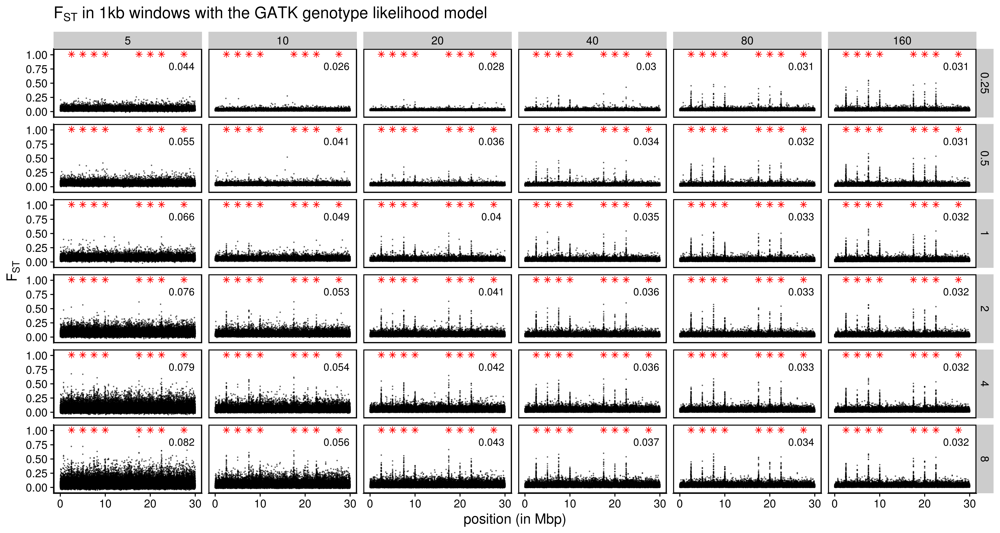

```{r setup, include=FALSE}
knitr::opts_chunk$set(echo = TRUE)
```

```{r eval=T, warning=F, message=F}
library(tidyverse)
library(cowplot)
library(knitr)
library(data.table)
library(RcppCNPy)
```

# Define all relevant functions

```{r eval=T, warning=F, message=F}
source("../misc/two_pop_functions.R")
```

# Standard model (Ne~50,000 in each population)

## The model

### Read in the ancestral states

```{r eval=T, warning=F, message=F}
ancestral <- get_ancestral("../two_pop_sim_fixed_m2_pos/rep_1/")
```

### Read mutation and substitution file

The target theta is ~ 0.004.

```{r eval=T, warning=F, message=F, fig.height=4, fig.width=10}
mutations_final <- get_mutations("../two_pop_sim_fixed_m2_pos/rep_1/")
mutations_final_m1 <- filter(mutations_final, type=="m1")
mutations_final_m2 <- filter(mutations_final, type=="m2")
real_theta_t_p1 <- sum(2*mutations_final$p1*(1-mutations_final$p1))/30000000
real_theta_t_p2 <- sum(2*mutations_final$p2*(1-mutations_final$p2))/30000000
real_theta_t_combined <- sum(2*mutations_final$frequency_mean*(1-mutations_final$frequency_mean))/30000000
real_theta_w_p1 <- filter(mutations_final, p1 > 0, p1 < 1) %>%
  nrow() %>% `/`(30000000*sum(1/(1:(5000*2-1))))
real_theta_w_p2 <- filter(mutations_final, p2 > 0, p2 < 1) %>%
  nrow() %>% `/`(30000000*sum(1/(1:(5000*2-1))))
real_theta_w_combined <- nrow(mutations_final) / (30000000*sum(1/(1:(10000*2-1))))
tibble(theta = c("tajima", "watterson"), 
       p1 = c(real_theta_t_p1, real_theta_w_p1), 
       p2 = c(real_theta_t_p2, real_theta_w_p2),
       combined = c(real_theta_t_combined, real_theta_w_combined)) %>% 
  kable()
## p1 SFS
filter(mutations_final, p1 > 0, p1 < 1) %>%
  mutate(p1 = round(p1, 4)) %>%
  count(p1) %>%
  ggplot(aes(x=p1, y=n)) +
  geom_line() +
  geom_point(size=1) +
  theme_cowplot()
## p2 SFS
filter(mutations_final, p2 > 0, p2 < 1) %>%
  mutate(p2 = round(p2, 4)) %>%
  count(p2) %>%
  ggplot(aes(x=p2, y=n)) +
  geom_line() +
  geom_point(size=1) +
  theme_cowplot()
```

`theta_w` is much lower than `theta_p` in p1 and p2, presumably because selection has strongly reduced the effective migration between the two populations, creating a genome-wide pattern of population contraction when each population is evaluated separately. 

### Plot Fst

The target mean neutral Fst is ~ 0.015 and the target peak Fst is ~ 0.6 (based on cod data). The expected neutral Fst is `1/(1+16Nm)` = 0.01234, but because of the selection stage, I expect Fst to be slightly higher than this theoretical expectation.

I used `mean(h_s)/mean(h_t)` to calculate average Fst. I am not sure if this estimator is biased though.

```{r eval=T, warning=F, message=F, fig.height=2, fig.width=10}
## genome-wide mean fst
summarise(mutations_final, average_fst = 1-mean(h_s)/mean(h_t))
## "neutral" mean fst (mean fst at both end of the genome that is not strongly affected by linkage with selected regions)
filter(mutations_final, position <= 1000000 | position >= 29000000) %>% summarise(average_fst = 1-mean(h_s)/mean(h_t))

ggplot(mutations_final_m1, aes(x=position, y=fst, color=type)) +
  geom_point(size=0.02, alpha=0.5) +
  geom_point(data=mutations_final_m2, aes(x=position, y=fst, color=type)) +
  theme_cowplot()

arrange(mutations_final, desc(fst)) %>%
  head()
arrange(mutations_final_m2, desc(fst))
```

### Plot Fst from the Greenland cod project as a comparison

```{r eval=FALSE, warning=F, message=F, fig.height=2, fig.width=10}
fst <- read_tsv("../../cod/greenland-cod/angsd/popminind2/ILU2011_UUM2010_bam_list_realigned_mindp161_maxdp768_minind97_minq20_popminind2.fst", col_names = F) %>%
  rename(lg=X1, position=X2, alpha=X3, beta=X4, fst=X5)
## LG03
filter(fst, lg=="LG03") %>%
ggplot(aes(x=position, y=fst)) +
  geom_point(size=0.02, alpha=0.5) +
  theme_cowplot()
## LG08
filter(fst, lg=="LG08") %>%
ggplot(aes(x=position, y=fst)) +
  geom_point(size=0.02, alpha=0.5) +
  theme_cowplot()
## LG19
filter(fst, lg=="LG19") %>%
ggplot(aes(x=position, y=fst)) +
  geom_point(size=0.02, alpha=0.5) +
  theme_cowplot()
## Mean Fst at LG19
filter(fst, lg=="LG19") %>% summarise(mean_fst_neutral=sum(alpha)/sum(beta))
```

## Inference with Samtool's GL model

### Read in read depth and estimated Fst

```{r eval=F, warning=F, message=F}
fst_n_ind_final <- get_estimated_fst("../two_pop_sim_fixed_m2_pos/rep_1/")
```

### Plot genome-wide average Fst (with no minimum individual filter)

```{r eval=F, warning=F, message=F, fig.height=4, fig.width=6}
group_by(fst_n_ind_final, sample_size, coverage) %>%
  count() %>%
  pivot_wider(names_from = sample_size, values_from = n)
average_fst <- fst_n_ind_final %>%
  group_by(coverage, sample_size) %>%
  summarise(average_fst = sum(alpha)/sum(beta)) 
average_fst_plot <- average_fst %>%
  ggplot(aes(x=as.factor(sample_size), y=as.factor(coverage), fill=average_fst, label=round(average_fst, 4))) +
  geom_tile() +
  geom_text() +
  scale_fill_viridis_c() +
  theme_cowplot()
ggsave("../figures/two_pop_sim_fixed_m2_pos_average_fst_raw.png", average_fst_plot, height = 4, width=6, units = "in")
```

```{r}
include_graphics("../figures/two_pop_sim_fixed_m2_pos_average_fst_raw.png")
```

* Although Fst is quite consistently estimated, these estimations are much higher than the true value (~0.013). This may cause problems when estimated Fst is used to infer demography, such as migration rate between populations. The relative value of these genome-wide Fst, however, may still be trusted. 

* I also tried to get average Fst only from neutral regions on the genome, but that didn't help much. At high coverage and high sample size, the estimated Fst is around 0.029, still much higher than the true value.

* Also, at smaller sample size, Fst tends to be even more overestimated. This is consistent with empircal data. But couterintuitively, higher coverage makes the problem worse in such cases. We'll need to look into this further. 

### Plot the estimated per-SNP Fst (with no minimum individual filter)

```{r eval=F, warning=F, message=F, fig.height=8, fig.width=15}
fst_plot <- ggplot(fst_n_ind_final, aes(x=position, y=fst)) +
  geom_point(alpha=0.1, size=0.1) +
  geom_point(data=mutations_final_m2, aes(x=position, y=1.01), color="red", size=0.2, shape=8) +
  facet_grid(coverage~sample_size) +
  theme_cowplot()
ggsave("../figures/two_pop_sim_fixed_m2_pos_fst_raw.png", fst_plot, height = 8, width=15, units = "in")
```

```{r}
include_graphics("../figures/two_pop_sim_fixed_m2_pos_fst_raw.png")
```

### Plot genome-wide average Fst (with minimum individual filter)

I am doing this to help Matt check whether filtering can introduce systematic changes in genome-wide average Fst estimation. There doesn't appear to be any systematic bias caused by filtering in here. However, mapping is not simulated here, and differential mapping at high Fst regions may cause systematic biases. 

```{r eval=F, warning=F, message=F, fig.height=4, fig.width=6}
fst_n_ind_final_filtered <- group_by(fst_n_ind_final, coverage, sample_size) %>%
  filter(p1_n_ind >= quantile(p1_n_ind)[4], p2_n_ind >= quantile(p2_n_ind)[4]) # filtering n_ind by the third quantile
count(fst_n_ind_final_filtered) %>%
  pivot_wider(names_from = sample_size, values_from = n)
average_fst_plot <- fst_n_ind_final_filtered %>%
  summarise(average_fst = sum(alpha)/sum(beta)) %>%
  ggplot(aes(x=as.factor(sample_size), y=as.factor(coverage), fill=average_fst, label=round(average_fst, 4))) +
  geom_tile() +
  geom_text() +
  scale_fill_viridis_c() +
  theme_cowplot()
ggsave("../figures/two_pop_sim_fixed_m2_pos_filtered_average_fst_raw.png", average_fst_plot, height = 4, width=6, units = "in")
```

```{r}
include_graphics("../figures/two_pop_sim_fixed_m2_pos_filtered_average_fst_raw.png")
```

### Plot the estimated per-SNP Fst (with minimum individual filter)

```{r eval=F, warning=F, message=F, fig.height=8, fig.width=15}
filtered_fst_plot <- fst_n_ind_final_filtered %>%
  ggplot(aes(x=position, y=fst)) +
    geom_point(alpha=0.1, size=0.1) +
    geom_point(data=mutations_final_m2, aes(x=position, y=1.01), color="red", size=0.2, shape=8) +
    facet_grid(coverage~sample_size) +
    theme_cowplot()
ggsave("../figures/two_pop_sim_fixed_m2_pos_filtered_fst_raw.png", filtered_fst_plot, height = 8, width=15, units = "in")
```

```{r}
include_graphics("../figures/two_pop_sim_fixed_m2_pos_filtered_fst_raw.png")
```

### Compute and plot the estimated windowed Fst (with no minimum individual filter and 1,000bp fixed windows)

```{r eval=F, warning=F, message=F, fig.height=8, fig.width=15}
windowed_fst_plot <- fixed_windowed_fst(fst_n_ind_final, 1000) %>%
  ggplot(aes(x=position/10^6, y=fst)) +
  geom_point(alpha=0.5, size=0.1) +
  geom_point(data=mutations_final_m2, aes(x=position/10^6, y=1.01), color="red", size=2, shape=8) +
  geom_text(data=average_fst,x=27, y=0.8, aes(label=round(average_fst,3))) +
  ylim(NA, 1.05) +
  labs(x = "position (in Mbp)", y = expression(F[ST])) + 
  facet_grid(coverage~sample_size) +
  ggtitle(expression(paste(F[ST], " in 1kb windows with the Samtools genotype likelihood model"))) +
  theme_cowplot() +
  theme(panel.border = element_rect(colour = "black", fill=NA, size=1),
        title = element_text(size=15)) 
ggsave("../figures/two_pop_sim_fixed_m2_pos_windowed_fst_raw.png", windowed_fst_plot, height = 8, width=15, units = "in")
```

```{r}
include_graphics("../figures/two_pop_sim_fixed_m2_pos_windowed_fst_raw.png")
```

### Selection scan using PCAngsd

```{r eval=F, warning=F, message=F}
selection_scan <- get_selection_scan("/workdir/lcwgs-simulation/two_pop_sim_fixed_m2_pos/rep_1/")
selection_scan_summary <- group_by(selection_scan, coverage, sample_size) %>%
  summarize(n_snp = n(), log_p_cutoff = -log(0.05/n_snp))
selection_scan_plot <- ggplot(selection_scan, aes(x = pos, y = neg_log_p_value)) +
  geom_point(alpha=0.5, size=0.1) +
  geom_point(data=mutations_final_m2, aes(x=position, y=27), color="red", size=0.2, shape=8) +
  geom_hline(data = selection_scan_summary, aes(yintercept = log_p_cutoff), linetype = "dashed") +
  facet_grid(coverage ~ sample_size) +
  theme_cowplot()
ggsave("../figures/two_pop_sim_fixed_m2_pos_selection_scan.png", selection_scan_plot, height = 8, width=15, units = "in")
```

```{r}
include_graphics("../figures/two_pop_sim_fixed_m2_pos_selection_scan.png")
```

### Selection scan using neutrality test stats

#### Read in the data

```{r eval=T, warning=F, message=F}
p1_neutrality_stats <- get_neutrality_stats("/workdir/lcwgs-simulation/two_pop_sim_fixed_m2_pos/rep_1/", "angsd")
```

#### Genome wide stats

###### SFS

```{r eval=T, warning=F, message=F, fig.height=12, fig.width=15}
i=1
for (coverage in c(0.25,0.5,1,2,4,8)){
  for (sample_size in c(5,10,20,40, 80, 160)){
    sfs <- scan(paste0("../two_pop_sim_fixed_m2_pos/rep_1/angsd/bam_list_p1_", sample_size, "_", coverage, "x_all_sites.sfs")) %>%
      enframe(name = frequency) %>%
      mutate(frequency=(0:(sample_size*2))/(sample_size*2), coverage=coverage, sample_size=sample_size)
    if (i==1){
      sfs_final <- sfs
    } else {
      sfs_final <- bind_rows(sfs_final, sfs)
    }
    i=i+1
  }
}
sfs_final_sum <- filter(sfs_final, frequency>0, frequency<1) %>%
  group_by(coverage, sample_size) %>%
  summarise(n=sum(value))
filter(sfs_final, frequency>0, frequency<1) %>%
  group_by(coverage, sample_size) %>%
  ggplot(aes(x=frequency, y=value)) +
  geom_point(size=0.5) +
  geom_line() +
  geom_text(data=sfs_final_sum, x=0.8, y=40000, aes(label=paste0("n=",round(n,0)))) +
  facet_grid(coverage~sample_size) +
  theme_cowplot()
```

###### Tajima's estimator

```{r eval=T, warning=F, message=F}
p1_neutrality_stats %>%
  group_by(coverage, sample_size) %>%
  summarise(t_p = round(sum(t_p) / sum(n_sites), 5)) %>%
  pivot_wider(names_from = sample_size, values_from = t_p) %>% 
  kable()
```

###### Watterson's estimator

```{r eval=T, warning=F, message=F}
p1_neutrality_stats %>%
  group_by(coverage, sample_size) %>%
  summarise(t_w = round(sum(t_w) / sum(n_sites), 5)) %>%
  pivot_wider(names_from = sample_size, values_from = t_w) %>% 
  kable()
```

Watterson's estimator is now overestimated at higher sample size and higher coverage. 

#### Window-based stats

###### Plot Tajima's D

```{r eval=F, warning=F, message=F}
p1_tajima_plot <- p1_neutrality_stats %>%
  arrange(coverage, sample_size) %>%
  #mutate(coverage=str_c("coverage = ", coverage), sample_size=str_c("sample size = ", sample_size)) %>%
  mutate(design=str_c(coverage, "x coverage, ", sample_size, " samples")) %>%
  mutate(design=as_factor(design)) %>%
  ggplot(aes(x = pos/10^6, y = tajima)) +
  geom_vline(data=mutations_final_m2, aes(xintercept=position/10^6), color="red", size=1, alpha=0.5) +
  geom_point(alpha=1, size=1) +
  facet_wrap(~ design, scales = "free_y", nrow = 6) +
  theme_cowplot() +
  theme(panel.border = element_rect(colour = "black", fill=NA, size=1)) +
  labs(x="position (in Mbp)", y="Tajima's D")
ggsave("../figures/two_pop_sim_fixed_m2_pos_p1_tajima_d.png", p1_tajima_plot, height = 10, width=17, units = "in")
```

```{r, fig.height=6, fig.width=11}
include_graphics("../figures/two_pop_sim_fixed_m2_pos_p1_tajima_d.png")
## for presentation
p1_neutrality_stats %>%
  filter(sample_size %in% c(10, 20, 40, 80), 
         coverage %in% c(0.25, 0.5, 1, 2)) %>%
  arrange(coverage, sample_size) %>%
  #mutate(coverage=str_c("coverage = ", coverage), sample_size=str_c("sample size = ", sample_size)) %>%
  mutate(design=str_c(coverage, "x coverage, ", sample_size, " samples")) %>%
  mutate(design=as_factor(design)) %>%
  ggplot(aes(x = pos/10^6, y = tajima)) +
  geom_vline(data=mutations_final_m2, aes(xintercept=position/10^6), color="red", size=1, alpha=0.5) +
  geom_point(alpha=1, size=1) +
  facet_wrap(~ design, scales = "free_y", nrow = 4) +
  theme_cowplot() +
  theme(panel.border = element_rect(colour = "black", fill=NA, size=1)) +
  labs(x="position (in Mbp)", y="Tajima's D")
```

###### Plot Fay and Wu's H

```{r eval=F, warning=F, message=F}
p1_fayh_plot <- p1_neutrality_stats %>%
  arrange(coverage, sample_size) %>%
  #mutate(coverage=str_c("coverage = ", coverage), sample_size=str_c("sample size = ", sample_size)) %>%
  mutate(design=str_c(coverage, "x coverage, ", sample_size, " samples")) %>%
  mutate(design=as_factor(design)) %>%
  ggplot(aes(x = pos/10^6, y = fayh)) +
  geom_vline(data=mutations_final_m2, aes(xintercept=position/10^6), color="red", size=1, alpha=0.5) +
  geom_point(alpha=1, size=1) +
  facet_wrap(~ design, scales = "free_y", nrow = 6) +
  theme_cowplot() +
  theme(panel.border = element_rect(colour = "black", fill=NA, size=1)) +
  labs(x="position (in Mbp)", y="Fay and Wu's H")
ggsave("../figures/two_pop_sim_fixed_m2_pos_p1_fay_h.png", p1_fayh_plot, height = 10, width=17, units = "in")
```

```{r}
include_graphics("../figures/two_pop_sim_fixed_m2_pos_p1_fay_h.png")
```

## Inference with GATK's GL model


#### Chromosome-average Fst

```{r eval=F, warning=F, message=F}
fst_windowed_final_gatk <- get_estimated_windowed_fst_gatk("../two_pop_sim_fixed_m2_pos/rep_1/", 1000)
average_fst_gatk <- fst_windowed_final_gatk %>%
  group_by(coverage, sample_size) %>%
  summarize(average_fst = sum(alpha) / sum(beta)) 
average_fst_gatk_plot <- average_fst_gatk %>%
  ggplot(aes(x=as.factor(sample_size), y=as.factor(coverage), fill=average_fst, label=round(average_fst, 4))) +
  geom_tile() +
  geom_text() +
  scale_fill_viridis_c() +
  theme_cowplot()
ggsave("../figures/two_pop_sim_fixed_m2_pos_average_fst_gatk.png", average_fst_gatk_plot, height = 4, width=6, units = "in")
```

```{r}
include_graphics("../figures/two_pop_sim_fixed_m2_pos_average_fst_gatk.png")
```

#### Fst in 1000bp windows

```{r eval=F, warning=F, message=F}
windowed_fst_plot <- fst_windowed_final_gatk %>%
  ggplot(aes(x=position/10^6, y=fst)) +
  geom_point(alpha=0.5, size=0.1) +
  geom_point(data=mutations_final_m2, aes(x=position/10^6, y=1.01), color="red", size=2, shape=8) +
  geom_text(data=average_fst_gatk,x=27, y=0.8, aes(label=round(average_fst,3))) +
  ylim(NA, 1.05) +
  labs(x = "position (in Mbp)", y = expression(F[ST])) + 
  facet_grid(coverage~sample_size) +
  ggtitle(expression(paste(F[ST], " in 1kb windows with the GATK genotype likelihood model"))) +
  theme_cowplot() +
  theme(panel.border = element_rect(colour = "black", fill=NA, size=1),
        title = element_text(size=15)) 
ggsave("../figures/two_pop_sim_fixed_m2_pos_windowed_fst_gatk.png", windowed_fst_plot, height = 8, width=15, units = "in")
```

```{r}

```

In general, these Fst results are very similar to those from the Samtools GL model.

## RAD seq simulation and inference 

To simulate RAD-seq, I assumed that the genotype calling is perfectly accurate (i.e. sequence depth is high). I then took random samples along the chromosome representing RAD tags.  

### Get true sample allele count

```{r eval=F, warning=F, message=F}
get_sample_allele_count_per_pop("../two_pop_sim_fixed_m2_pos/rep_1/")
fst_all_snps <- allele_count_to_fst("/workdir/lcwgs-simulation/two_pop_sim_fixed_m2_pos/rep_1/")
write_tsv(fst_all_snps, "/workdir/lcwgs-simulation/two_pop_sim_fixed_m2_pos/rep_1/slim/fst_all_snps.tsv")
```

### Get the true SFS and theta estimators with population samples in p1

```{r eval=T, warning=F, message=F}
fst_all_snps <- read_tsv("/workdir/lcwgs-simulation/two_pop_sim_fixed_m2_pos/rep_1/slim/fst_all_snps.tsv")
## SFS
group_by(fst_all_snps, sample_size) %>%
  filter(p1>0, p1<1) %>%
  count(p1) %>%
  ggplot(aes(x=p1, y=n)) +
  geom_line() +
  geom_point() +
  theme_cowplot() +
  facet_wrap(~sample_size)
## theta_p
group_by(fst_all_snps, sample_size) %>%
  filter(p1>0, p1<1) %>%
  summarise(theta_p = 2 * sum(p1*(1-p1)) / 30000000,
            theta_w = n() / 30000000 / sum(1/1:(2*sample_size-1)))
```

### Get sample true MAF and Fst from allele counts

Each RAD tag is 150 bp. Note that `n_rad_tag` are numbers of RAD tags per Mbp. According to the "Breaking RAD" paper, the median RAD tag density that they've found in studies published by then is 4.08. A few studies had up to 20 tags per Mbp, three had up to 110 per Mbp, and one had 362 tags per Mbp.

```{r eval=T, warning=F, message=F}
i <- 1
for (n in c(1,2,4,8,16,32)*120){
  maf <- subset_fst(n_rad_tag = n, combined_fst = fst_all_snps) %>%
    mutate(n_rad_tag = n/30)
  if (i == 1){
    maf_final <- maf
  } else {
    maf_final <- bind_rows(maf_final, maf)
  }
  i <- i + 1
}
```

### Chromosome-wide stats

#### Plot SFS in p1 from RAD data

```{r eval=T, warning=F, message=F, fig.height=8, fig.width=15}
count(maf_final, p1, sample_size, n_rad_tag) %>%
  filter(p1>0, p1<1) %>%
  ggplot(aes(x=p1, y=n)) +
  geom_point(size=0.5) +
  geom_line(size=0.2) +
  facet_grid(n_rad_tag~sample_size, scales = "free_y") +
  theme_cowplot()
```

#### Tajima's estimator

```{r eval=T}
group_by(maf_final, sample_size, n_rad_tag) %>%
  summarise(theta_t = 2 * sum(p1 * (1 - p1)) / unique(n_sites)) %>%
  pivot_wider(names_from = sample_size, values_from = theta_t) %>%
  kable()
```

#### Watterson's estimator

```{r eval=T}
filter(maf_final, p1 > 0, p1 < 1) %>%
  group_by(sample_size, n_rad_tag) %>%
  summarize(theta_w = n() / (unique(n_sites)*sum(1/(1:(unique(sample_size)*2-1))))) %>%
  pivot_wider(names_from = sample_size, values_from = theta_w) %>%
  kable()
```


### Plot per SNP Fst

```{r eval=T, warning=F, message=F, fig.height=8, fig.width=15}
mutate(maf_final, coverage="RAD") %>%
  filter(maf_mean>0.05, maf_mean < 0.95) %>%
  ggplot(aes(x=position, y=fst)) +
    geom_point(alpha=0.5, size=0.2) +
    geom_point(data=mutations_final_m2, aes(x=position, y=1.01), color="red", size=0.2, shape=8) +
    facet_grid(n_rad_tag~sample_size) +
    theme_cowplot()
```

