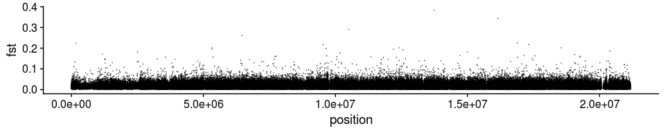
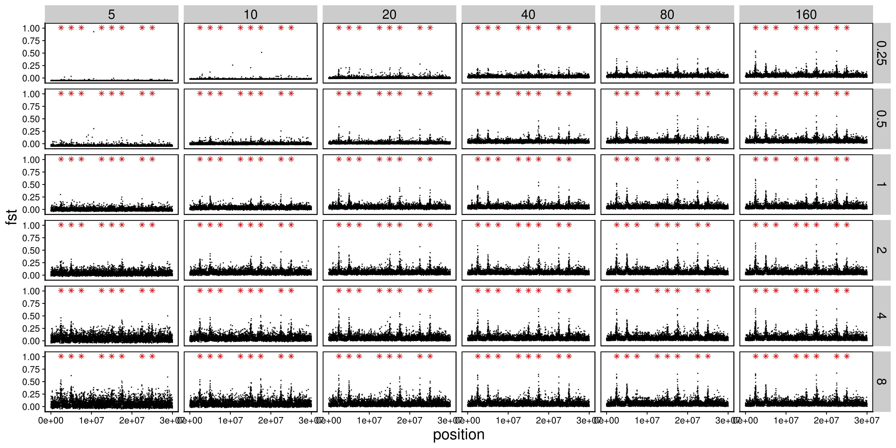

Data analysis with simulation of divergent selection on two populations
================

  - [Define all relevant functions](#define-all-relevant-functions)
  - [Standard model ( Ne\~50,000 in each
    population)](#standard-model-ne50000-in-each-population)
      - [Read in the ancestral states](#read-in-the-ancestral-states)
      - [Read mutation and substitution
        file](#read-mutation-and-substitution-file)
      - [Plot Fst](#plot-fst)
      - [Plot Fst from the Greenland cod project as a
        comparison](#plot-fst-from-the-greenland-cod-project-as-a-comparison)
      - [Read in read depth and estimated
        Fst](#read-in-read-depth-and-estimated-fst)
      - [Plot genome-wide average Fst (with no minimum individual
        filter)](#plot-genome-wide-average-fst-with-no-minimum-individual-filter)
      - [Plot the estimated per-SNP Fst (with no minimum individual
        filter)](#plot-the-estimated-per-snp-fst-with-no-minimum-individual-filter)
      - [Plot genome-wide average Fst (with minimum individual
        filter)](#plot-genome-wide-average-fst-with-minimum-individual-filter)
      - [Plot the estimated per-SNP Fst (with minimum individual
        filter)](#plot-the-estimated-per-snp-fst-with-minimum-individual-filter)
      - [Compute and plot the estimated windowed Fst (with no minimum
        individual filter and 1,000bp fixed
        windows)](#compute-and-plot-the-estimated-windowed-fst-with-no-minimum-individual-filter-and-1000bp-fixed-windows)
      - [Selection scan using PCAngsd](#selection-scan-using-pcangsd)
  - [RAD seq simulation with lower selection and lower
    recombination](#rad-seq-simulation-with-lower-selection-and-lower-recombination)
      - [Get true sample allele count](#get-true-sample-allele-count)
      - [Get sample true MAF and Fst from allele
        counts](#get-sample-true-maf-and-fst-from-allele-counts)
      - [Plot per SNP Fst](#plot-per-snp-fst)
  - [Two populations with divergent selection, with smaller population
    size ( Ne\~10,000 in each
    population)](#two-populations-with-divergent-selection-with-smaller-population-size-ne10000-in-each-population)
      - [Read in the ancestral states](#read-in-the-ancestral-states-1)
      - [Read mutation and substitution
        file](#read-mutation-and-substitution-file-1)
      - [Plot Fst](#plot-fst-1)
      - [Read in read depth and estimated
        Fst](#read-in-read-depth-and-estimated-fst-1)
      - [Plot the estimated per-SNP Fst (with no minimum individual
        filter)](#plot-the-estimated-per-snp-fst-with-no-minimum-individual-filter-1)
      - [Compute and plot the estimated windowed Fst (with no minimum
        individual filter and 1,000bp fixed
        windows)](#compute-and-plot-the-estimated-windowed-fst-with-no-minimum-individual-filter-and-1000bp-fixed-windows-1)
      - [Selection scan using PCAngsd](#selection-scan-using-pcangsd-1)
  - [RAD seq simulation with lower selection and lower
    recombination](#rad-seq-simulation-with-lower-selection-and-lower-recombination-1)
      - [Get true sample allele count](#get-true-sample-allele-count-1)
      - [Get sample true MAF and Fst from allele
        counts](#get-sample-true-maf-and-fst-from-allele-counts-1)
      - [Plot per SNP Fst](#plot-per-snp-fst-1)

``` r
library(tidyverse)
library(cowplot)
library(knitr)
library(data.table)
library(RcppCNPy)
```

# Define all relevant functions

``` r
get_ancestral <- function(x){
  read_csv(paste0(x,"slim/ancestral.fasta"), col_types = cols())[[1]] %>%
    str_split(pattern="") %>%
    .[[1]] %>%
    bind_cols(ancestral=., position=1:30000000)
}

get_mutations <- function(x){
  ## Read in the mutation file outputted by SLiM
  mutations <- read_delim(paste0(x, "slim/mutations.txt"), delim = " ", col_names = F, col_types = cols()) %>%
    transmute(population=X4, type=X6, position=X7+1, base=X13, frequency=X12/10000) %>%
    left_join(ancestral, by="position") %>%
    group_by(population, type, position, ancestral, base) %>%
    summarise(frequency=sum(frequency)) %>%
    ungroup()
  ## Read in the substitutions file outputted by SLiM
  ## This is necessary because mutations can happen again after one fixation, so frequencies from the mutation file do not always reflect the true derived allele frequency
  substitutions <- read_delim(paste0(x,"slim/substitutions.txt"), delim = " ", skip=2, col_names = F, col_types = cols()) %>%
    transmute(type=X3, position=X4+1, base=X10, generation=X9, p1=1, p2=1) %>%
    group_by(type, position) %>%
    filter(generation==max(generation)) %>%
    ungroup() %>%
    left_join(ancestral, by="position") %>%
    select(-generation) %>%
    filter(base!=ancestral) %>%
    gather(key=population, value=frequency, 4:5) %>%
    arrange(position)
  ## The following steps are necessary because there are complications such as back mutations and triallelic loci in the mutation file
  ## Join mutations and substitutions in a temp table
  mutations_final_temp <-  mutations %>%
    spread(key = base, value=frequency) %>%
    full_join(substitutions, by=c("position", "type", "ancestral", "population")) %>%
    arrange(position) %>%
    mutate(base=ifelse(is.na(base), ancestral, base)) %>%
    mutate_all(~replace(., is.na(.), 0)) %>%
    mutate(frequency=1-`A` -`C` -`G` -`T`)
  ## More wrangling
  mutations_final <- mutations_final_temp[1:8] %>%
    gather(key=base, value=frequency, 5:8) %>%
    bind_rows(mutations_final_temp[c(1:4, 9:10)]) %>%
    mutate(frequency=ifelse(base==ancestral, 0, frequency)) %>%
    group_by(population, type, position, ancestral) %>%
    summarise(frequency=sum(frequency)) %>%
    ungroup() %>%
    spread(key=population, value=frequency) %>%
    mutate_all(~replace(., is.na(.), 0)) %>% 
    filter(!(p1==1 & p2==1), !(p1==0 & p2==0)) %>%
    mutate(frequency_mean = (p1 + p2)/2, h_t=2*frequency_mean*(1-frequency_mean), h_s=p1*(1-p1) + p2*(1-p2), fst=1-h_s/h_t)
  return(mutations_final)
}

get_estimated_fst <- function(x){
  i=1
  for (coverage in c(0.25,0.5,1,2,4,8)){
    for (sample_size in c(5,10,20,40,80, 160)){
      ## read in estimated fst
      fst <- read_tsv(paste0(x, "angsd/bam_list_", sample_size, "_", coverage, "x.fst"), col_names = F, col_types = cols()) %>%
        transmute(position=X2, alpha=X3, beta=X4, fst=X5, coverage=coverage, sample_size=sample_size)
      ## read per population depth
      p1_n_ind <- read_tsv(paste0(x, "angsd/bam_list_p1_", sample_size, "_", coverage, "x.mafs.gz"), col_types = cols()) %>%
        transmute(position=position, p1_n_ind=nInd)
      p2_n_ind <- read_tsv(paste0(x, "angsd/bam_list_p2_", sample_size, "_", coverage, "x.mafs.gz"), col_types = cols()) %>%
        transmute(position=position, p2_n_ind=nInd)
      ## join fst with depth_files
      fst_n_ind <- left_join(fst, p1_n_ind, by="position") %>%
        left_join(p2_n_ind, by="position")
      ## compile the final files for plotting
      if (i==1){
        fst_n_ind_final <- fst_n_ind
      } else {
        fst_n_ind_final <- bind_rows(fst_n_ind_final, fst_n_ind)
      }
      i=i+1
    }
  }
  return(fst_n_ind_final)
}

fixed_windowed_fst <- function(x, window_length){
  mutate(x, position=cut(position, 
                         breaks=seq(0,40*10^6,window_length),
                         labels=seq(window_length/2,40*10^6-window_length/2,window_length))) %>%
    group_by(position, coverage, sample_size) %>%
    summarise(fst=sum(alpha)/sum(beta)) %>%
    ungroup() %>%
    mutate(position=as.numeric(as.character(position)))
}
get_selection_scan <- function(x){
  i=1
  for (coverage in c(0.25,0.5,1,2,4,8)){
    for (sample_size in c(5,10,20,40,80, 160)){
      ## read in estimated fst
      genome_selection <- npyLoad(paste0(x, "angsd/pcagnsd_bam_list_", sample_size, "_", coverage, "x.selection.npy"))
      genome_selection_sites <- read_table(paste0(x, "angsd/pcagnsd_bam_list_", sample_size, "_", coverage, "x.sites"), col_names = F) %>%
        transmute(coverage = coverage, 
                  sample_size = sample_size,
                  pos = parse_integer(str_remove(X1, "rep_1_")), 
                  chi_squared = genome_selection[,1],
                  neg_log_p_value = -log(1-pchisq(chi_squared, df=1)))
      ## compile the final files for plotting
      if (i==1){
        genome_selection_sites_final <- genome_selection_sites
      } else {
        genome_selection_sites_final <- bind_rows(genome_selection_sites_final, genome_selection_sites)
      }
      i=i+1
    }
  }
  return(genome_selection_sites_final)
}
count_to_maf <- function(ancestral_allele, totA, totC, totG, totT){
  if(ancestral_allele == "A"){
    minor_allele_count <- max(totC, totG, totT)
  } else if(ancestral_allele == "C"){
    minor_allele_count <- max(totA, totG, totT)
  } else if(ancestral_allele == "G"){
    minor_allele_count <- max(totA, totC, totT)
  } else if(ancestral_allele == "T"){
    minor_allele_count <- max(totA, totC, totG)
  }
  maf <- minor_allele_count/sum(totA, totC, totG, totT)
  return(maf)
}
get_sample_allele_count_per_pop <- function(x){
  for (p in 1:2){
    i <- 1
    for (sample_id in 1:160){
      for (genome in 1:2){
        sequence <- read_csv(paste0(x, "fasta/p", p, "_derived_", sample_id, "_", genome, ".fasta"), col_types = cols())[[1]] %>%
          str_split(pattern="") %>%
          .[[1]] %>%
          tibble(base=., position=1:30000000, ancestral=ancestral$ancestral) %>%
          filter(position %in% mutations_final$position)
        allele_count <- transmute(sequence,
                                  A_count = ifelse(base=="A", 1, 0),
                                  C_count = ifelse(base=="C", 1, 0),
                                  G_count = ifelse(base=="G", 1, 0),
                                  T_count = ifelse(base=="T", 1, 0))
        if (i==1){
          allele_count_final <- allele_count
        } else {
          allele_count_final <- allele_count + allele_count_final
        }
        i <- i+1
      }
      if (sample_id %in% c(5,10,20,40,80,160)){
        write_tsv(bind_cols(select(sequence, -base), allele_count_final), paste0(x,"slim/p", p, "_", sample_id, "_base_count.tsv")) 
      }
    }
  }
}
allele_count_to_fst <- function(x, n_rad_tag){
  set.seed(1)
  rad_intervals <- sample(1:(30000000-150), n_rad_tag) %>%
    tibble(start=., stop=.+150) %>%
    arrange(by=start)
  i <- 1
  for (sample_size in c(5,10,20,40,80,160)){
    base_count_p1 <- read_tsv(paste0(x,"slim/p1_", sample_size, "_base_count.tsv"), col_types = cols()) %>%
      filter(position %inrange% as.list(rad_intervals))
    maf_p1 <- base_count_p1 %>%
      rowwise() %>%
      transmute(maf = count_to_maf(ancestral, A_count, C_count, G_count, T_count), position=position) %>%
      ungroup()
    base_count_p2 <- read_tsv(paste0(x, "slim/p2_", sample_size, "_base_count.tsv"), col_types = cols()) %>%
      filter(position %inrange% as.list(rad_intervals))
    maf_p2 <- base_count_p2 %>%
      rowwise() %>%
      transmute(maf = count_to_maf(ancestral, A_count, C_count, G_count, T_count), position=position) %>%
      ungroup()
    fst <- tibble(position=maf_p1$position, p1=maf_p1$maf, p2=maf_p2$maf) %>%
      rowwise() %>%
      mutate(maf_mean = (p1+p2)/2) %>%
      filter(maf_mean>0.05, maf_mean < 0.95) %>%
      mutate(h_t=2*maf_mean*(1-maf_mean), h_s=p1*(1-p1) + p2*(1-p2), fst=1-h_s/h_t, sample_size=sample_size)
    if (i==1) {
      fst_final <- fst
    } else {
      fst_final <- bind_rows(fst_final, fst)
    }
    i <- i+1
  }
  return(fst_final)
}
```

# Standard model ( Ne\~50,000 in each population)

## Read in the ancestral states

``` r
ancestral <- get_ancestral("../two_pop_sim_fixed_m2_pos/rep_1/")
```

## Read mutation and substitution file

The target theta is \~ 0.004

``` r
mutations_final <- get_mutations("../two_pop_sim_fixed_m2_pos/rep_1/")
real_theta_t_p1 <- sum(2*mutations_final$p1*(1-mutations_final$p1))/30000000
real_theta_t_p2 <- sum(2*mutations_final$p2*(1-mutations_final$p2))/30000000
real_theta_w_p1 <- filter(mutations_final, p1 > 0, p1 < 1) %>%
  nrow() %>% `/`(30000000*sum(1/(1:1999)))
real_theta_w_p2 <- filter(mutations_final, p1 > 0, p1 < 1) %>%
  nrow() %>% `/`(30000000*sum(1/(1:1999)))
tibble(theta = c("tajima", "watterson"), p1=c(real_theta_t_p1, real_theta_w_p1), p2=c(real_theta_t_p2,real_theta_w_p2))
```

    ## # A tibble: 2 x 3
    ##   theta          p1      p2
    ##   <chr>       <dbl>   <dbl>
    ## 1 tajima    0.00361 0.00363
    ## 2 watterson 0.00367 0.00367

## Plot Fst

The target mean neutral Fst is \~ 0.015 and the target peak Fst is \~
0.6 (based on cod data). The expected neutral Fst is `1/(1+16Nm)` =
0.01234, but because of the selection stage, I expect Fst to be slightly
higher than this theoretical expectation.

``` r
mutations_final_m1 <- filter(mutations_final, type=="m1")
mutations_final_m2 <- filter(mutations_final, type=="m2")
## genome-wide mean fst
summarise(mutations_final, average_fst = 1-mean(h_s)/mean(h_t))
```

    ## # A tibble: 1 x 1
    ##   average_fst
    ##         <dbl>
    ## 1      0.0158

``` r
## "neutral" mean fst (mean fst at both end of the genome that is not strongly affected by linkage with selected regions)
filter(mutations_final, position <= 1000000 | position >= 29000000) %>% summarise(average_fst = 1-mean(h_s)/mean(h_t))
```

    ## # A tibble: 1 x 1
    ##   average_fst
    ##         <dbl>
    ## 1      0.0136

``` r
ggplot(mutations_final_m1, aes(x=position, y=fst, color=type)) +
  geom_point(size=0.02, alpha=0.5) +
  geom_point(data=mutations_final_m2, aes(x=position, y=fst, color=type)) +
  theme_cowplot()
```

<!-- -->

``` r
arrange(mutations_final, desc(fst)) %>%
  head()
```

    ## # A tibble: 6 x 9
    ##   type  position ancestral    p1     p2 frequency_mean   h_t    h_s   fst
    ##   <chr>    <dbl> <chr>     <dbl>  <dbl>          <dbl> <dbl>  <dbl> <dbl>
    ## 1 m2    17500001 A         0.918 0.0071          0.462 0.497 0.0827 0.834
    ## 2 m2     7500001 A         0.904 0.0119          0.458 0.496 0.0987 0.801
    ## 3 m1     7504306 T         0.887 0.0117          0.449 0.495 0.112  0.774
    ## 4 m1     7501513 G         0.898 0.0233          0.460 0.497 0.115  0.769
    ## 5 m1    17503032 G         0.862 0.0062          0.434 0.491 0.125  0.746
    ## 6 m1     7502493 C         0.898 0.0453          0.472 0.498 0.134  0.730

``` r
arrange(mutations_final_m2, desc(fst))
```

    ## # A tibble: 8 x 9
    ##   type  position ancestral     p1      p2 frequency_mean    h_t    h_s    fst
    ##   <chr>    <dbl> <chr>      <dbl>   <dbl>          <dbl>  <dbl>  <dbl>  <dbl>
    ## 1 m2    17500001 A         0.918  0.0071          0.462  0.497  0.0827 0.834 
    ## 2 m2     7500001 A         0.904  0.0119          0.458  0.496  0.0987 0.801 
    ## 3 m2     2500001 G         0.841  0.0055          0.423  0.488  0.139  0.715 
    ## 4 m2    22500001 G         0.823  0.0052          0.414  0.485  0.151  0.689 
    ## 5 m2    10000001 G         0.791  0.00930         0.400  0.480  0.174  0.637 
    ## 6 m2    20000001 G         0.762  0.0061          0.384  0.473  0.187  0.604 
    ## 7 m2     5000001 G         0.665  0.0067          0.336  0.446  0.229  0.486 
    ## 8 m2    27500001 C         0.0268 0               0.0134 0.0264 0.0261 0.0136

## Plot Fst from the Greenland cod project as a comparison

``` r
fst <- read_tsv("../../cod/greenland-cod/angsd/popminind2/ILU2011_UUM2010_bam_list_realigned_mindp161_maxdp768_minind97_minq20_popminind2.fst", col_names = F) %>%
  rename(lg=X1, position=X2, alpha=X3, beta=X4, fst=X5)
## LG03
filter(fst, lg=="LG03") %>%
ggplot(aes(x=position, y=fst)) +
  geom_point(size=0.02, alpha=0.5) +
  theme_cowplot()
```

<!-- -->

``` r
## LG08
filter(fst, lg=="LG08") %>%
ggplot(aes(x=position, y=fst)) +
  geom_point(size=0.02, alpha=0.5) +
  theme_cowplot()
```

<!-- -->

``` r
## LG19
filter(fst, lg=="LG19") %>%
ggplot(aes(x=position, y=fst)) +
  geom_point(size=0.02, alpha=0.5) +
  theme_cowplot()
```

<!-- -->

``` r
## Mean Fst at LG19
filter(fst, lg=="LG19") %>% summarise(mean_fst_neutral=sum(alpha)/sum(beta))
```

    ## # A tibble: 1 x 1
    ##   mean_fst_neutral
    ##              <dbl>
    ## 1           0.0136

## Read in read depth and estimated Fst

``` r
fst_n_ind_final <- get_estimated_fst("../two_pop_sim_fixed_m2_pos/rep_1/")
```

## Plot genome-wide average Fst (with no minimum individual filter)

``` r
group_by(fst_n_ind_final, sample_size, coverage) %>%
  count() %>%
  pivot_wider(names_from = sample_size, values_from = n)
average_fst_plot <- fst_n_ind_final %>%
  group_by(coverage, sample_size) %>%
  summarise(average_fst = sum(alpha)/sum(beta)) %>%
  ggplot(aes(x=as.factor(sample_size), y=as.factor(coverage), fill=average_fst, label=round(average_fst, 4))) +
  geom_tile() +
  geom_text() +
  scale_fill_viridis_c() +
  theme_cowplot()
ggsave("../figures/two_pop_sim_fixed_m2_pos_average_fst_raw.png", average_fst_plot, height = 4, width=6, units = "in")
```

``` r

```

<!-- -->

  - Although Fst is quite consistently estimated, these estimations are
    much higher than the true value (\~0.013). This may cause problems
    when estimated Fst is used to infer demography, such as migration
    rate between populations. The relative value of these genome-wide
    Fst, however, may still be trusted.

  - Also, at smaller sample size, Fst tends to be even more
    overestimated. This is consistent with empircal data. But
    couterintuitively, higher coverage makes the problem worse in such
    cases. We’ll need to look into this further.

## Plot the estimated per-SNP Fst (with no minimum individual filter)

``` r
fst_plot <- ggplot(fst_n_ind_final, aes(x=position, y=fst)) +
  geom_point(alpha=0.1, size=0.1) +
  geom_point(data=mutations_final_m2, aes(x=position, y=1.01), color="red", size=0.2, shape=8) +
  facet_grid(coverage~sample_size) +
  theme_cowplot()
ggsave("../figures/two_pop_sim_fixed_m2_pos_fst_raw.png", fst_plot, height = 8, width=15, units = "in")
```

``` r
include_graphics("../figures/two_pop_sim_fixed_m2_pos_fst_raw.png")
```

<!-- -->

## Plot genome-wide average Fst (with minimum individual filter)

I am doing this to help Matt check whether filtering can introduce
systematic changes in genome-wide average Fst estimation. There doesn’t
appear to be any systematic bias caused by filtering in here. However,
mapping is not simulated here, and differential mapping at high Fst
regions may cause systematic biases.

``` r
fst_n_ind_final_filtered <- group_by(fst_n_ind_final, coverage, sample_size) %>%
  filter(p1_n_ind >= quantile(p1_n_ind)[4], p2_n_ind >= quantile(p2_n_ind)[4]) # filtering n_ind by the third quantile
count(fst_n_ind_final_filtered) %>%
  pivot_wider(names_from = sample_size, values_from = n)
average_fst_plot <- fst_n_ind_final_filtered %>%
  summarise(average_fst = sum(alpha)/sum(beta)) %>%
  ggplot(aes(x=as.factor(sample_size), y=as.factor(coverage), fill=average_fst, label=round(average_fst, 4))) +
  geom_tile() +
  geom_text() +
  scale_fill_viridis_c() +
  theme_cowplot()
ggsave("../figures/two_pop_sim_fixed_m2_pos_filtered_average_fst_raw.png", average_fst_plot, height = 4, width=6, units = "in")
```

``` r
include_graphics("../figures/two_pop_sim_fixed_m2_pos_filtered_average_fst_raw.png")
```

<!-- -->

## Plot the estimated per-SNP Fst (with minimum individual filter)

``` r
filtered_fst_plot <- fst_n_ind_final_filtered %>%
  ggplot(aes(x=position, y=fst)) +
    geom_point(alpha=0.1, size=0.1) +
    geom_point(data=mutations_final_m2, aes(x=position, y=1.01), color="red", size=0.2, shape=8) +
    facet_grid(coverage~sample_size) +
    theme_cowplot()
ggsave("../figures/two_pop_sim_fixed_m2_pos_filtered_fst_raw.png", filtered_fst_plot, height = 8, width=15, units = "in")
```

``` r
include_graphics("../figures/two_pop_sim_fixed_m2_pos_filtered_fst_raw.png")
```

<!-- -->

## Compute and plot the estimated windowed Fst (with no minimum individual filter and 1,000bp fixed windows)

``` r
windowed_fst_plot <- fixed_windowed_fst(fst_n_ind_final, 1000) %>%
  ggplot(aes(x=position, y=fst)) +
    geom_point(alpha=0.5, size=0.1) +
    geom_point(data=mutations_final_m2, aes(x=position, y=1.01), color="red", size=0.2, shape=8) +
    facet_grid(coverage~sample_size) +
    theme_cowplot()
ggsave("../figures/two_pop_sim_fixed_m2_pos_windowed_fst_raw.png", windowed_fst_plot, height = 8, width=15, units = "in")
```

``` r
include_graphics("../figures/two_pop_sim_fixed_m2_pos_windowed_fst_raw.png")
```

<!-- -->

## Selection scan using PCAngsd

``` r
selection_scan <- get_selection_scan("/workdir/lcwgs-simulation/two_pop_sim_fixed_m2_pos/rep_1/")
selection_scan_summary <- group_by(selection_scan, coverage, sample_size) %>%
  summarize(n_snp = n(), log_p_cutoff = -log(0.05/n_snp))
selection_scan_plot <- ggplot(selection_scan, aes(x = pos, y = neg_log_p_value)) +
  geom_point(alpha=0.5, size=0.1) +
  geom_point(data=mutations_final_m2, aes(x=position, y=27), color="red", size=0.2, shape=8) +
  geom_hline(data = selection_scan_summary, aes(yintercept = log_p_cutoff), linetype = "dashed") +
  facet_grid(coverage ~ sample_size) +
  theme_cowplot()
ggsave("../figures/two_pop_sim_fixed_m2_pos_selection_scan.png", selection_scan_plot, height = 8, width=15, units = "in")
```

``` r
include_graphics("../figures/two_pop_sim_fixed_m2_pos_selection_scan.png")
```

<!-- -->

# RAD seq simulation with lower selection and lower recombination

To simulate RAD-seq, I assumed that the genotype calling is perfectly
accurate (i.e. sequence depth is high). I then took random samples along
the chromosome representing RAD tags.

## Get true sample allele count

``` r
get_sample_allele_count_per_pop("../two_pop_sim_fixed_m2_pos/rep_1/")
```

## Get sample true MAF and Fst from allele counts

Each RAD tag is 150 bp. Note that `n_rad_tag` are numbers of RAD tags
per Mbp. According to the “Breaking RAD” paper, the median RAD tag
density that they’ve found in studies published by then is 4.08. A few
studies had up to 20 tags per Mbp, three had up to 110 per Mbp, and one
had 362 tags per Mbp.

``` r
i <- 1
for (n in c(1,2,4,8,16,32)*120){
  maf <- allele_count_to_fst("../two_pop_sim_fixed_m2_pos/rep_1/", n_rad_tag = n) %>%
  mutate(n_rad_tag = n/30)
  if (i == 1){
    maf_final <- maf
  } else {
    maf_final <- bind_rows(maf_final, maf)
  }
  i <- i + 1
}
```

## Plot per SNP Fst

``` r
mutate(maf_final, coverage="RAD") %>%
  ggplot(aes(x=position, y=fst)) +
    geom_point(alpha=0.5, size=0.2) +
    geom_point(data=mutations_final_m2, aes(x=position, y=1.01), color="red", size=0.2, shape=8) +
    facet_grid(n_rad_tag~sample_size) +
    theme_cowplot()
```

<!-- -->

# Two populations with divergent selection, with smaller population size ( Ne\~10,000 in each population)

The same population size is simulated, but I’ve scaled down mutation
rate, recombination rate, migration rate. The selection coefficient is
unchanged. (Ignore the directory name. I’m just using it for
convenience.)

## Read in the ancestral states

``` r
ancestral <- get_ancestral("../two_pop_sim_fixed_m2_pos_lower_s_lower_r/rep_1/")
```

## Read mutation and substitution file

``` r
mutations_final <- get_mutations("../two_pop_sim_fixed_m2_pos_lower_s_lower_r/rep_1/")
real_theta_t_p1 <- sum(2*mutations_final$p1*(1-mutations_final$p1))/30000000
real_theta_t_p2 <- sum(2*mutations_final$p2*(1-mutations_final$p2))/30000000
real_theta_w_p1 <- filter(mutations_final, p1 > 0, p1 < 1) %>%
  nrow() %>% `/`(30000000*sum(1/(1:999)))
real_theta_w_p2 <- filter(mutations_final, p1 > 0, p1 < 1) %>%
  nrow() %>% `/`(30000000*sum(1/(1:999)))
tibble(theta = c("tajima", "watterson"), p1=c(real_theta_t_p1, real_theta_w_p1), p2=c(real_theta_t_p2,real_theta_w_p2))
```

    ## # A tibble: 2 x 3
    ##   theta           p1       p2
    ##   <chr>        <dbl>    <dbl>
    ## 1 tajima    0.000704 0.000728
    ## 2 watterson 0.000776 0.000776

## Plot Fst

``` r
mutations_final_m1 <- filter(mutations_final, type=="m1")
mutations_final_m2 <- filter(mutations_final, type=="m2")
mean_neutral_fst_weighted <- sum(mutations_final_m1$h_t-mutations_final_m1$h_s)/sum(mutations_final_m1$h_t)
mean_neutral_fst_weighted
```

    ## [1] 0.03674846

``` r
ggplot(mutations_final_m1, aes(x=position, y=fst, color=type)) +
  geom_point(size=0.002, alpha=0.2) +
  geom_point(data=mutations_final_m2, aes(x=position, y=fst, color=type)) +
  theme_cowplot()
```

<!-- -->

``` r
arrange(mutations_final, desc(fst)) %>%
  head()
```

    ## # A tibble: 6 x 9
    ##   type  position ancestral    p1     p2 frequency_mean   h_t    h_s   fst
    ##   <chr>    <dbl> <chr>     <dbl>  <dbl>          <dbl> <dbl>  <dbl> <dbl>
    ## 1 m2     2500001 G         0.969 0.0019          0.485 0.500 0.0320 0.936
    ## 2 m1     2498645 C         0.970 0.0218          0.496 0.500 0.0506 0.899
    ## 3 m1     2491161 A         0.933 0.0326          0.483 0.499 0.0940 0.812
    ## 4 m1     2477186 A         0.887 0.0084          0.448 0.495 0.108  0.781
    ## 5 m1     2469162 A         0.879 0.0084          0.444 0.494 0.115  0.767
    ## 6 m1     2470141 A         0.879 0.0084          0.444 0.494 0.115  0.767

``` r
arrange(mutations_final_m2, desc(fst))
```

    ## # A tibble: 8 x 9
    ##   type  position ancestral    p1     p2 frequency_mean   h_t    h_s   fst
    ##   <chr>    <dbl> <chr>     <dbl>  <dbl>          <dbl> <dbl>  <dbl> <dbl>
    ## 1 m2     2500001 G         0.969 0.0019          0.485 0.500 0.0320 0.936
    ## 2 m2    22500001 G         0.869 0.0082          0.439 0.492 0.122  0.752
    ## 3 m2    17500001 A         0.833 0.002           0.417 0.486 0.141  0.709
    ## 4 m2     7500001 A         0.766 0.0018          0.384 0.473 0.181  0.618
    ## 5 m2     5000001 G         0.713 0.0009          0.357 0.459 0.205  0.553
    ## 6 m2    15000001 C         0.645 0.002           0.324 0.438 0.231  0.472
    ## 7 m2    25000001 G         0.582 0.003           0.292 0.414 0.246  0.404
    ## 8 m2    12500001 A         0.299 0.0008          0.150 0.255 0.211  0.175

## Read in read depth and estimated Fst

``` r
fst_n_ind_final <- get_estimated_fst("../two_pop_sim_fixed_m2_pos_lower_s_lower_r/rep_1/")
```

## Plot the estimated per-SNP Fst (with no minimum individual filter)

``` r
fst_plot <- ggplot(fst_n_ind_final, aes(x=position, y=fst)) +
  geom_point(alpha=0.1, size=0.1) +
  geom_point(data=mutations_final_m2, aes(x=position, y=1.01), color="red", size=0.2, shape=8) +
  facet_grid(coverage~sample_size) +
  theme_cowplot()
ggsave("../figures/two_pop_sim_fixed_m2_pos_lower_s_lower_r_fst_raw.png", fst_plot, height = 8, width=15, units = "in")
```

``` r

```

<!-- -->

## Compute and plot the estimated windowed Fst (with no minimum individual filter and 1,000bp fixed windows)

``` r
windowed_fst_plot <- fixed_windowed_fst(fst_n_ind_final, 5000) %>%
  ggplot(aes(x=position, y=fst)) +
    geom_point(alpha=0.5, size=0.1) +
    geom_point(data=mutations_final_m2, aes(x=position, y=1.01), color="red", size=0.2, shape=8) +
    facet_grid(coverage~sample_size) +
    theme_cowplot()
ggsave("../figures/two_pop_sim_fixed_m2_pos_lower_s_lower_r_windowed_fst_raw.png", windowed_fst_plot, height = 8, width=15, units = "in")
```

``` r

```

<!-- -->

## Selection scan using PCAngsd

``` r
selection_scan <- get_selection_scan("/workdir/lcwgs-simulation/two_pop_sim_fixed_m2_pos_lower_s_lower_r/rep_1/")
selection_scan_summary <- group_by(selection_scan, coverage, sample_size) %>%
  summarize(n_snp = n(), log_p_cutoff = -log(0.05/n_snp))
selection_scan_plot <- ggplot(selection_scan, aes(x = pos, y = neg_log_p_value)) +
  geom_point(alpha=0.5, size=0.1) +
  geom_point(data=mutations_final_m2, aes(x=position, y=16), color="red", size=0.2, shape=8) +
  geom_hline(data = selection_scan_summary, aes(yintercept = log_p_cutoff), linetype = "dashed") +
  facet_grid(coverage ~ sample_size) +
  theme_cowplot()
ggsave("../figures/two_pop_sim_fixed_m2_pos_lower_s_lower_r_selection_scan.png", selection_scan_plot, height = 8, width=15, units = "in")
```

``` r
include_graphics("../figures/two_pop_sim_fixed_m2_pos_lower_s_lower_r_selection_scan.png")
```

<!-- -->

# RAD seq simulation with lower selection and lower recombination

To simulate RAD-seq, I assumed that the genotype calling is perfectly
accurate (i.e. sequence depth is high). I then took random samples along
the chromosome representing RAD tags.

## Get true sample allele count

``` r
get_sample_allele_count_per_pop("../two_pop_sim_fixed_m2_pos_lower_s_lower_r/rep_1/")
```

## Get sample true MAF and Fst from allele counts

Each RAD tag is 150 bp. Note that `n_rad_tag` are numbers of RAD tags
per Mbp. According to the “Breaking RAD” paper, the median RAD tag
density that they’ve found in studies published by then is 4.08. A few
studies had up to 20 tags per Mbp, three had up to 110 per Mbp, and one
had 362 tags per Mbp.

``` r
i <- 1
for (n in c(1,2,4,8,16,32)*120){
  maf <- allele_count_to_fst("../two_pop_sim_fixed_m2_pos_lower_s_lower_r/rep_1/", n_rad_tag = n) %>%
  mutate(n_rad_tag = n/30)
  if (i == 1){
    maf_final <- maf
  } else {
    maf_final <- bind_rows(maf_final, maf)
  }
  i <- i + 1
}
```

## Plot per SNP Fst

``` r
mutate(maf_final, coverage="RAD") %>%
  ggplot(aes(x=position, y=fst)) +
    geom_point(alpha=0.5, size=0.2) +
    geom_point(data=mutations_final_m2, aes(x=position, y=1.01), color="red", size=0.2, shape=8) +
    facet_grid(n_rad_tag~sample_size) +
    theme_cowplot()
```

<!-- -->
