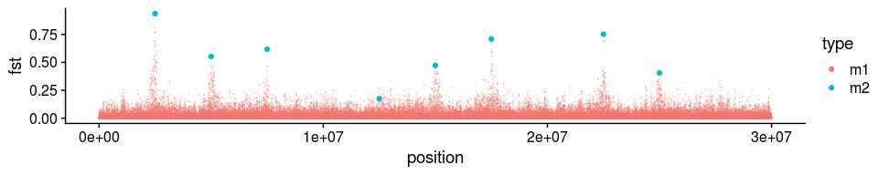
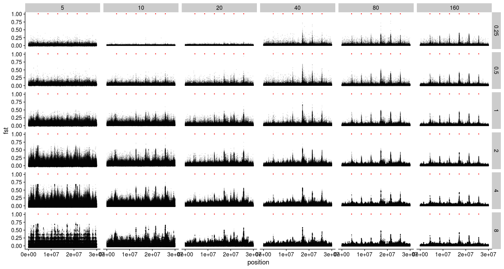
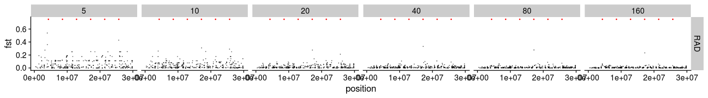
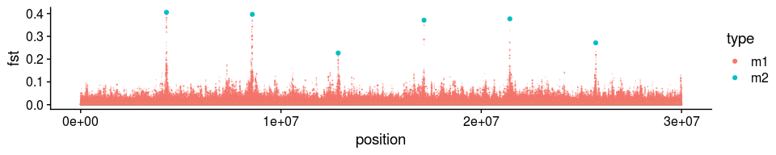
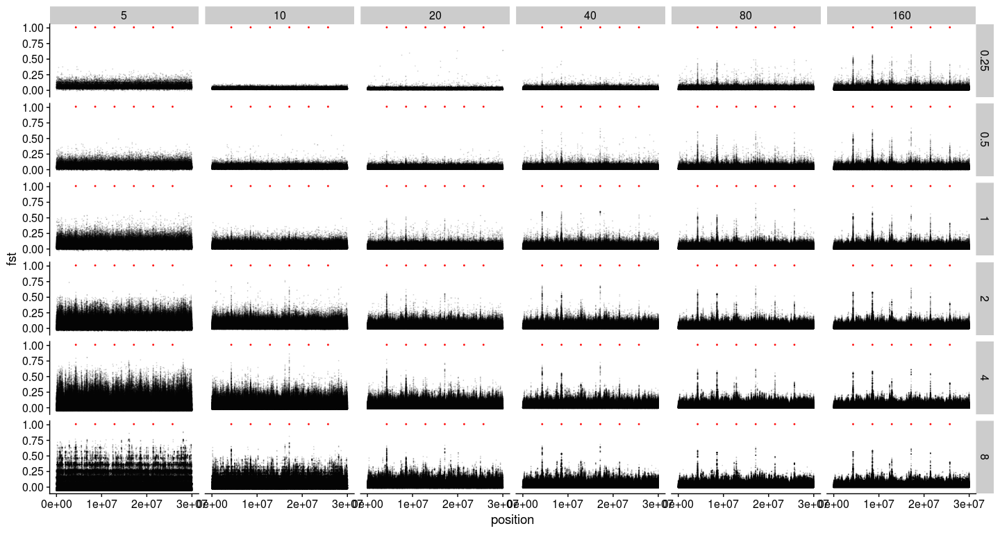
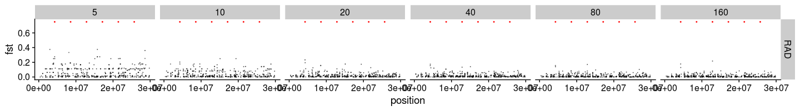

Data analysis with simulation of divergent selection on two populations
================

-   [Define all relevant functions](#define-all-relevant-functions)
-   [Standard model](#standard-model)
    -   [Read in the ancestral states](#read-in-the-ancestral-states)
    -   [Read mutation and substitution file](#read-mutation-and-substitution-file)
    -   [Plot Fst](#plot-fst)
    -   [Read in read depth and estimated Fst](#read-in-read-depth-and-estimated-fst)
    -   [Plot the estimated per-SNP Fst (with no minimum individual filter)](#plot-the-estimated-per-snp-fst-with-no-minimum-individual-filter)
    -   [Plot the estimated per-SNP Fst (with minimum individual filter)](#plot-the-estimated-per-snp-fst-with-minimum-individual-filter)
    -   [Compute and plot the estimated windowed Fst (with no minimum individual filter and 1,000bp fixed windows)](#compute-and-plot-the-estimated-windowed-fst-with-no-minimum-individual-filter-and-1000bp-fixed-windows)
    -   [Compute and plot the estimated windowed Fst (with no minimum individual filter and 10,000bp fixed windows)](#compute-and-plot-the-estimated-windowed-fst-with-no-minimum-individual-filter-and-10000bp-fixed-windows)
-   [Lower selection](#lower-selection)
    -   [Read in the ancestral states](#read-in-the-ancestral-states-1)
    -   [Read mutation and substitution file](#read-mutation-and-substitution-file-1)
    -   [Plot Fst](#plot-fst-1)
    -   [Read in read depth and estimated Fst](#read-in-read-depth-and-estimated-fst-1)
    -   [Plot the estimated per-SNP Fst (with no minimum individual filter)](#plot-the-estimated-per-snp-fst-with-no-minimum-individual-filter-1)
    -   [Compute and plot the estimated windowed Fst (with no minimum individual filter and 1,000bp fixed windows)](#compute-and-plot-the-estimated-windowed-fst-with-no-minimum-individual-filter-and-1000bp-fixed-windows-1)
-   [Lower selection and lower recombination](#lower-selection-and-lower-recombination)
    -   [Read in the ancestral states](#read-in-the-ancestral-states-2)
    -   [Read mutation and substitution file](#read-mutation-and-substitution-file-2)
    -   [Plot Fst](#plot-fst-2)
    -   [Read in read depth and estimated Fst](#read-in-read-depth-and-estimated-fst-2)
    -   [Plot the estimated per-SNP Fst (with no minimum individual filter)](#plot-the-estimated-per-snp-fst-with-no-minimum-individual-filter-2)
    -   [Compute and plot the estimated windowed Fst (with no minimum individual filter and 1,000bp fixed windows)](#compute-and-plot-the-estimated-windowed-fst-with-no-minimum-individual-filter-and-1000bp-fixed-windows-2)
-   [RAD seq simulation with lower selection and lower recombination](#rad-seq-simulation-with-lower-selection-and-lower-recombination)
    -   [Get true sample allele count](#get-true-sample-allele-count)
    -   [Get sample true MAF and Fst from allele counts](#get-sample-true-maf-and-fst-from-allele-counts)
    -   [Plot per SNP Fst](#plot-per-snp-fst)
-   [Lower selection and lower migration](#lower-selection-and-lower-migration)
    -   [Read in the ancestral states](#read-in-the-ancestral-states-3)
    -   [Read mutation and substitution file](#read-mutation-and-substitution-file-3)
    -   [Plot Fst](#plot-fst-3)
    -   [Read in read depth and estimated Fst](#read-in-read-depth-and-estimated-fst-3)
    -   [Plot the estimated per-SNP Fst (with no minimum individual filter)](#plot-the-estimated-per-snp-fst-with-no-minimum-individual-filter-3)
    -   [Compute and plot the estimated windowed Fst (with no minimum individual filter and 1,000bp fixed windows)](#compute-and-plot-the-estimated-windowed-fst-with-no-minimum-individual-filter-and-1000bp-fixed-windows-3)
-   [RAD seq simulation with lower selection and lower recombination](#rad-seq-simulation-with-lower-selection-and-lower-recombination-1)
    -   [Get true sample allele count](#get-true-sample-allele-count-1)
    -   [Get sample true MAF and Fst from allele counts](#get-sample-true-maf-and-fst-from-allele-counts-1)
    -   [Plot per SNP Fst](#plot-per-snp-fst-1)

``` r
library(tidyverse)
library(cowplot)
library(knitr)
library(data.table)
```

Define all relevant functions
=============================

``` r
get_ancestral <- function(x){
  read_csv(paste0(x,"slim/ancestral.fasta"), col_types = cols())[[1]] %>%
    str_split(pattern="") %>%
    .[[1]] %>%
    bind_cols(ancestral=., position=1:30000000)
}

get_mutations <- function(x){
  ## Read in the mutation file outputted by SLiM
  mutations <- read_delim(paste0(x, "slim/mutations.txt"), delim = " ", col_names = F, col_types = cols()) %>%
    transmute(population=X4, type=X6, position=X7+1, base=X13, frequency=X12/2000) %>%
    left_join(ancestral, by="position") %>%
    group_by(population, type, position, ancestral, base) %>%
    summarise(frequency=sum(frequency)) %>%
    ungroup()
  ## Read in the substitutions file outputted by SLiM
  ## This is necessary because mutations can happen again after one fixation, so frequencies from the mutation file do not always reflect the true derived allele frequency
  substitutions <- read_delim(paste0(x,"slim/substitutions.txt"), delim = " ", skip=2, col_names = F, col_types = cols()) %>%
    transmute(type=X3, position=X4+1, base=X10, generation=X9, p1=1, p2=1) %>%
    group_by(type, position) %>%
    filter(generation==max(generation)) %>%
    ungroup() %>%
    left_join(ancestral, by="position") %>%
    select(-generation) %>%
    filter(base!=ancestral) %>%
    gather(key=population, value=frequency, 4:5) %>%
    arrange(position)
  ## The following steps are necessary because there are complications such as back mutations and triallelic loci in the mutation file
  ## Join mutations and substitutions in a temp table
  mutations_final_temp <-  mutations %>%
    spread(key = base, value=frequency) %>%
    full_join(substitutions, by=c("position", "type", "ancestral", "population")) %>%
    arrange(position) %>%
    mutate(base=ifelse(is.na(base), ancestral, base)) %>%
    mutate_all(~replace(., is.na(.), 0)) %>%
    mutate(frequency=1-`A` -`C` -`G` -`T`)
  ## More wrangling
  mutations_final <- mutations_final_temp[1:8] %>%
    gather(key=base, value=frequency, 5:8) %>%
    bind_rows(mutations_final_temp[c(1:4, 9:10)]) %>%
    mutate(frequency=ifelse(base==ancestral, 0, frequency)) %>%
    group_by(population, type, position, ancestral) %>%
    summarise(frequency=sum(frequency)) %>%
    ungroup() %>%
    spread(key=population, value=frequency) %>%
    mutate_all(~replace(., is.na(.), 0)) %>% 
    filter(!(p1==1 & p2==1), !(p1==0 & p2==0)) %>%
    mutate(frequency_mean = (p1 + p2)/2, h_t=2*frequency_mean*(1-frequency_mean), h_s=p1*(1-p1) + p2*(1-p2), fst=1-h_s/h_t)
  return(mutations_final)
}

get_estimated_fst <- function(x){
  i=1
  for (coverage in c(0.25,0.5,1,2,4,8)){
    for (sample_size in c(5,10,20,40,80, 160)){
      ## read in estimated fst
      fst <- read_tsv(paste0(x, "angsd/bam_list_", sample_size, "_", coverage, "x.fst"), col_names = F, col_types = cols()) %>%
        transmute(position=X2, alpha=X3, beta=X4, fst=X5, coverage=coverage, sample_size=sample_size)
      ## read per population depth
      p1_n_ind <- read_tsv(paste0(x, "angsd/bam_list_p1_", sample_size, "_", coverage, "x.mafs.gz"), col_types = cols()) %>%
        transmute(position=position, p1_n_ind=nInd)
      p2_n_ind <- read_tsv(paste0(x, "angsd/bam_list_p2_", sample_size, "_", coverage, "x.mafs.gz"), col_types = cols()) %>%
        transmute(position=position, p2_n_ind=nInd)
      ## join fst with depth_files
      fst_n_ind <- left_join(fst, p1_n_ind, by="position") %>%
        left_join(p2_n_ind, by="position")
      ## compile the final files for plotting
      if (i==1){
        fst_n_ind_final <- fst_n_ind
      } else {
        fst_n_ind_final <- bind_rows(fst_n_ind_final, fst_n_ind)
      }
      i=i+1
    }
  }
  return(fst_n_ind_final)
}

fixed_windowed_fst <- function(x, window_length){
  mutate(x, position=cut(position, 
                         breaks=seq(0,40*10^6,window_length),
                         labels=seq(window_length/2,40*10^6-window_length/2,window_length))) %>%
    group_by(position, coverage, sample_size) %>%
    summarise(fst=sum(alpha)/sum(beta)) %>%
    ungroup() %>%
    mutate(position=as.numeric(as.character(position)))
}
count_to_maf <- function(ancestral_allele, totA, totC, totG, totT){
  if(ancestral_allele == "A"){
    minor_allele_count <- max(totC, totG, totT)
  } else if(ancestral_allele == "C"){
    minor_allele_count <- max(totA, totG, totT)
  } else if(ancestral_allele == "G"){
    minor_allele_count <- max(totA, totC, totT)
  } else if(ancestral_allele == "T"){
    minor_allele_count <- max(totA, totC, totG)
  }
  maf <- minor_allele_count/sum(totA, totC, totG, totT)
  return(maf)
}
get_sample_allele_count_per_pop <- function(x){
  for (p in 1:2){
    i <- 1
    for (sample_id in 1:160){
      for (genome in 1:2){
        sequence <- read_csv(paste0(x, "fasta/p", p, "_derived_", sample_id, "_", genome, ".fasta"), col_types = cols())[[1]] %>%
          str_split(pattern="") %>%
          .[[1]] %>%
          tibble(base=., position=1:30000000, ancestral=ancestral$ancestral) %>%
          filter(position %in% mutations_final$position)
        allele_count <- transmute(sequence,
                                  A_count = ifelse(base=="A", 1, 0),
                                  C_count = ifelse(base=="C", 1, 0),
                                  G_count = ifelse(base=="G", 1, 0),
                                  T_count = ifelse(base=="T", 1, 0))
        if (i==1){
          allele_count_final <- allele_count
        } else {
          allele_count_final <- allele_count + allele_count_final
        }
        i <- i+1
      }
      if (sample_id %in% c(5,10,20,40,80,160)){
        write_tsv(bind_cols(select(sequence, -base), allele_count_final), paste0(x,"slim/p", p, "_", sample_id, "_base_count.tsv")) 
      }
    }
  }
}
allele_count_to_fst <- function(x){
  set.seed(1)
  rad_intervals <- sample(1:(30000000-150), 250) %>%
    tibble(start=., stop=.+150) %>%
    arrange(by=start)
  i <- 1
  for (sample_size in c(5,10,20,40,80,160)){
    base_count_p1 <- read_tsv(paste0(x,"slim/p1_", sample_size, "_base_count.tsv"), col_types = cols()) %>%
      filter(position %inrange% as.list(rad_intervals))
    maf_p1 <- base_count_p1 %>%
      rowwise() %>%
      transmute(maf = count_to_maf(ancestral, A_count, C_count, G_count, T_count), position=position) %>%
      ungroup()
    base_count_p2 <- read_tsv(paste0(x, "slim/p2_", sample_size, "_base_count.tsv"), col_types = cols()) %>%
      filter(position %inrange% as.list(rad_intervals))
    maf_p2 <- base_count_p2 %>%
      rowwise() %>%
      transmute(maf = count_to_maf(ancestral, A_count, C_count, G_count, T_count), position=position) %>%
      ungroup()
    fst <- tibble(position=maf_p1$position, p1=maf_p1$maf, p2=maf_p2$maf) %>%
      rowwise() %>%
      mutate(maf_mean = (p1+p2)/2) %>%
      filter(maf_mean>0.05, maf_mean < 0.95) %>%
      mutate(h_t=2*maf_mean*(1-maf_mean), h_s=p1*(1-p1) + p2*(1-p2), fst=1-h_s/h_t, sample_size=sample_size)
    if (i==1) {
      fst_final <- fst
    } else {
      fst_final <- bind_rows(fst_final, fst)
    }
    i <- i+1
  }
  return(fst_final)
}
```

Standard model
==============

Read in the ancestral states
----------------------------

``` r
ancestral <- get_ancestral("../two_pop_sim_fixed_m2_pos/rep_1/")
```

Read mutation and substitution file
-----------------------------------

``` r
mutations_final <- get_mutations("../two_pop_sim_fixed_m2_pos/rep_1/")
```

Plot Fst
--------

``` r
mutations_final_m1 <- filter(mutations_final, type=="m1")
mutations_final_m2 <- filter(mutations_final, type=="m2")

ggplot(mutations_final_m1, aes(x=position, y=fst, color=type)) +
  geom_point(size=0.002, alpha=0.2) +
  geom_point(data=mutations_final_m2, aes(x=position, y=fst, color=type)) +
  theme_cowplot()
```


``` r
arrange(mutations_final, desc(fst)) %>%
  head()
```

    ## # A tibble: 6 x 9
    ##   type  position ancestral    p1    p2 frequency_mean   h_t   h_s   fst
    ##   <chr>    <dbl> <chr>     <dbl> <dbl>          <dbl> <dbl> <dbl> <dbl>
    ## 1 m1    17137546 G         0.120 0.919          0.520 0.499 0.180 0.639
    ## 2 m1    17137813 G         0.120 0.919          0.520 0.499 0.180 0.639
    ## 3 m1    17138031 G         0.120 0.919          0.520 0.499 0.180 0.639
    ## 4 m1    17138127 C         0.120 0.919          0.520 0.499 0.180 0.639
    ## 5 m1    17138266 A         0.120 0.919          0.520 0.499 0.180 0.639
    ## 6 m1    17138809 T         0.120 0.919          0.520 0.499 0.180 0.639

``` r
arrange(mutations_final_m2, desc(fst))
```

    ## # A tibble: 6 x 9
    ##   type  position ancestral    p1     p2 frequency_mean   h_t   h_s   fst
    ##   <chr>    <dbl> <chr>     <dbl>  <dbl>          <dbl> <dbl> <dbl> <dbl>
    ## 1 m2     8571430 G         0.888 0.089           0.488 0.500 0.181 0.638
    ## 2 m2    17142858 A         0.88  0.0825          0.481 0.499 0.181 0.637
    ## 3 m2    21428572 A         0.900 0.107           0.503 0.500 0.186 0.628
    ## 4 m2    12857144 C         0.876 0.0925          0.484 0.499 0.193 0.614
    ## 5 m2     4285715 T         0.891 0.114           0.502 0.500 0.198 0.605
    ## 6 m2    25714287 C         0.876 0.114           0.496 0.500 0.210 0.581

Read in read depth and estimated Fst
------------------------------------

``` r
fst_n_ind_final <- get_estimated_fst("../two_pop_sim_fixed_m2_pos/rep_1/")
```

Plot the estimated per-SNP Fst (with no minimum individual filter)
------------------------------------------------------------------

``` r
ggplot(fst_n_ind_final, aes(x=position, y=fst)) +
  geom_point(alpha=0.1, size=0.1) +
  geom_point(data=mutations_final_m2, aes(x=position, y=1.01), color="red", size=0.2, shape=8) +
  facet_grid(coverage~sample_size) +
  theme_cowplot()
```


Plot the estimated per-SNP Fst (with minimum individual filter)
---------------------------------------------------------------

``` r
filter(fst_n_ind_final, p1_n_ind>=min(sample_size*coverage, sample_size), p2_n_ind>=min(sample_size*coverage, sample_size)) %>%
  ggplot(aes(x=position, y=fst)) +
    geom_point(alpha=0.1, size=0.1) +
    geom_point(data=mutations_final_m2, aes(x=position, y=1.01), color="red", size=0.2, shape=8) +
    facet_grid(coverage~sample_size) +
    theme_cowplot()
```


Compute and plot the estimated windowed Fst (with no minimum individual filter and 1,000bp fixed windows)
---------------------------------------------------------------------------------------------------------

``` r
fixed_windowed_fst(fst_n_ind_final, 1000) %>%
  ggplot(aes(x=position, y=fst)) +
    geom_point(alpha=0.5, size=0.1) +
    geom_point(data=mutations_final_m2, aes(x=position, y=1.01), color="red", size=0.2, shape=8) +
    facet_grid(coverage~sample_size) +
    theme_cowplot()
```


Compute and plot the estimated windowed Fst (with no minimum individual filter and 10,000bp fixed windows)
----------------------------------------------------------------------------------------------------------

``` r
fixed_windowed_fst(fst_n_ind_final, 10000) %>%
  ggplot(aes(x=position, y=fst)) +
    geom_point(alpha=0.5, size=0.1) +
    geom_point(data=mutations_final_m2, aes(x=position, y=1.01), color="red", size=0.2, shape=8) +
    facet_grid(coverage~sample_size) +
    theme_cowplot()
```


Lower selection
===============

Read in the ancestral states
----------------------------

``` r
ancestral <- get_ancestral("../two_pop_sim_fixed_m2_pos_lower_s/rep_1/")
```

Read mutation and substitution file
-----------------------------------

``` r
mutations_final <- get_mutations("../two_pop_sim_fixed_m2_pos_lower_s/rep_1/")
```

Plot Fst
--------

``` r
mutations_final_m1 <- filter(mutations_final, type=="m1")
mutations_final_m2 <- filter(mutations_final, type=="m2")

ggplot(mutations_final_m1, aes(x=position, y=fst, color=type)) +
  geom_point(size=0.002, alpha=0.2) +
  geom_point(data=mutations_final_m2, aes(x=position, y=fst, color=type)) +
  theme_cowplot()
```


``` r
arrange(mutations_final, desc(fst)) %>%
  head()
```

    ## # A tibble: 6 x 9
    ##   type  position ancestral    p1    p2 frequency_mean   h_t   h_s    fst
    ##   <chr>    <dbl> <chr>     <dbl> <dbl>          <dbl> <dbl> <dbl>  <dbl>
    ## 1 m1    25711520 T         0.623 0.335          0.479 0.499 0.458 0.0831
    ## 2 m1    25712388 C         0.623 0.335          0.479 0.499 0.458 0.0831
    ## 3 m1    25713020 C         0.377 0.665          0.521 0.499 0.458 0.0831
    ## 4 m1    25713191 G         0.377 0.665          0.521 0.499 0.458 0.0831
    ## 5 m1    25713324 G         0.377 0.665          0.521 0.499 0.458 0.0831
    ## 6 m1    25713373 C         0.377 0.665          0.521 0.499 0.458 0.0831

``` r
arrange(mutations_final_m2, desc(fst))
```

    ## # A tibble: 6 x 9
    ##   type  position ancestral    p1    p2 frequency_mean   h_t   h_s    fst
    ##   <chr>    <dbl> <chr>     <dbl> <dbl>          <dbl> <dbl> <dbl>  <dbl>
    ## 1 m2    25714287 C         0.623 0.335          0.479 0.499 0.458 0.0831
    ## 2 m2    17142858 A         0.608 0.324          0.466 0.498 0.457 0.0810
    ## 3 m2    12857144 C         0.634 0.382          0.508 0.500 0.468 0.0633
    ## 4 m2     8571430 G         0.588 0.346          0.467 0.498 0.468 0.0591
    ## 5 m2    21428572 A         0.544 0.304          0.424 0.489 0.460 0.0589
    ## 6 m2     4285715 T         0.602 0.376          0.489 0.500 0.474 0.0513

Read in read depth and estimated Fst
------------------------------------

``` r
fst_n_ind_final <- get_estimated_fst("../two_pop_sim_fixed_m2_pos_lower_s/rep_1/")
```

Plot the estimated per-SNP Fst (with no minimum individual filter)
------------------------------------------------------------------

``` r
ggplot(fst_n_ind_final, aes(x=position, y=fst)) +
  geom_point(alpha=0.1, size=0.1) +
  geom_point(data=mutations_final_m2, aes(x=position, y=1.01), color="red", size=0.2, shape=8) +
  facet_grid(coverage~sample_size) +
  theme_cowplot()
```


Compute and plot the estimated windowed Fst (with no minimum individual filter and 1,000bp fixed windows)
---------------------------------------------------------------------------------------------------------

``` r
fixed_windowed_fst(fst_n_ind_final, 1000) %>%
  ggplot(aes(x=position, y=fst)) +
    geom_point(alpha=0.5, size=0.1) +
    geom_point(data=mutations_final_m2, aes(x=position, y=0.25), color="red", size=0.2, shape=8) +
    ylim(0, 0.25) +
    facet_grid(coverage~sample_size) +
    theme_cowplot()
```


Lower selection and lower recombination
=======================================

Read in the ancestral states
----------------------------

``` r
ancestral <- get_ancestral("../two_pop_sim_fixed_m2_pos_lower_s_lower_r/rep_1/")
```

Read mutation and substitution file
-----------------------------------

``` r
mutations_final <- get_mutations("../two_pop_sim_fixed_m2_pos_lower_s_lower_r/rep_1/")
```

Plot Fst
--------

``` r
mutations_final_m1 <- filter(mutations_final, type=="m1")
mutations_final_m2 <- filter(mutations_final, type=="m2")

ggplot(mutations_final_m1, aes(x=position, y=fst, color=type)) +
  geom_point(size=0.002, alpha=0.2) +
  geom_point(data=mutations_final_m2, aes(x=position, y=fst, color=type)) +
  theme_cowplot()
```



``` r
arrange(mutations_final, desc(fst)) %>%
  head()
```

    ## # A tibble: 6 x 9
    ##   type  position ancestral    p1    p2 frequency_mean   h_t   h_s   fst
    ##   <chr>    <dbl> <chr>     <dbl> <dbl>          <dbl> <dbl> <dbl> <dbl>
    ## 1 m1    17140611 C         0.744 0.244          0.494 0.500 0.375 0.250
    ## 2 m1    17140856 G         0.744 0.244          0.494 0.500 0.375 0.250
    ## 3 m1    17141225 C         0.744 0.244          0.494 0.500 0.375 0.250
    ## 4 m1    17140120 G         0.256 0.756          0.506 0.500 0.375 0.250
    ## 5 m1    17140365 G         0.256 0.756          0.506 0.500 0.375 0.250
    ## 6 m1    17140460 C         0.256 0.756          0.506 0.500 0.375 0.250

``` r
arrange(mutations_final_m2, desc(fst))
```

    ## # A tibble: 6 x 9
    ##   type  position ancestral    p1    p2 frequency_mean   h_t   h_s   fst
    ##   <chr>    <dbl> <chr>     <dbl> <dbl>          <dbl> <dbl> <dbl> <dbl>
    ## 1 m2    17142858 A         0.74  0.242          0.491 0.500 0.376 0.248
    ## 2 m2    21428572 A         0.692 0.216          0.454 0.496 0.382 0.229
    ## 3 m2    12857144 C         0.684 0.230          0.457 0.496 0.394 0.207
    ## 4 m2    25714287 C         0.680 0.27           0.475 0.499 0.415 0.169
    ## 5 m2     8571430 G         0.639 0.233          0.436 0.492 0.409 0.168
    ## 6 m2     4285715 T         0.656 0.249          0.452 0.495 0.413 0.167

Read in read depth and estimated Fst
------------------------------------

``` r
fst_n_ind_final <- get_estimated_fst("../two_pop_sim_fixed_m2_pos_lower_s_lower_r/rep_1/")
```

Plot the estimated per-SNP Fst (with no minimum individual filter)
------------------------------------------------------------------

``` r
ggplot(fst_n_ind_final, aes(x=position, y=fst)) +
  geom_point(alpha=0.1, size=0.1) +
  geom_point(data=mutations_final_m2, aes(x=position, y=1.01), color="red", size=0.2, shape=8) +
  facet_grid(coverage~sample_size) +
  theme_cowplot()
```



Compute and plot the estimated windowed Fst (with no minimum individual filter and 1,000bp fixed windows)
---------------------------------------------------------------------------------------------------------

``` r
fixed_windowed_fst(fst_n_ind_final, 1000) %>%
  ggplot(aes(x=position, y=fst)) +
    geom_point(alpha=0.5, size=0.1) +
    geom_point(data=mutations_final_m2, aes(x=position, y=0.75), color="red", size=0.2, shape=8) +
    ylim(0, 0.75) +
    facet_grid(coverage~sample_size) +
    theme_cowplot()
```


RAD seq simulation with lower selection and lower recombination
===============================================================

To simulate RAD-seq, I assumed that the genotype calling is perfectly accurate (i.e. sequence depth is high). I then took random samples along the chromosome representing RAD tags.

Get true sample allele count
----------------------------

``` r
get_sample_allele_count_per_pop("../two_pop_sim_fixed_m2_pos_lower_s_lower_r/rep_1/")
```

Get sample true MAF and Fst from allele counts
----------------------------------------------

``` r
maf_final <- allele_count_to_fst("../two_pop_sim_fixed_m2_pos_lower_s_lower_r/rep_1/")
```

Plot per SNP Fst
----------------

``` r
mutate(maf_final, coverage="RAD") %>%
  ggplot(aes(x=position, y=fst)) +
    geom_point(alpha=0.5, size=0.1) +
    geom_point(data=mutations_final_m2, aes(x=position, y=0.75), color="red", size=0.2, shape=8) +
    facet_grid(coverage~sample_size) +
    theme_cowplot()
```



Lower selection and lower migration
===================================

Read in the ancestral states
----------------------------

``` r
ancestral <- get_ancestral("../two_pop_sim_fixed_m2_pos_lower_s_lower_m/rep_1/")
```

Read mutation and substitution file
-----------------------------------

``` r
mutations_final <- get_mutations("../two_pop_sim_fixed_m2_pos_lower_s_lower_m/rep_1/")
```

Plot Fst
--------

``` r
mutations_final_m1 <- filter(mutations_final, type=="m1")
mutations_final_m2 <- filter(mutations_final, type=="m2")

ggplot(mutations_final_m1, aes(x=position, y=fst, color=type)) +
  geom_point(size=0.002, alpha=0.2) +
  geom_point(data=mutations_final_m2, aes(x=position, y=fst, color=type)) +
  theme_cowplot()
```



``` r
arrange(mutations_final, desc(fst)) %>%
  head()
```

    ## # A tibble: 6 x 9
    ##   type  position ancestral    p1    p2 frequency_mean   h_t   h_s   fst
    ##   <chr>    <dbl> <chr>     <dbl> <dbl>          <dbl> <dbl> <dbl> <dbl>
    ## 1 m1     4285017 A         0.234 0.868          0.551 0.495 0.294 0.406
    ## 2 m1     4285394 G         0.234 0.868          0.551 0.495 0.294 0.406
    ## 3 m1     4285587 C         0.766 0.132          0.449 0.495 0.294 0.405
    ## 4 m1     4285682 A         0.766 0.132          0.449 0.495 0.294 0.405
    ## 5 m1     4285939 G         0.766 0.132          0.449 0.495 0.294 0.405
    ## 6 m1     4286507 T         0.766 0.132          0.449 0.495 0.294 0.405

``` r
arrange(mutations_final_m2, desc(fst))
```

    ## # A tibble: 6 x 9
    ##   type  position ancestral    p1    p2 frequency_mean   h_t   h_s   fst
    ##   <chr>    <dbl> <chr>     <dbl> <dbl>          <dbl> <dbl> <dbl> <dbl>
    ## 1 m2     4285715 T         0.766 0.132          0.449 0.495 0.294 0.405
    ## 2 m2     8571430 G         0.793 0.164          0.479 0.499 0.301 0.396
    ## 3 m2    21428572 A         0.824 0.211          0.518 0.499 0.311 0.377
    ## 4 m2    17142858 A         0.750 0.145          0.448 0.495 0.311 0.371
    ## 5 m2    25714287 C         0.798 0.278          0.538 0.497 0.362 0.271
    ## 6 m2    12857144 C         0.679 0.206          0.442 0.493 0.382 0.227

Read in read depth and estimated Fst
------------------------------------

``` r
fst_n_ind_final <- get_estimated_fst("../two_pop_sim_fixed_m2_pos_lower_s_lower_m/rep_1/")
```

Plot the estimated per-SNP Fst (with no minimum individual filter)
------------------------------------------------------------------

``` r
ggplot(fst_n_ind_final, aes(x=position, y=fst)) +
  geom_point(alpha=0.1, size=0.1) +
  geom_point(data=mutations_final_m2, aes(x=position, y=1.01), color="red", size=0.2, shape=8) +
  facet_grid(coverage~sample_size) +
  theme_cowplot()
```



Compute and plot the estimated windowed Fst (with no minimum individual filter and 1,000bp fixed windows)
---------------------------------------------------------------------------------------------------------

``` r
fixed_windowed_fst(fst_n_ind_final, 1000) %>%
  ggplot(aes(x=position, y=fst)) +
    geom_point(alpha=0.5, size=0.1) +
    geom_point(data=mutations_final_m2, aes(x=position, y=0.75), color="red", size=0.2, shape=8) +
    ylim(0, 0.75) +
    facet_grid(coverage~sample_size) +
    theme_cowplot()
```


RAD seq simulation with lower selection and lower recombination
===============================================================

To simulate RAD-seq, I assumed that the genotype calling is perfectly accurate (i.e. sequence depth is high). I then took random samples along the chromosome to represent RAD tags.

Get true sample allele count
----------------------------

``` r
get_sample_allele_count_per_pop("../two_pop_sim_fixed_m2_pos_lower_s_lower_m/rep_1/")
```

Get sample true MAF and Fst from allele counts
----------------------------------------------

``` r
maf_final <- allele_count_to_fst("../two_pop_sim_fixed_m2_pos_lower_s_lower_m/rep_1/")
```

Plot per SNP Fst
----------------

``` r
mutate(maf_final, coverage="RAD") %>%
  ggplot(aes(x=position, y=fst)) +
    geom_point(alpha=0.5, size=0.1) +
    geom_point(data=mutations_final_m2, aes(x=position, y=0.75), color="red", size=0.2, shape=8) +
    facet_grid(coverage~sample_size) +
    theme_cowplot()
```


