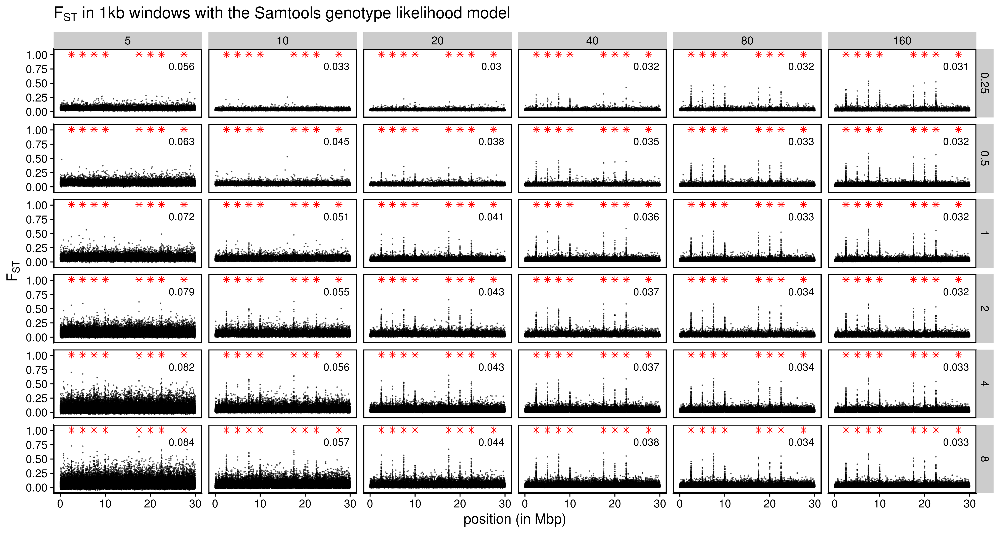
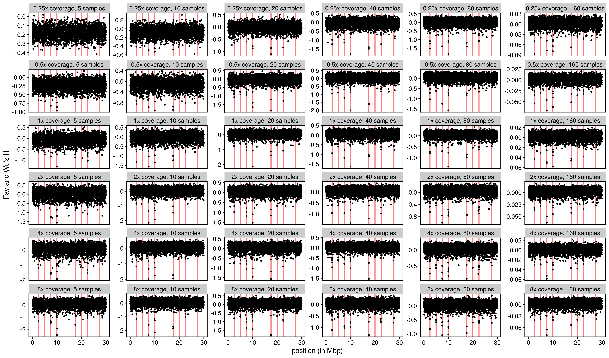

Data analysis with simulation of divergent selection on two populations
================

  - [Define all relevant functions](#define-all-relevant-functions)
  - [Standard model (Ne\~50,000 in each
    population)](#standard-model-ne50000-in-each-population)
      - [The model](#the-model)
          - [Read in the ancestral
            states](#read-in-the-ancestral-states)
          - [Read mutation and substitution
            file](#read-mutation-and-substitution-file)
          - [Plot Fst](#plot-fst)
          - [Plot Fst from the Greenland cod project as a
            comparison](#plot-fst-from-the-greenland-cod-project-as-a-comparison)
      - [Inference with Samtool’s GL
        model](#inference-with-samtools-gl-model)
          - [Read in read depth and estimated
            Fst](#read-in-read-depth-and-estimated-fst)
          - [Plot genome-wide average Fst (with no minimum individual
            filter)](#plot-genome-wide-average-fst-with-no-minimum-individual-filter)
          - [Plot the estimated per-SNP Fst (with no minimum individual
            filter)](#plot-the-estimated-per-snp-fst-with-no-minimum-individual-filter)
          - [Plot genome-wide average Fst (with minimum individual
            filter)](#plot-genome-wide-average-fst-with-minimum-individual-filter)
          - [Plot the estimated per-SNP Fst (with minimum individual
            filter)](#plot-the-estimated-per-snp-fst-with-minimum-individual-filter)
          - [Compute and plot the estimated windowed Fst (with no
            minimum individual filter and 1,000bp fixed
            windows)](#compute-and-plot-the-estimated-windowed-fst-with-no-minimum-individual-filter-and-1000bp-fixed-windows)
          - [Selection scan using
            PCAngsd](#selection-scan-using-pcangsd)
          - [Selection scan using neutrality test
            stats](#selection-scan-using-neutrality-test-stats)
              - [Read in the data](#read-in-the-data)
              - [Genome wide stats](#genome-wide-stats)
              - [Window-based stats](#window-based-stats)
      - [Inference with GATK’s GL model](#inference-with-gatks-gl-model)
          - [Chromosome-average Fst](#chromosome-average-fst)
          - [Fst in 1000bp windows](#fst-in-1000bp-windows)
      - [RAD seq simulation and
        inference](#rad-seq-simulation-and-inference)
          - [Get true sample allele
            count](#get-true-sample-allele-count)
          - [Get the true SFS and theta estimators with population
            samples in
            p1](#get-the-true-sfs-and-theta-estimators-with-population-samples-in-p1)
          - [Get sample true MAF and Fst from allele
            counts](#get-sample-true-maf-and-fst-from-allele-counts)
          - [Chromosome-wide stats](#chromosome-wide-stats)
              - [Plot SFS in p1 from RAD
                data](#plot-sfs-in-p1-from-rad-data)
              - [Tajima’s estimator](#tajimas-estimator-1)
              - [Watterson’s estimator](#wattersons-estimator-1)
          - [Plot per SNP Fst](#plot-per-snp-fst)

``` r
library(tidyverse)
library(cowplot)
library(knitr)
library(data.table)
library(RcppCNPy)
```

# Define all relevant functions

``` r
source("../misc/two_pop_functions.R")
```

# Standard model (Ne\~50,000 in each population)

## The model

### Read in the ancestral states

``` r
ancestral <- get_ancestral("../two_pop_sim_fixed_m2_pos/rep_1/")
```

### Read mutation and substitution file

The target theta is \~ 0.004.

``` r
mutations_final <- get_mutations("../two_pop_sim_fixed_m2_pos/rep_1/")
mutations_final_m1 <- filter(mutations_final, type=="m1")
mutations_final_m2 <- filter(mutations_final, type=="m2")
real_theta_t_p1 <- sum(2*mutations_final$p1*(1-mutations_final$p1))/30000000
real_theta_t_p2 <- sum(2*mutations_final$p2*(1-mutations_final$p2))/30000000
real_theta_t_combined <- sum(2*mutations_final$frequency_mean*(1-mutations_final$frequency_mean))/30000000
real_theta_w_p1 <- filter(mutations_final, p1 > 0, p1 < 1) %>%
  nrow() %>% `/`(30000000*sum(1/(1:(5000*2-1))))
real_theta_w_p2 <- filter(mutations_final, p2 > 0, p2 < 1) %>%
  nrow() %>% `/`(30000000*sum(1/(1:(5000*2-1))))
real_theta_w_combined <- nrow(mutations_final) / (30000000*sum(1/(1:(10000*2-1))))
tibble(theta = c("tajima", "watterson"), 
       p1 = c(real_theta_t_p1, real_theta_w_p1), 
       p2 = c(real_theta_t_p2, real_theta_w_p2),
       combined = c(real_theta_t_combined, real_theta_w_combined)) %>% 
  kable()
```

| theta     |        p1 |        p2 |  combined |
| :-------- | --------: | --------: | --------: |
| tajima    | 0.0036054 | 0.0036273 | 0.0036745 |
| watterson | 0.0030680 | 0.0030931 | 0.0038472 |

``` r
## p1 SFS
filter(mutations_final, p1 > 0, p1 < 1) %>%
  mutate(p1 = round(p1, 4)) %>%
  count(p1) %>%
  ggplot(aes(x=p1, y=n)) +
  geom_line() +
  geom_point(size=1) +
  theme_cowplot()
```

<!-- -->

``` r
## p2 SFS
filter(mutations_final, p2 > 0, p2 < 1) %>%
  mutate(p2 = round(p2, 4)) %>%
  count(p2) %>%
  ggplot(aes(x=p2, y=n)) +
  geom_line() +
  geom_point(size=1) +
  theme_cowplot()
```

<!-- -->

`theta_w` is much lower than `theta_p` in p1 and p2, presumably because
selection has strongly reduced the effective migration between the two
populations, creating a genome-wide pattern of population contraction
when each population is evaluated separately.

### Plot Fst

The target mean neutral Fst is \~ 0.015 and the target peak Fst is \~
0.6 (based on cod data). The expected neutral Fst is `1/(1+16Nm)` =
0.01234, but because of the selection stage, I expect Fst to be slightly
higher than this theoretical expectation.

I used `mean(h_s)/mean(h_t)` to calculate average Fst. I am not sure if
this estimator is biased though.

``` r
## genome-wide mean fst
summarise(mutations_final, average_fst = 1-mean(h_s)/mean(h_t))
```

    ## # A tibble: 1 x 1
    ##   average_fst
    ##         <dbl>
    ## 1      0.0158

``` r
## "neutral" mean fst (mean fst at both end of the genome that is not strongly affected by linkage with selected regions)
filter(mutations_final, position <= 1000000 | position >= 29000000) %>% summarise(average_fst = 1-mean(h_s)/mean(h_t))
```

    ## # A tibble: 1 x 1
    ##   average_fst
    ##         <dbl>
    ## 1      0.0136

``` r
ggplot(mutations_final_m1, aes(x=position, y=fst, color=type)) +
  geom_point(size=0.02, alpha=0.5) +
  geom_point(data=mutations_final_m2, aes(x=position, y=fst, color=type)) +
  theme_cowplot()
```

<!-- -->

``` r
arrange(mutations_final, desc(fst)) %>%
  head()
```

    ## # A tibble: 6 x 9
    ##   type  position ancestral    p1     p2 frequency_mean   h_t    h_s   fst
    ##   <chr>    <dbl> <chr>     <dbl>  <dbl>          <dbl> <dbl>  <dbl> <dbl>
    ## 1 m2    17500001 A         0.918 0.0071          0.462 0.497 0.0827 0.834
    ## 2 m2     7500001 A         0.904 0.0119          0.458 0.496 0.0987 0.801
    ## 3 m1     7504306 T         0.887 0.0117          0.449 0.495 0.112  0.774
    ## 4 m1     7501513 G         0.898 0.0233          0.460 0.497 0.115  0.769
    ## 5 m1    17503032 G         0.862 0.0062          0.434 0.491 0.125  0.746
    ## 6 m1     7502493 C         0.898 0.0453          0.472 0.498 0.134  0.730

``` r
arrange(mutations_final_m2, desc(fst))
```

    ## # A tibble: 8 x 9
    ##   type  position ancestral     p1      p2 frequency_mean    h_t    h_s    fst
    ##   <chr>    <dbl> <chr>      <dbl>   <dbl>          <dbl>  <dbl>  <dbl>  <dbl>
    ## 1 m2    17500001 A         0.918  0.0071          0.462  0.497  0.0827 0.834 
    ## 2 m2     7500001 A         0.904  0.0119          0.458  0.496  0.0987 0.801 
    ## 3 m2     2500001 G         0.841  0.0055          0.423  0.488  0.139  0.715 
    ## 4 m2    22500001 G         0.823  0.0052          0.414  0.485  0.151  0.689 
    ## 5 m2    10000001 G         0.791  0.00930         0.400  0.480  0.174  0.637 
    ## 6 m2    20000001 G         0.762  0.0061          0.384  0.473  0.187  0.604 
    ## 7 m2     5000001 G         0.665  0.0067          0.336  0.446  0.229  0.486 
    ## 8 m2    27500001 C         0.0268 0               0.0134 0.0264 0.0261 0.0136

### Plot Fst from the Greenland cod project as a comparison

``` r
fst <- read_tsv("../../cod/greenland-cod/angsd/popminind2/ILU2011_UUM2010_bam_list_realigned_mindp161_maxdp768_minind97_minq20_popminind2.fst", col_names = F) %>%
  rename(lg=X1, position=X2, alpha=X3, beta=X4, fst=X5)
## LG03
filter(fst, lg=="LG03") %>%
ggplot(aes(x=position, y=fst)) +
  geom_point(size=0.02, alpha=0.5) +
  theme_cowplot()
## LG08
filter(fst, lg=="LG08") %>%
ggplot(aes(x=position, y=fst)) +
  geom_point(size=0.02, alpha=0.5) +
  theme_cowplot()
## LG19
filter(fst, lg=="LG19") %>%
ggplot(aes(x=position, y=fst)) +
  geom_point(size=0.02, alpha=0.5) +
  theme_cowplot()
## Mean Fst at LG19
filter(fst, lg=="LG19") %>% summarise(mean_fst_neutral=sum(alpha)/sum(beta))
```

## Inference with Samtool’s GL model

### Read in read depth and estimated Fst

``` r
fst_n_ind_final <- get_estimated_fst("../two_pop_sim_fixed_m2_pos/rep_1/")
```

### Plot genome-wide average Fst (with no minimum individual filter)

``` r
group_by(fst_n_ind_final, sample_size, coverage) %>%
  count() %>%
  pivot_wider(names_from = sample_size, values_from = n)
average_fst <- fst_n_ind_final %>%
  group_by(coverage, sample_size) %>%
  summarise(average_fst = sum(alpha)/sum(beta)) 
average_fst_plot <- average_fst %>%
  ggplot(aes(x=as.factor(sample_size), y=as.factor(coverage), fill=average_fst, label=round(average_fst, 4))) +
  geom_tile() +
  geom_text() +
  scale_fill_viridis_c() +
  theme_cowplot()
ggsave("../figures/two_pop_sim_fixed_m2_pos_average_fst_raw.png", average_fst_plot, height = 4, width=6, units = "in")
```

``` r
include_graphics("../figures/two_pop_sim_fixed_m2_pos_average_fst_raw.png")
```

<!-- -->

  - Although Fst is quite consistently estimated, these estimations are
    much higher than the true value (\~0.013). This may cause problems
    when estimated Fst is used to infer demography, such as migration
    rate between populations. The relative value of these genome-wide
    Fst, however, may still be trusted.

  - I also tried to get average Fst only from neutral regions on the
    genome, but that didn’t help much. At high coverage and high sample
    size, the estimated Fst is around 0.029, still much higher than the
    true value.

  - Also, at smaller sample size, Fst tends to be even more
    overestimated. This is consistent with empircal data. But
    couterintuitively, higher coverage makes the problem worse in such
    cases. We’ll need to look into this further.

### Plot the estimated per-SNP Fst (with no minimum individual filter)

``` r
fst_plot <- ggplot(fst_n_ind_final, aes(x=position, y=fst)) +
  geom_point(alpha=0.1, size=0.1) +
  geom_point(data=mutations_final_m2, aes(x=position, y=1.01), color="red", size=0.2, shape=8) +
  facet_grid(coverage~sample_size) +
  theme_cowplot()
ggsave("../figures/two_pop_sim_fixed_m2_pos_fst_raw.png", fst_plot, height = 8, width=15, units = "in")
```

``` r
include_graphics("../figures/two_pop_sim_fixed_m2_pos_fst_raw.png")
```

<!-- -->

### Plot genome-wide average Fst (with minimum individual filter)

I am doing this to help Matt check whether filtering can introduce
systematic changes in genome-wide average Fst estimation. There doesn’t
appear to be any systematic bias caused by filtering in here. However,
mapping is not simulated here, and differential mapping at high Fst
regions may cause systematic biases.

``` r
fst_n_ind_final_filtered <- group_by(fst_n_ind_final, coverage, sample_size) %>%
  filter(p1_n_ind >= quantile(p1_n_ind)[4], p2_n_ind >= quantile(p2_n_ind)[4]) # filtering n_ind by the third quantile
count(fst_n_ind_final_filtered) %>%
  pivot_wider(names_from = sample_size, values_from = n)
average_fst_plot <- fst_n_ind_final_filtered %>%
  summarise(average_fst = sum(alpha)/sum(beta)) %>%
  ggplot(aes(x=as.factor(sample_size), y=as.factor(coverage), fill=average_fst, label=round(average_fst, 4))) +
  geom_tile() +
  geom_text() +
  scale_fill_viridis_c() +
  theme_cowplot()
ggsave("../figures/two_pop_sim_fixed_m2_pos_filtered_average_fst_raw.png", average_fst_plot, height = 4, width=6, units = "in")
```

``` r
include_graphics("../figures/two_pop_sim_fixed_m2_pos_filtered_average_fst_raw.png")
```

<!-- -->

### Plot the estimated per-SNP Fst (with minimum individual filter)

``` r
filtered_fst_plot <- fst_n_ind_final_filtered %>%
  ggplot(aes(x=position, y=fst)) +
    geom_point(alpha=0.1, size=0.1) +
    geom_point(data=mutations_final_m2, aes(x=position, y=1.01), color="red", size=0.2, shape=8) +
    facet_grid(coverage~sample_size) +
    theme_cowplot()
ggsave("../figures/two_pop_sim_fixed_m2_pos_filtered_fst_raw.png", filtered_fst_plot, height = 8, width=15, units = "in")
```

``` r

```

<!-- -->

### Compute and plot the estimated windowed Fst (with no minimum individual filter and 1,000bp fixed windows)

``` r
windowed_fst_plot <- fixed_windowed_fst(fst_n_ind_final, 1000) %>%
  ggplot(aes(x=position/10^6, y=fst)) +
  geom_point(alpha=0.5, size=0.1) +
  geom_point(data=mutations_final_m2, aes(x=position/10^6, y=1.01), color="red", size=2, shape=8) +
  geom_text(data=average_fst,x=27, y=0.8, aes(label=round(average_fst,3))) +
  ylim(NA, 1.05) +
  labs(x = "position (in Mbp)", y = expression(F[ST])) + 
  facet_grid(coverage~sample_size) +
  ggtitle(expression(paste(F[ST], " in 1kb windows with the Samtools genotype likelihood model"))) +
  theme_cowplot() +
  theme(panel.border = element_rect(colour = "black", fill=NA, size=1),
        title = element_text(size=15)) 
ggsave("../figures/two_pop_sim_fixed_m2_pos_windowed_fst_raw.png", windowed_fst_plot, height = 8, width=15, units = "in")
```

``` r

```

<!-- -->

### Selection scan using PCAngsd

``` r
selection_scan <- get_selection_scan("/workdir/lcwgs-simulation/two_pop_sim_fixed_m2_pos/rep_1/")
selection_scan_summary <- group_by(selection_scan, coverage, sample_size) %>%
  summarize(n_snp = n(), log_p_cutoff = -log(0.05/n_snp))
selection_scan_plot <- ggplot(selection_scan, aes(x = pos, y = neg_log_p_value)) +
  geom_point(alpha=0.5, size=0.1) +
  geom_point(data=mutations_final_m2, aes(x=position, y=27), color="red", size=0.2, shape=8) +
  geom_hline(data = selection_scan_summary, aes(yintercept = log_p_cutoff), linetype = "dashed") +
  facet_grid(coverage ~ sample_size) +
  theme_cowplot()
ggsave("../figures/two_pop_sim_fixed_m2_pos_selection_scan.png", selection_scan_plot, height = 8, width=15, units = "in")
```

``` r
include_graphics("../figures/two_pop_sim_fixed_m2_pos_selection_scan.png")
```

<!-- -->

### Selection scan using neutrality test stats

#### Read in the data

``` r
p1_neutrality_stats <- get_neutrality_stats("/workdir/lcwgs-simulation/two_pop_sim_fixed_m2_pos/rep_1/", "angsd")
```

#### Genome wide stats

###### SFS

``` r
i=1
for (coverage in c(0.25,0.5,1,2,4,8)){
  for (sample_size in c(5,10,20,40, 80, 160)){
    sfs <- scan(paste0("../two_pop_sim_fixed_m2_pos/rep_1/angsd/bam_list_p1_", sample_size, "_", coverage, "x_all_sites.sfs")) %>%
      enframe(name = frequency) %>%
      mutate(frequency=(0:(sample_size*2))/(sample_size*2), coverage=coverage, sample_size=sample_size)
    if (i==1){
      sfs_final <- sfs
    } else {
      sfs_final <- bind_rows(sfs_final, sfs)
    }
    i=i+1
  }
}
sfs_final_sum <- filter(sfs_final, frequency>0, frequency<1) %>%
  group_by(coverage, sample_size) %>%
  summarise(n=sum(value))
filter(sfs_final, frequency>0, frequency<1) %>%
  group_by(coverage, sample_size) %>%
  ggplot(aes(x=frequency, y=value)) +
  geom_point(size=0.5) +
  geom_line() +
  geom_text(data=sfs_final_sum, x=0.8, y=40000, aes(label=paste0("n=",round(n,0)))) +
  facet_grid(coverage~sample_size) +
  theme_cowplot()
```

<!-- -->

###### Tajima’s estimator

``` r
p1_neutrality_stats %>%
  group_by(coverage, sample_size) %>%
  summarise(t_p = round(sum(t_p) / sum(n_sites), 5)) %>%
  pivot_wider(names_from = sample_size, values_from = t_p) %>% 
  kable()
```

| coverage |       5 |      10 |      20 |      40 |      80 |     160 |
| -------: | ------: | ------: | ------: | ------: | ------: | ------: |
|     0.25 | 0.00295 | 0.00297 | 0.00317 | 0.00334 | 0.00350 | 0.00361 |
|     0.50 | 0.00304 | 0.00317 | 0.00338 | 0.00350 | 0.00361 | 0.00367 |
|     1.00 | 0.00328 | 0.00339 | 0.00354 | 0.00362 | 0.00366 | 0.00369 |
|     2.00 | 0.00348 | 0.00352 | 0.00363 | 0.00365 | 0.00369 | 0.00371 |
|     4.00 | 0.00362 | 0.00361 | 0.00369 | 0.00368 | 0.00369 | 0.00370 |
|     8.00 | 0.00368 | 0.00364 | 0.00367 | 0.00365 | 0.00364 | 0.00365 |

###### Watterson’s estimator

``` r
p1_neutrality_stats %>%
  group_by(coverage, sample_size) %>%
  summarise(t_w = round(sum(t_w) / sum(n_sites), 5)) %>%
  pivot_wider(names_from = sample_size, values_from = t_w) %>% 
  kable()
```

| coverage |       5 |      10 |      20 |      40 |      80 |     160 |
| -------: | ------: | ------: | ------: | ------: | ------: | ------: |
|     0.25 | 0.00245 | 0.00191 | 0.00190 | 0.00199 | 0.00217 | 0.00279 |
|     0.50 | 0.00243 | 0.00228 | 0.00236 | 0.00249 | 0.00310 | 0.00439 |
|     1.00 | 0.00285 | 0.00279 | 0.00297 | 0.00332 | 0.00388 | 0.00495 |
|     2.00 | 0.00332 | 0.00333 | 0.00356 | 0.00382 | 0.00432 | 0.00529 |
|     4.00 | 0.00363 | 0.00365 | 0.00387 | 0.00408 | 0.00453 | 0.00541 |
|     8.00 | 0.00374 | 0.00373 | 0.00387 | 0.00395 | 0.00413 | 0.00451 |

Watterson’s estimator is now overestimated at higher sample size and
higher coverage.

#### Window-based stats

###### Plot Tajima’s D

``` r
p1_tajima_plot <- p1_neutrality_stats %>%
  arrange(coverage, sample_size) %>%
  #mutate(coverage=str_c("coverage = ", coverage), sample_size=str_c("sample size = ", sample_size)) %>%
  mutate(design=str_c(coverage, "x coverage, ", sample_size, " samples")) %>%
  mutate(design=as_factor(design)) %>%
  ggplot(aes(x = pos/10^6, y = tajima)) +
  geom_vline(data=mutations_final_m2, aes(xintercept=position/10^6), color="red", size=1, alpha=0.5) +
  geom_point(alpha=1, size=1) +
  facet_wrap(~ design, scales = "free_y", nrow = 6) +
  theme_cowplot() +
  theme(panel.border = element_rect(colour = "black", fill=NA, size=1)) +
  labs(x="position (in Mbp)", y="Tajima's D")
ggsave("../figures/two_pop_sim_fixed_m2_pos_p1_tajima_d.png", p1_tajima_plot, height = 10, width=17, units = "in")
```

``` r
include_graphics("../figures/two_pop_sim_fixed_m2_pos_p1_tajima_d.png")
```

<!-- -->

###### Plot Fay and Wu’s H

``` r
p1_fayh_plot <- p1_neutrality_stats %>%
  arrange(coverage, sample_size) %>%
  #mutate(coverage=str_c("coverage = ", coverage), sample_size=str_c("sample size = ", sample_size)) %>%
  mutate(design=str_c(coverage, "x coverage, ", sample_size, " samples")) %>%
  mutate(design=as_factor(design)) %>%
  ggplot(aes(x = pos/10^6, y = fayh)) +
  geom_vline(data=mutations_final_m2, aes(xintercept=position/10^6), color="red", size=1, alpha=0.5) +
  geom_point(alpha=1, size=1) +
  facet_wrap(~ design, scales = "free_y", nrow = 6) +
  theme_cowplot() +
  theme(panel.border = element_rect(colour = "black", fill=NA, size=1)) +
  labs(x="position (in Mbp)", y="Fay and Wu's H")
ggsave("../figures/two_pop_sim_fixed_m2_pos_p1_fay_h.png", p1_fayh_plot, height = 10, width=17, units = "in")
```

``` r

```

<!-- -->

## Inference with GATK’s GL model

#### Chromosome-average Fst

``` r
fst_windowed_final_gatk <- get_estimated_windowed_fst_gatk("../two_pop_sim_fixed_m2_pos/rep_1/", 1000)
average_fst_gatk <- fst_windowed_final_gatk %>%
  group_by(coverage, sample_size) %>%
  summarize(average_fst = sum(alpha) / sum(beta)) 
average_fst_gatk_plot <- average_fst_gatk %>%
  ggplot(aes(x=as.factor(sample_size), y=as.factor(coverage), fill=average_fst, label=round(average_fst, 4))) +
  geom_tile() +
  geom_text() +
  scale_fill_viridis_c() +
  theme_cowplot()
ggsave("../figures/two_pop_sim_fixed_m2_pos_average_fst_gatk.png", average_fst_gatk_plot, height = 4, width=6, units = "in")
```

``` r
include_graphics("../figures/two_pop_sim_fixed_m2_pos_average_fst_gatk.png")
```

<!-- -->

#### Fst in 1000bp windows

``` r
windowed_fst_plot <- fst_windowed_final_gatk %>%
  ggplot(aes(x=position/10^6, y=fst)) +
  geom_point(alpha=0.5, size=0.1) +
  geom_point(data=mutations_final_m2, aes(x=position/10^6, y=1.01), color="red", size=2, shape=8) +
  geom_text(data=average_fst_gatk,x=27, y=0.8, aes(label=round(average_fst,3))) +
  ylim(NA, 1.05) +
  labs(x = "position (in Mbp)", y = expression(F[ST])) + 
  facet_grid(coverage~sample_size) +
  ggtitle(expression(paste(F[ST], " in 1kb windows with the GATK genotype likelihood model"))) +
  theme_cowplot() +
  theme(panel.border = element_rect(colour = "black", fill=NA, size=1),
        title = element_text(size=15)) 
ggsave("../figures/two_pop_sim_fixed_m2_pos_windowed_fst_gatk.png", windowed_fst_plot, height = 8, width=15, units = "in")
```

``` r
include_graphics("../figures/two_pop_sim_fixed_m2_pos_windowed_fst_gatk.png")
```

<!-- -->

In general, these Fst results are very similar to those from the
Samtools GL model.

## RAD seq simulation and inference

To simulate RAD-seq, I assumed that the genotype calling is perfectly
accurate (i.e. sequence depth is high). I then took random samples along
the chromosome representing RAD tags.

### Get true sample allele count

``` r
get_sample_allele_count_per_pop("../two_pop_sim_fixed_m2_pos/rep_1/")
fst_all_snps <- allele_count_to_fst("/workdir/lcwgs-simulation/two_pop_sim_fixed_m2_pos/rep_1/")
write_tsv(fst_all_snps, "/workdir/lcwgs-simulation/two_pop_sim_fixed_m2_pos/rep_1/slim/fst_all_snps.tsv")
```

### Get the true SFS and theta estimators with population samples in p1

``` r
fst_all_snps <- read_tsv("/workdir/lcwgs-simulation/two_pop_sim_fixed_m2_pos/rep_1/slim/fst_all_snps.tsv")
## SFS
group_by(fst_all_snps, sample_size) %>%
  filter(p1>0, p1<1) %>%
  count(p1) %>%
  ggplot(aes(x=p1, y=n)) +
  geom_line() +
  geom_point() +
  theme_cowplot() +
  facet_wrap(~sample_size)
```

<!-- -->

``` r
## theta_p
group_by(fst_all_snps, sample_size) %>%
  filter(p1>0, p1<1) %>%
  summarise(theta_p = 2 * sum(p1*(1-p1)) / 30000000,
            theta_w = n() / 30000000 / sum(1/1:(2*sample_size-1)))
```

    ## # A tibble: 6 x 3
    ##   sample_size theta_p theta_w
    ##         <dbl>   <dbl>   <dbl>
    ## 1           5 0.00325 0.00361
    ## 2          10 0.00342 0.00359
    ## 3          20 0.00352 0.00355
    ## 4          40 0.00356 0.00351
    ## 5          80 0.00358 0.00344
    ## 6         160 0.00359 0.00336

### Get sample true MAF and Fst from allele counts

Each RAD tag is 150 bp. Note that `n_rad_tag` are numbers of RAD tags
per Mbp. According to the “Breaking RAD” paper, the median RAD tag
density that they’ve found in studies published by then is 4.08. A few
studies had up to 20 tags per Mbp, three had up to 110 per Mbp, and one
had 362 tags per Mbp.

``` r
i <- 1
for (n in c(1,2,4,8,16,32)*120){
  maf <- subset_fst(n_rad_tag = n, combined_fst = fst_all_snps) %>%
    mutate(n_rad_tag = n/30)
  if (i == 1){
    maf_final <- maf
  } else {
    maf_final <- bind_rows(maf_final, maf)
  }
  i <- i + 1
}
```

### Chromosome-wide stats

#### Plot SFS in p1 from RAD data

``` r
count(maf_final, p1, sample_size, n_rad_tag) %>%
  filter(p1>0, p1<1) %>%
  ggplot(aes(x=p1, y=n)) +
  geom_point(size=0.5) +
  geom_line(size=0.2) +
  facet_grid(n_rad_tag~sample_size, scales = "free_y") +
  theme_cowplot()
```

<!-- -->

#### Tajima’s estimator

``` r
group_by(maf_final, sample_size, n_rad_tag) %>%
  summarise(theta_t = 2 * sum(p1 * (1 - p1)) / unique(n_sites)) %>%
  pivot_wider(names_from = sample_size, values_from = theta_t) %>%
  kable()
```

    ## `summarise()` regrouping output by 'sample_size' (override with `.groups` argument)

| n\_rad\_tag |         5 |        10 |        20 |        40 |        80 |       160 |
| ----------: | --------: | --------: | --------: | --------: | --------: | --------: |
|           4 | 0.0033753 | 0.0035577 | 0.0036674 | 0.0037537 | 0.0038450 | 0.0038126 |
|           8 | 0.0034398 | 0.0035614 | 0.0036205 | 0.0036860 | 0.0037190 | 0.0037028 |
|          16 | 0.0033141 | 0.0034242 | 0.0035067 | 0.0035776 | 0.0036231 | 0.0036235 |
|          32 | 0.0032981 | 0.0034204 | 0.0035125 | 0.0035752 | 0.0036206 | 0.0036185 |
|          64 | 0.0032879 | 0.0034148 | 0.0035083 | 0.0035587 | 0.0035994 | 0.0036082 |
|         128 | 0.0032864 | 0.0034177 | 0.0035249 | 0.0035683 | 0.0036006 | 0.0036114 |

#### Watterson’s estimator

``` r
filter(maf_final, p1 > 0, p1 < 1) %>%
  group_by(sample_size, n_rad_tag) %>%
  summarize(theta_w = n() / (unique(n_sites)*sum(1/(1:(unique(sample_size)*2-1))))) %>%
  pivot_wider(names_from = sample_size, values_from = theta_w) %>%
  kable()
```

    ## `summarise()` regrouping output by 'sample_size' (override with `.groups` argument)

| n\_rad\_tag |         5 |        10 |        20 |        40 |        80 |       160 |
| ----------: | --------: | --------: | --------: | --------: | --------: | --------: |
|           4 | 0.0038236 | 0.0039045 | 0.0038275 | 0.0037550 | 0.0036634 | 0.0035928 |
|           8 | 0.0038138 | 0.0037723 | 0.0036588 | 0.0035934 | 0.0034973 | 0.0034449 |
|          16 | 0.0036377 | 0.0036093 | 0.0035365 | 0.0034945 | 0.0034428 | 0.0033750 |
|          32 | 0.0036604 | 0.0036004 | 0.0035632 | 0.0034952 | 0.0034374 | 0.0033648 |
|          64 | 0.0036750 | 0.0036155 | 0.0035690 | 0.0035026 | 0.0034251 | 0.0033638 |
|         128 | 0.0036608 | 0.0035999 | 0.0035741 | 0.0035192 | 0.0034381 | 0.0033565 |

### Plot per SNP Fst

``` r
mutate(maf_final, coverage="RAD") %>%
  filter(maf_mean>0.05, maf_mean < 0.95) %>%
  ggplot(aes(x=position, y=fst)) +
    geom_point(alpha=0.5, size=0.2) +
    geom_point(data=mutations_final_m2, aes(x=position, y=1.01), color="red", size=0.2, shape=8) +
    facet_grid(n_rad_tag~sample_size) +
    theme_cowplot()
```

<!-- -->
