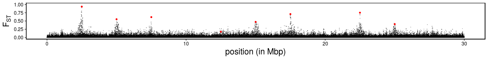
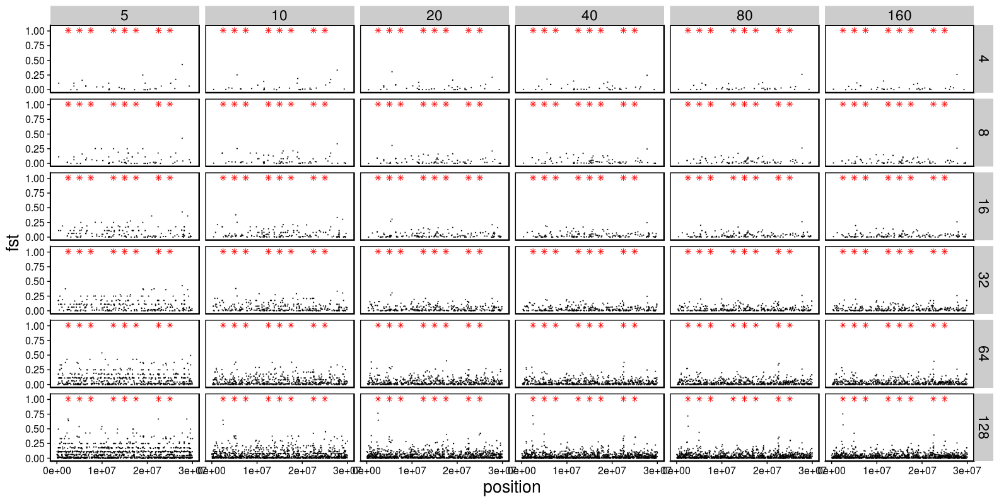

Data analysis with simulation of divergent selection on two smaller
populations
================

  - [Define all relevant functions](#define-all-relevant-functions)
  - [Two populations with divergent selection, with smaller population
    size ( Ne\~10,000 in each
    population)](#two-populations-with-divergent-selection-with-smaller-population-size-ne10000-in-each-population)
      - [The model](#the-model)
          - [Read in the ancestral
            states](#read-in-the-ancestral-states)
          - [Read mutation and substitution
            file](#read-mutation-and-substitution-file)
          - [Plot Fst](#plot-fst)
      - [Inference based on Samtool’s GL
        model](#inference-based-on-samtools-gl-model)
          - [Read in read depth and estimated
            Fst](#read-in-read-depth-and-estimated-fst)
          - [Plot the estimated per-SNP Fst (with no minimum individual
            filter)](#plot-the-estimated-per-snp-fst-with-no-minimum-individual-filter)
          - [Compute and plot the estimated windowed Fst (with no
            minimum individual filter and 5,000bp fixed
            windows)](#compute-and-plot-the-estimated-windowed-fst-with-no-minimum-individual-filter-and-5000bp-fixed-windows)
          - [Selection scan using
            PCAngsd](#selection-scan-using-pcangsd)
      - [RAD seq simulation and
        inference](#rad-seq-simulation-and-inference)
          - [Get true sample allele
            count](#get-true-sample-allele-count)
          - [Read in true sample allele count and
            Fst](#read-in-true-sample-allele-count-and-fst)
          - [Get sample true MAF and Fst from allele
            counts](#get-sample-true-maf-and-fst-from-allele-counts)
          - [Plot per SNP Fst](#plot-per-snp-fst)

``` r
library(tidyverse)
library(cowplot)
library(knitr)
library(data.table)
library(RcppCNPy)
```

# Define all relevant functions

``` r
source("../misc/two_pop_functions.R")
```

# Two populations with divergent selection, with smaller population size ( Ne\~10,000 in each population)

The same population size is simulated, but I’ve scaled down mutation
rate, recombination rate, migration rate. The selection coefficient is
unchanged. (Ignore the directory name. I’m just using it for
convenience.)

## The model

### Read in the ancestral states

``` r
ancestral <- get_ancestral("../two_pop_sim_fixed_m2_pos_lower_s_lower_r/rep_1/")
```

### Read mutation and substitution file

``` r
mutations_final <- get_mutations("../two_pop_sim_fixed_m2_pos_lower_s_lower_r/rep_1/")
real_theta_t_p1 <- sum(2*mutations_final$p1*(1-mutations_final$p1))/30000000
real_theta_t_p2 <- sum(2*mutations_final$p2*(1-mutations_final$p2))/30000000
real_theta_w_p1 <- filter(mutations_final, p1 > 0, p1 < 1) %>%
  nrow() %>% `/`(30000000*sum(1/(1:(5000*2-1))))
real_theta_w_p2 <- filter(mutations_final, p2 > 0, p2 < 1) %>%
  nrow() %>% `/`(30000000*sum(1/(1:(5000*2-1))))
tibble(theta = c("tajima", "watterson"), p1=c(real_theta_t_p1, real_theta_w_p1), p2=c(real_theta_t_p2,real_theta_w_p2))
```

    ## # A tibble: 2 x 3
    ##   theta           p1       p2
    ##   <chr>        <dbl>    <dbl>
    ## 1 tajima    0.000704 0.000728
    ## 2 watterson 0.000593 0.000605

### Plot Fst

``` r
mutations_final_m1 <- filter(mutations_final, type=="m1")
mutations_final_m2 <- filter(mutations_final, type=="m2")
mean_neutral_fst_weighted <- sum(mutations_final_m1$h_t-mutations_final_m1$h_s)/sum(mutations_final_m1$h_t)
mean_neutral_fst_weighted
```

    ## [1] 0.03674846

``` r
ggplot(mutations_final_m1, aes(x=position/10^6, y=fst)) +
  geom_point(size=0.02, alpha=0.5) +
  geom_point(data=mutations_final_m2, color="red") +
  labs(x = "position (in Mbp)", y = expression(F[ST])) + 
  xlim(c(0, 30)) +
  ylim(c(0, 1)) +
  theme_cowplot() +
  theme(text = element_text(size=20),
        panel.border = element_rect(colour = "black", fill=NA, size=1))
```

<!-- -->

``` r
arrange(mutations_final, desc(fst)) %>%
  head()
```

    ## # A tibble: 6 x 9
    ##   type  position ancestral    p1     p2 frequency_mean   h_t    h_s   fst
    ##   <chr>    <dbl> <chr>     <dbl>  <dbl>          <dbl> <dbl>  <dbl> <dbl>
    ## 1 m2     2500001 G         0.969 0.0019          0.485 0.500 0.0320 0.936
    ## 2 m1     2498645 C         0.970 0.0218          0.496 0.500 0.0506 0.899
    ## 3 m1     2491161 A         0.933 0.0326          0.483 0.499 0.0940 0.812
    ## 4 m1     2477186 A         0.887 0.0084          0.448 0.495 0.108  0.781
    ## 5 m1     2469162 A         0.879 0.0084          0.444 0.494 0.115  0.767
    ## 6 m1     2470141 A         0.879 0.0084          0.444 0.494 0.115  0.767

``` r
arrange(mutations_final_m2, desc(fst))
```

    ## # A tibble: 8 x 9
    ##   type  position ancestral    p1     p2 frequency_mean   h_t    h_s   fst
    ##   <chr>    <dbl> <chr>     <dbl>  <dbl>          <dbl> <dbl>  <dbl> <dbl>
    ## 1 m2     2500001 G         0.969 0.0019          0.485 0.500 0.0320 0.936
    ## 2 m2    22500001 G         0.869 0.0082          0.439 0.492 0.122  0.752
    ## 3 m2    17500001 A         0.833 0.002           0.417 0.486 0.141  0.709
    ## 4 m2     7500001 A         0.766 0.0018          0.384 0.473 0.181  0.618
    ## 5 m2     5000001 G         0.713 0.0009          0.357 0.459 0.205  0.553
    ## 6 m2    15000001 C         0.645 0.002           0.324 0.438 0.231  0.472
    ## 7 m2    25000001 G         0.582 0.003           0.292 0.414 0.246  0.404
    ## 8 m2    12500001 A         0.299 0.0008          0.150 0.255 0.211  0.175

## Inference based on Samtool’s GL model

### Read in read depth and estimated Fst

``` r
fst_n_ind_final <- get_estimated_fst("../two_pop_sim_fixed_m2_pos_lower_s_lower_r/rep_1/")
```

### Plot the estimated per-SNP Fst (with no minimum individual filter)

``` r
fst_plot <- ggplot(fst_n_ind_final, aes(x=position, y=fst)) +
  geom_point(alpha=0.1, size=0.1) +
  geom_point(data=mutations_final_m2, aes(x=position, y=1.01), color="red", size=0.2, shape=8) +
  facet_grid(coverage~sample_size) +
  theme_cowplot()
ggsave("../figures/two_pop_sim_fixed_m2_pos_lower_s_lower_r_fst_raw.png", fst_plot, height = 8, width=15, units = "in")
```

``` r
include_graphics("../figures/two_pop_sim_fixed_m2_pos_lower_s_lower_r_fst_raw.png")
```

<!-- -->

### Compute and plot the estimated windowed Fst (with no minimum individual filter and 5,000bp fixed windows)

``` r
windowed_fst_plot <- fixed_windowed_fst(fst_n_ind_final, 5000) %>%
  ggplot(aes(x=position, y=fst)) +
    geom_point(alpha=0.8, size=0.15) +
    geom_point(data=mutations_final_m2, aes(x=position, y=1.01), color="red", size=2, shape=8) +
    ylim(NA, 1.05) +
    facet_grid(coverage~sample_size) +
    theme_cowplot() +
    theme(text = element_text(size=20),
        panel.border = element_rect(colour = "black", fill=NA, size=1))
ggsave("../figures/two_pop_sim_fixed_m2_pos_lower_s_lower_r_windowed_fst_raw.png", windowed_fst_plot, width = 42, height = 21, units = "cm", pointsize = 20)
```

``` r
include_graphics("../figures/two_pop_sim_fixed_m2_pos_lower_s_lower_r_windowed_fst_raw.png")
```

<!-- -->

### Selection scan using PCAngsd

``` r
selection_scan <- get_selection_scan("/workdir/lcwgs-simulation/two_pop_sim_fixed_m2_pos_lower_s_lower_r/rep_1/")
selection_scan_summary <- group_by(selection_scan, coverage, sample_size) %>%
  summarize(n_snp = n(), log_p_cutoff = -log(0.05/n_snp))
selection_scan_plot <- ggplot(selection_scan, aes(x = pos, y = neg_log_p_value)) +
  geom_point(alpha=0.5, size=0.1) +
  geom_point(data=mutations_final_m2, aes(x=position, y=16), color="red", size=0.2, shape=8) +
  geom_hline(data = selection_scan_summary, aes(yintercept = log_p_cutoff), linetype = "dashed") +
  facet_grid(coverage ~ sample_size) +
  theme_cowplot()
ggsave("../figures/two_pop_sim_fixed_m2_pos_lower_s_lower_r_selection_scan.png", selection_scan_plot, height = 8, width=15, units = "in")
```

``` r
include_graphics("../figures/two_pop_sim_fixed_m2_pos_lower_s_lower_r_selection_scan.png")
```

<!-- -->

## RAD seq simulation and inference

To simulate RAD-seq, I assumed that the genotype calling is perfectly
accurate (i.e. sequence depth is high). I then took random samples along
the chromosome representing RAD tags.

### Get true sample allele count

``` r
get_sample_allele_count_per_pop("../two_pop_sim_fixed_m2_pos_lower_s_lower_r/rep_1/")
fst_all_snps <- allele_count_to_fst("/workdir/lcwgs-simulation/two_pop_sim_fixed_m2_pos_lower_s_lower_r/rep_1/")
write_tsv(fst_all_snps, "/workdir/lcwgs-simulation/two_pop_sim_fixed_m2_pos_lower_s_lower_r/rep_1/slim/fst_all_snps.tsv")
```

### Read in true sample allele count and Fst

``` r
fst_all_snps <- read_tsv("/workdir/lcwgs-simulation/two_pop_sim_fixed_m2_pos_lower_s_lower_r/rep_1/slim/fst_all_snps.tsv")
```

### Get sample true MAF and Fst from allele counts

Each RAD tag is 150 bp. Note that `n_rad_tag` are numbers of RAD tags
per Mbp. According to the “Breaking RAD” paper, the median RAD tag
density that they’ve found in studies published by then is 4.08. A few
studies had up to 20 tags per Mbp, three had up to 110 per Mbp, and one
had 362 tags per Mbp.

``` r
i <- 1
for (n in c(1,2,4,8,16,32)*120){
  maf <- subset_fst(n_rad_tag = n, combined_fst = fst_all_snps) %>%
    mutate(n_rad_tag = n/30)
  if (i == 1){
    maf_final <- maf
  } else {
    maf_final <- bind_rows(maf_final, maf)
  }
  i <- i + 1
}
```

### Plot per SNP Fst

``` r
mutate(maf_final, coverage="RAD") %>%
  filter(maf_mean>0.05, maf_mean < 0.95) %>%
  ggplot(aes(x=position, y=fst)) +
    geom_point(alpha=0.8, size=0.15) +
    geom_point(data=mutations_final_m2, aes(x=position, y=1.01), color="red", size=2, shape=8) +
    ylim(NA, 1.05) +
    facet_grid(n_rad_tag~sample_size) +
    theme_cowplot() +
    theme(text = element_text(size=20),
        panel.border = element_rect(colour = "black", fill=NA, size=1))
```

<!-- -->
