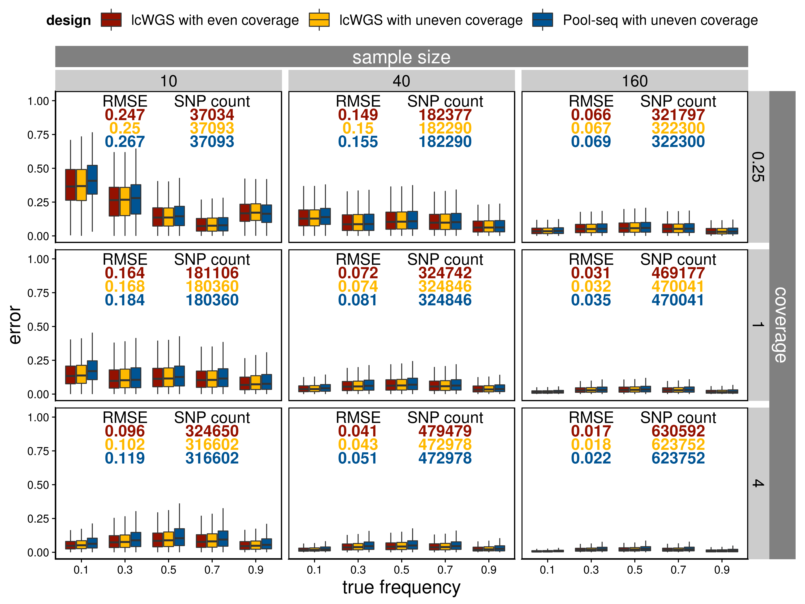

```{r setup, include=FALSE}
knitr::opts_chunk$set(echo = TRUE)
```

```{r eval=T, warning=F, message=F}
library(tidyverse)
library(cowplot)
library(knitr)
library(viridis)
library(scales)
```

## Error in allele frequency estimation

```{r eval=F, warning=F, message=F}
## lcwgs with even contribution
joined_frequency_final_even <- read_tsv("../neutral_sim/rep_1/angsd/joined_frequency_final.tsv") %>%
  transmute(frequency=frequency, frequency_bin = cut(frequency, breaks = 0:5/5), estimated_frequency=estimated_frequency, error=estimated_frequency-frequency, coverage=coverage, sample_size=sample_size, design="lcwgs_even")
## lcwgs with uneven contribution
joined_frequency_final_uneven <- read_tsv("../neutral_sim_uneven_input/rep_1/angsd/joined_frequency_final.tsv") %>%
  mutate(frequency_bin = cut(frequency, breaks = 0:5/5), error=estimated_frequency-frequency) %>%
  transmute(frequency=frequency, frequency_bin = frequency_bin, estimated_frequency=estimated_frequency, error=estimated_frequency-frequency, coverage=coverage, sample_size=sample_size, design="lcwgs_uneven")
## pool-seq with uneven contribution
joined_frequency_final_pooled_uneven <- read_tsv("../neutral_sim_uneven_input/rep_1/angsd/joined_frequency_final_poolseq.tsv") %>%
  transmute(frequency=frequency, frequency_bin = cut(frequency, breaks = 0:5/5), estimated_frequency=maf, error=estimated_frequency-frequency, coverage=coverage, sample_size=sample_size, design="poolseq_uneven") 
## combine these
joined_frequency_final_combined <- bind_rows(joined_frequency_final_even, joined_frequency_final_uneven, joined_frequency_final_pooled_uneven)
## get summary stats (number of SNPs, RMSE, R-squared)
joined_summary_table <- group_by(joined_frequency_final_combined, coverage, sample_size, design) %>%
  summarise(r_squared=round(summary(lm(estimated_frequency~frequency))$r.squared,3), 
            n=n(), 
            root_mean_error_squared=round(sqrt(mean(error^2)), 3))
  
joined_frequency_final_combined_test <- joined_frequency_final_combined[sample(1:nrow(joined_frequency_final_combined), 10000),]
## make the plot
error_plot_combined <- joined_frequency_final_combined %>%
  ggplot(aes(x=frequency_bin, y=abs(error), fill=design)) +
  geom_boxplot(outlier.shape = NA) +
  geom_text(data = joined_summary_table, x = 1.3, aes(label=root_mean_error_squared, color = design, y = 1-as.numeric(as.factor(design))/15), fontface = "bold", size=3) +
  geom_text(data = joined_summary_table, x = 2.8, aes(label=r_squared, color = design, y = 1-as.numeric(as.factor(design))/15), fontface = "bold", size=3) +
  geom_text(data = joined_summary_table, x = 4.5, aes(label=n, color = design, y = 1-as.numeric(as.factor(design))/15), fontface = "bold", size=3) +
  annotate("text", x = 1.3, y=1, label="RMSE", size=3) +
  annotate("text", x = 2.8, y=1.01, label="R^2", parse=T, size=3) +
  annotate("text", x = 4.5, y=1, label="SNP count", size=3) +
  facet_grid(coverage~sample_size) +
  scale_x_discrete(labels=seq(0.1, 0.9, 0.2))  +
  scale_fill_viridis_d(labels=c("LC-WGS with even coverage", "LC-WGS with uneven coverage", "Pool-seq with uneven coverage")) +
  scale_color_viridis_d(labels=c("LC-WGS with even coverage", "LC-WGS with uneven coverage", "Pool-seq with uneven coverage")) +
  xlab("true frequency") +
  ylab("error") +
  ylim(c(0,1.02)) +
  theme_cowplot() +
  theme(axis.text.x = element_text(angle=45),
        panel.border = element_rect(colour = "black", fill=NA, size=1),
        legend.position="top")
ggsave("../figures/error_plot_combined.png", error_plot_combined, width = 28, height = 32, units = "cm", pointsize = 20)
```

```{r eval=T, warning=F, message=F}

```

## PCA

```{r eval=F, warning=F, message=F}
i=1
for (coverage in c(0.125,0.25,0.5,1,2,4)){
  for (sample_size in c(5,10,20,40,80)){
    pop_label <- read_lines(paste0("../spatial_pop_sim_lower_m/rep_1/sample_lists/bam_list_",sample_size,"_",coverage,"x.txt")) %>%
      str_extract('p[1-9]')
    ## Read covariance matrix
    cov_matrix <- read_tsv(paste0("../spatial_pop_sim_lower_m/rep_1/angsd/bam_list_",sample_size,"_",coverage,"x.covMat"), col_names = F) %>%
      as.matrix() %>%
      .[,-(sample_size*9+1)]
    cov_matrix[is.na(cov_matrix)]<- median(cov_matrix, na.rm = T)
    ## Perform eigen decomposition
    e <- eigen(cov_matrix)
    e_value<-e$values
    x_variance<-e_value[1]/sum(e_value)*100
    y_variance<-e_value[2]/sum(e_value)*100
    e_vector <- as.data.frame(e$vectors)[,1:5]
    pca_table <- bind_cols(pop_label=pop_label, e_vector) %>%
      transmute(population=pop_label, PC1=rescale(V1, c(-1, 1)), PC2=rescale(V2, c(-1, 1)), PC3=rescale(V3, c(-1, 1)), PC4=rescale(V3, c(-1, 1)), PC5=rescale(V5, c(-1, 1)), coverage=coverage, sample_size=sample_size)
    ## Bind PCA tables and DAPC tables for all sample size and coverage combinations
    if (i==1){
      pca_table_final <- pca_table
    } else {
      pca_table_final <- bind_rows(pca_table_final,pca_table)
    }
    i=i+1
  }
}
## Get mean PC values per population
pca_table_final_per_pop <- group_by(pca_table_final, population, coverage, sample_size) %>%
  summarise(PC1_mean=mean(PC1), PC2_mean=mean(PC2), PC3_mean=mean(PC3), PC1_sd=sd(PC1), PC2_sd=sd(PC2), PC3_sd=sd(PC3)) %>%
  ungroup() %>%
  group_by(coverage, sample_size) %>%
  mutate(PC1_mean=rescale(PC1_mean, c(-1,1)), PC2_mean=rescale(PC2_mean, c(-1,1)), PC3_mean=rescale(PC3_mean, c(-1,1)))
## Plot PCA
pca_plot <- filter(pca_table_final, coverage < 4) %>% 
  ggplot(aes(x=PC1, y=PC2, color=population)) +
  geom_point() +
  facet_grid(coverage~sample_size, scales="free") +
  scale_color_viridis_d() +
  theme_cowplot() +
  theme(panel.grid = element_blank(),
        axis.text = element_blank(),
        axis.ticks = element_blank(),
        panel.border = element_rect(colour = "black", fill=NA, size=1),
        legend.position="none")
ggsave("../figures/spatial_pop_lower_m_cov_mat_pca.png", pca_plot, width = 32, height = 20, units = "cm", pointsize = 20)
```

```{r eval=T, warning=F, message=F}
include_graphics("../figures/spatial_pop_lower_m_cov_mat_pca.png")
```
