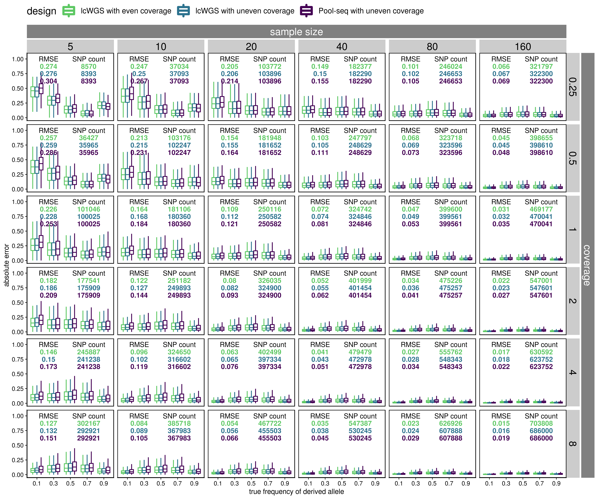
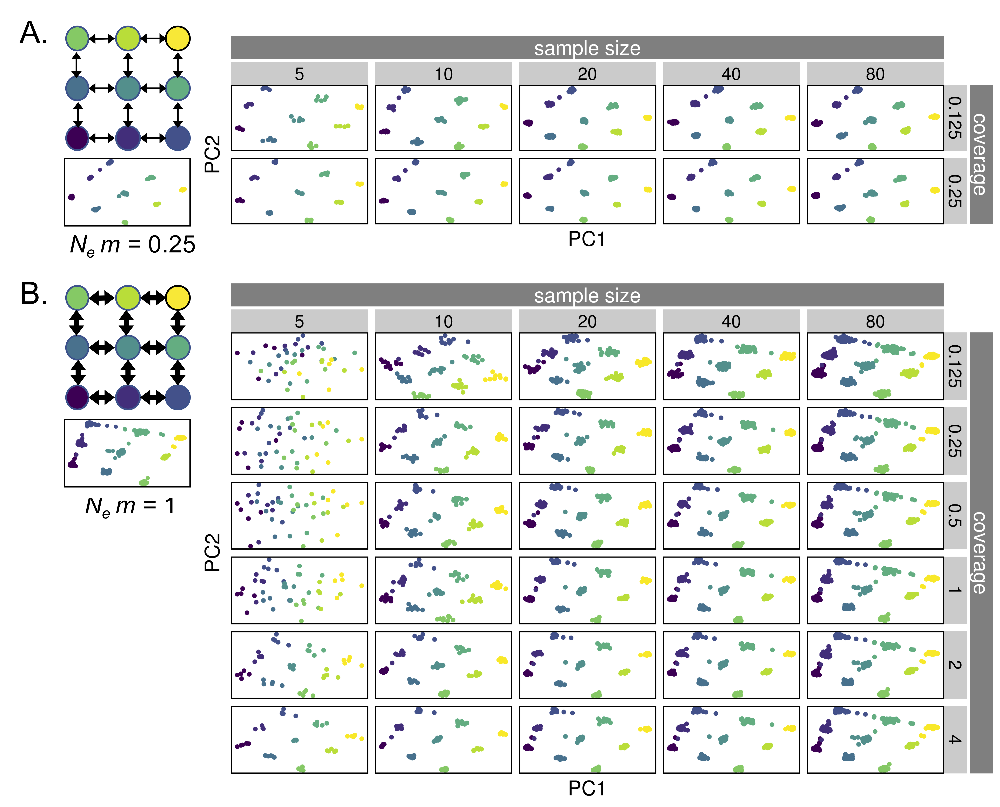
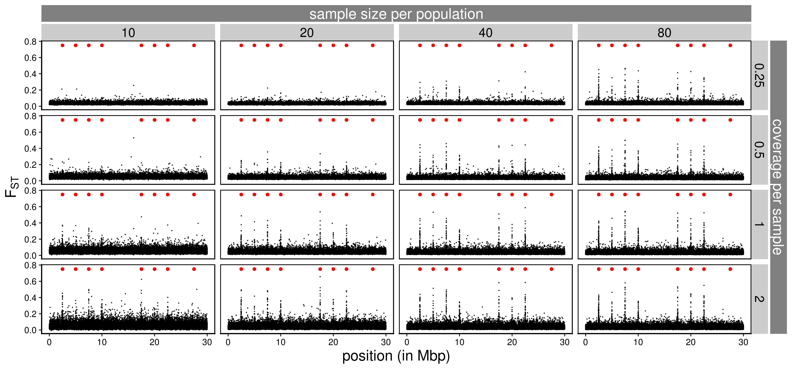
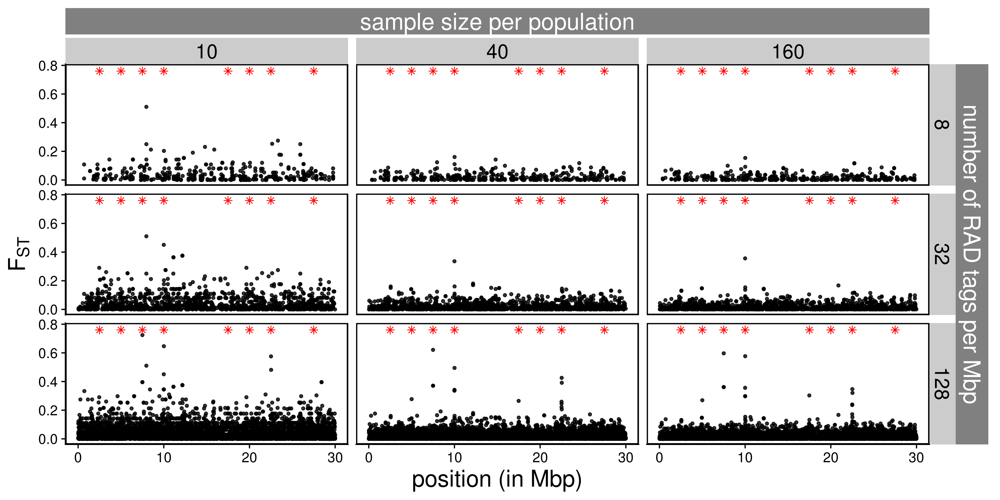
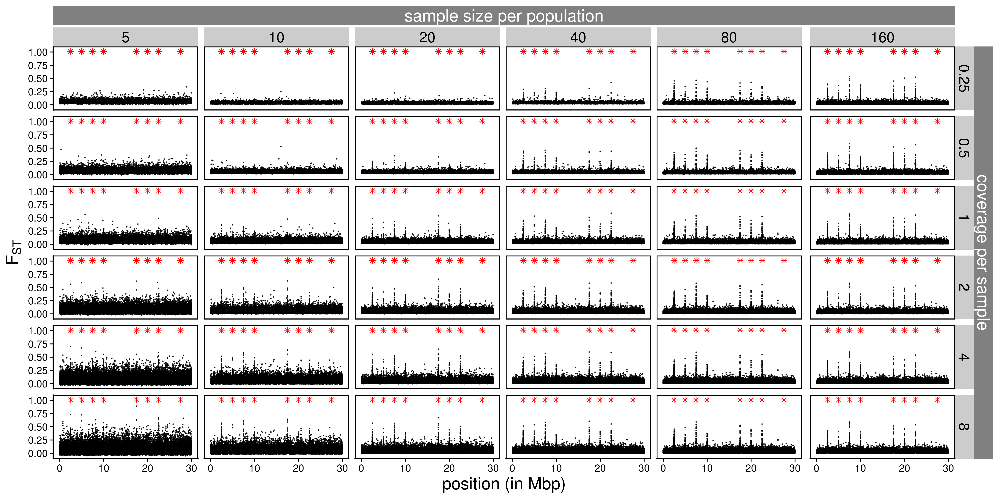
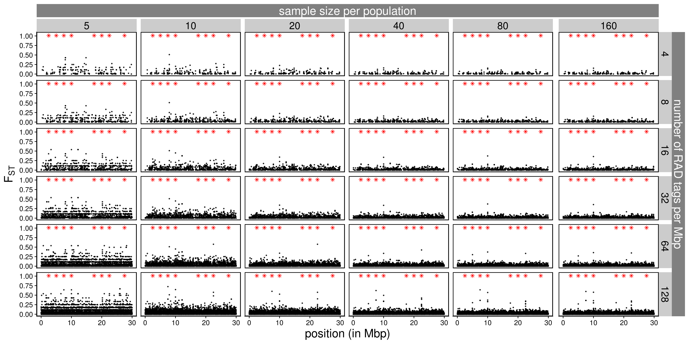

Figures for presentation and paper
================

``` r
library(tidyverse)
library(cowplot)
library(knitr)
library(viridis)
library(scales)
library(data.table)
library(grid)
library(gtable)
```

## Error in allele frequency estimation

``` r
## lcwgs with even contribution
joined_frequency_final_even <- read_tsv("../neutral_sim/rep_1/angsd/joined_frequency_final.tsv") %>%
  transmute(frequency=frequency, frequency_bin = cut(frequency, breaks = 0:5/5), estimated_frequency=estimated_frequency, error=estimated_frequency-frequency, coverage=coverage, sample_size=sample_size, design="lcwgs_even")
## lcwgs with uneven contribution
joined_frequency_final_uneven <- read_tsv("../neutral_sim_uneven_input/rep_1/angsd/joined_frequency_final.tsv") %>%
  mutate(frequency_bin = cut(frequency, breaks = 0:5/5), error=estimated_frequency-frequency) %>%
  transmute(frequency=frequency, frequency_bin = frequency_bin, estimated_frequency=estimated_frequency, error=estimated_frequency-frequency, coverage=coverage, sample_size=sample_size, design="lcwgs_uneven")
## pool-seq with uneven contribution
joined_frequency_final_pooled_uneven <- read_tsv("../neutral_sim_uneven_input/rep_1/angsd/joined_frequency_final_poolseq.tsv") %>%
  transmute(frequency=frequency, frequency_bin = cut(frequency, breaks = 0:5/5), estimated_frequency=maf, error=estimated_frequency-frequency, coverage=coverage, sample_size=sample_size, design="poolseq_uneven")
```

#### For presentations

``` r
## combine these
joined_frequency_final_combined <- bind_rows(joined_frequency_final_even, joined_frequency_final_uneven, joined_frequency_final_pooled_uneven) %>%
  filter(coverage < 4, sample_size > 5, sample_size < 160)

## get summary stats (number of SNPs, RMSE, R-squared)
joined_summary_table <- group_by(joined_frequency_final_combined, coverage, sample_size, design) %>%
  summarise(r_squared=round(summary(lm(estimated_frequency~frequency))$r.squared,3), 
            n=n(), 
            root_mean_error_squared=round(sqrt(mean(error^2)), 3))
  
joined_frequency_final_combined_test <- joined_frequency_final_combined[sample(1:nrow(joined_frequency_final_combined), 10000),]
## make the plot
error_plot_combined <- joined_frequency_final_combined %>%
  ggplot(aes(x=frequency_bin, y=abs(error), fill=design)) +
  geom_boxplot(outlier.shape = NA) +
  geom_text(data = joined_summary_table, x = 2, aes(label=root_mean_error_squared, color = design, y = 1-as.numeric(as.factor(design))/10), fontface = "bold", size=6, show.legend = F) +
  #geom_text(data = joined_summary_table, x = 2.8, aes(label=r_squared, color = design, y = 1-as.numeric(as.factor(design))/14), fontface = "bold", size=5, show.legend = F) +
  geom_text(data = joined_summary_table, x = 4, aes(label=n, color = design, y = 1-as.numeric(as.factor(design))/10), fontface = "bold", size=6, show.legend = F) +
  annotate("text", x = 2, y=1, label="RMSE", size=6) +
  #annotate("text", x = 2.8, y=1.01, label="R^2", parse=T, size=5) +
  annotate("text", x = 4, y=1, label="SNP count", size=6) +
  facet_grid(coverage~sample_size) +
  scale_x_discrete(labels=seq(0.1, 0.9, 0.2))  +
  scale_fill_viridis_d(labels=c("LC-WGS with even coverage", "LC-WGS with uneven coverage", "Pool-seq with uneven coverage"), begin = 0, end = 0.75) +
  scale_color_viridis_d(labels=c("LC-WGS with even coverage", "LC-WGS with uneven coverage", "Pool-seq with uneven coverage"), begin = 0, end = 0.75) +
  xlab("true frequency") +
  ylab("error") +
  ylim(c(0,1.02)) +
  theme_cowplot() +
  theme(text = element_text(size=20),
        axis.text.x = element_text(angle=0),
        panel.border = element_rect(colour = "black", fill=NA, size=1),
        legend.position="right")

error_plot_combined_grob <- ggplotGrob(error_plot_combined)

error_plot_combined_new <- gtable_add_cols(error_plot_combined_grob, unit(error_plot_combined_grob$widths[[12]], 'cm'), 13)  %>%
  gtable_add_grob(list(rectGrob(gp = gpar(col = NA, fill = gray(0.5))),
                       textGrob("coverage", rot = -90, gp = gpar(col = gray(1)))),
                  8, 14, 14, 14, name = paste(runif(2))) %>%
  gtable_add_cols(unit(1/8, "line"), 13) %>%
  gtable_add_rows(unit(error_plot_combined_grob$heights[[7]], 'cm'), 6) %>%
  gtable_add_grob(list(rectGrob(gp = gpar(col = NA, fill = gray(0.5))),
                          textGrob("sample size", gp = gpar(col = gray(1)))),
                     7, 5, 7, 11, name = paste(runif(2))) %>%
  gtable_add_rows(unit(1/8, "line"), 7)

ggsave("../figures/error_plot_combined.png", error_plot_combined_new, width = 45, height = 27, units = "cm", pointsize = 20)
```

``` r
include_graphics("../figures/error_plot_combined.png")
```

<!-- -->

#### For the paper

``` r
## combine these
joined_frequency_final_combined <- bind_rows(joined_frequency_final_even, joined_frequency_final_uneven, joined_frequency_final_pooled_uneven) 

## get summary stats (number of SNPs, RMSE, R-squared)
joined_summary_table <- group_by(joined_frequency_final_combined, coverage, sample_size, design) %>%
  summarise(r_squared=round(summary(lm(estimated_frequency~frequency))$r.squared,3), 
            n=n(), 
            root_mean_error_squared=round(sqrt(mean(error^2)), 3))
  
joined_frequency_final_combined_test <- joined_frequency_final_combined[sample(1:nrow(joined_frequency_final_combined), 10000),]
## make the plot
error_plot_combined <- joined_frequency_final_combined %>%
  ggplot(aes(x=frequency_bin, y=abs(error), fill=design)) +
  geom_boxplot(outlier.shape = NA, color="black") +
  geom_text(data = joined_summary_table, x = 1.7, aes(label=root_mean_error_squared, color = design, y = 1-as.numeric(as.factor(design))/8), fontface = "bold", size=4.8, show.legend = F) +
  #geom_text(data = joined_summary_table, x = 2.8, aes(label=r_squared, color = design, y = 1-as.numeric(as.factor(design))/14), fontface = "bold", size=5, show.legend = F) +
  geom_text(data = joined_summary_table, x = 4.1, aes(label=n, color = design, y = 1-as.numeric(as.factor(design))/8), fontface = "bold", size=4.8, show.legend = F) +
  annotate("text", x = 1.7, y = 1, label="RMSE", size=4.8) +
  #annotate("text", x = 2.8, y=1.01, label="R^2", parse=T, size=5) +
  annotate("text", x = 4.1, y = 1, label="SNP count", size=4.8) +
  facet_grid(coverage~sample_size) +
  scale_x_discrete(labels=seq(0.1, 0.9, 0.2))  +
  scale_fill_viridis_d(labels=c("LC-WGS with even coverage", "LC-WGS with uneven coverage", "Pool-seq with uneven coverage"), begin = 0, end = 0.75) +
  scale_color_viridis_d(labels=c("LC-WGS with even coverage", "LC-WGS with uneven coverage", "Pool-seq with uneven coverage"), begin = 0, end = 0.75) +
  xlab("true frequency of derived allele") +
  ylab("absolute error") +
  ylim(c(0,1.05)) +
  theme_cowplot() +
  theme(strip.text = element_text(size=20),
        axis.text.x = element_text(angle=0),
        panel.border = element_rect(colour = "black", fill=NA, size=1),
        legend.position = "top",
        legend.title = element_text(size = 20),
        legend.text = element_text(size = 15),
        legend.key.size = unit(1, 'cm'))

error_plot_combined_grob <- ggplotGrob(error_plot_combined)

error_plot_combined_new <- gtable_add_cols(error_plot_combined_grob, unit(error_plot_combined_grob$widths[[16]], 'cm'), 16)  %>%
  gtable_add_grob(list(rectGrob(gp = gpar(col = NA, fill = gray(0.5))),
                       textGrob("coverage", rot = -90, gp = gpar(col = gray(1)))),
                  10, 17, 20, 17, name = paste(runif(2))) %>%
  gtable_add_cols(unit(1/8, "line"), 16) %>%
  gtable_add_rows(unit(error_plot_combined_grob$heights[[9]], 'cm'), 8) %>%
  gtable_add_grob(list(rectGrob(gp = gpar(col = NA, fill = gray(0.5))),
                          textGrob("sample size", gp = gpar(col = gray(1)))),
                     9, 5, 9, 15, name = paste(runif(2))) %>%
  gtable_add_rows(unit(1/8, "line"), 9)

ggsave("../figures/error_plot_combined_for_paper.png", error_plot_combined_new, width = 42, height = 35, units = "cm", pointsize = 20)
```

``` r

```

<!-- -->

## PCA

#### Lower migration rate

``` r
i=1
for (coverage in c(0.125,0.25,0.5,1,2,4)){
  for (sample_size in c(5,10,20,40,80)){
    pop_label <- read_lines(paste0("../spatial_pop_sim_lower_m/rep_1/sample_lists/bam_list_",sample_size,"_",coverage,"x.txt")) %>%
      str_extract('p[1-9]')
    ## Read covariance matrix
    cov_matrix <- read_tsv(paste0("../spatial_pop_sim_lower_m/rep_1/angsd/bam_list_",sample_size,"_",coverage,"x.covMat"), col_names = F) %>%
      as.matrix() %>%
      .[,-(sample_size*9+1)]
    cov_matrix[is.na(cov_matrix)]<- median(cov_matrix, na.rm = T)
    ## Perform eigen decomposition
    e <- eigen(cov_matrix)
    e_value<-e$values
    x_variance<-e_value[1]/sum(e_value)*100
    y_variance<-e_value[2]/sum(e_value)*100
    e_vector <- as.data.frame(e$vectors)[,1:5]
    pca_table <- bind_cols(pop_label=pop_label, e_vector) %>%
      transmute(population=pop_label, PC1=rescale(V1, c(-1, 1)), PC2=rescale(V2, c(-1, 1)), PC3=rescale(V3, c(-1, 1)), PC4=rescale(V3, c(-1, 1)), PC5=rescale(V5, c(-1, 1)), coverage=coverage, sample_size=sample_size)
    ## Bind PCA tables and DAPC tables for all sample size and coverage combinations
    if (i==1){
      pca_table_final <- pca_table
    } else {
      pca_table_final <- bind_rows(pca_table_final,pca_table)
    }
    i=i+1
  }
}
## Get mean PC values per population
pca_table_final_per_pop <- group_by(pca_table_final, population, coverage, sample_size) %>%
  summarise(PC1_mean=mean(PC1), PC2_mean=mean(PC2), PC3_mean=mean(PC3), PC1_sd=sd(PC1), PC2_sd=sd(PC2), PC3_sd=sd(PC3)) %>%
  ungroup() %>%
  group_by(coverage, sample_size) %>%
  mutate(PC1_mean=rescale(PC1_mean, c(-1,1)), PC2_mean=rescale(PC2_mean, c(-1,1)), PC3_mean=rescale(PC3_mean, c(-1,1)))

## Plot PCA
pca_plot <- filter(pca_table_final, coverage < 0.5) %>% 
  ggplot(aes(x=PC1, y=PC2, color=population)) +
  geom_point() +
  facet_grid(coverage~sample_size, scales="free") +
  scale_color_viridis_d() +
  theme_cowplot() +
  theme(text = element_text(size=20),
        panel.grid = element_blank(),
        axis.text = element_blank(),
        axis.ticks = element_blank(),
        panel.border = element_rect(colour = "black", fill=NA, size=1),
        legend.position="none")

pca_plot_grob <- ggplotGrob(pca_plot)

pca_plot_new <- gtable_add_cols(pca_plot_grob, unit(pca_plot_grob$widths[[14]], 'cm'), 15)  %>%
  gtable_add_grob(list(rectGrob(gp = gpar(col = NA, fill = gray(0.5))),
                       textGrob("coverage", rot = -90, gp = gpar(col = gray(1)))),
                  8, 16, 10, 16, name = paste(runif(2))) %>%
  gtable_add_cols(unit(1/8, "line"), 15) %>%
  gtable_add_rows(unit(pca_plot_grob$heights[[7]], 'cm'), 6) %>%
  gtable_add_grob(list(rectGrob(gp = gpar(col = NA, fill = gray(0.5))),
                          textGrob("sample size", gp = gpar(col = gray(1)))),
                     7, 5, 7, 13, name = paste(runif(2))) %>%
  gtable_add_rows(unit(1/8, "line"), 7)

ggsave("../figures/spatial_pop_lower_m_cov_mat_pca.png", pca_plot_new, width = 28, height = 8, units = "cm", pointsize = 20)
```

``` r
include_graphics("../figures/spatial_pop_lower_m_cov_mat_pca.png")
```

<!-- -->

#### Higher migration rate

``` r
i=1
for (coverage in c(0.125,0.25,0.5,1,2,4)){
  for (sample_size in c(5,10,20,40,80)){
    pop_label <- read_lines(paste0("../spatial_pop_sim/rep_1/sample_lists/bam_list_",sample_size,"_",coverage,"x.txt")) %>%
      str_extract('p[1-9]')
    ## Read covariance matrix
    cov_matrix <- read_tsv(paste0("../spatial_pop_sim/rep_1/angsd/bam_list_",sample_size,"_",coverage,"x.covMat"), col_names = F) %>%
      as.matrix() %>%
      .[,-(sample_size*9+1)]
    cov_matrix[is.na(cov_matrix)]<- median(cov_matrix, na.rm = T)
    ## Perform eigen decomposition
    e <- eigen(cov_matrix)
    e_value<-e$values
    x_variance<-e_value[1]/sum(e_value)*100
    y_variance<-e_value[2]/sum(e_value)*100
    e_vector <- as.data.frame(e$vectors)[,1:5]
    pca_table <- bind_cols(pop_label=pop_label, e_vector) %>%
      transmute(population=pop_label, PC1=rescale(V1, c(-1, 1)), PC2=rescale(V2, c(-1, 1)), PC3=rescale(V3, c(-1, 1)), PC4=rescale(V3, c(-1, 1)), PC5=rescale(V5, c(-1, 1)), coverage=coverage, sample_size=sample_size)
    ## Bind PCA tables and DAPC tables for all sample size and coverage combinations
    if (i==1){
      pca_table_final <- pca_table
    } else {
      pca_table_final <- bind_rows(pca_table_final,pca_table)
    }
    i=i+1
  }
}
## Get mean PC values per population
pca_table_final_per_pop <- group_by(pca_table_final, population, coverage, sample_size) %>%
  summarise(PC1_mean=mean(PC1), PC2_mean=mean(PC2), PC3_mean=mean(PC3), PC1_sd=sd(PC1), PC2_sd=sd(PC2), PC3_sd=sd(PC3)) %>%
  ungroup() %>%
  group_by(coverage, sample_size) %>%
  mutate(PC1_mean=rescale(PC1_mean, c(-1,1)), PC2_mean=rescale(PC2_mean, c(-1,1)), PC3_mean=rescale(PC3_mean, c(-1,1)))

## Plot PCA
pca_plot <- pca_table_final %>% 
  ggplot(aes(x=PC1, y=PC2, color=population)) +
  geom_point() +
  facet_grid(coverage~sample_size, scales="free") +
  scale_color_viridis_d() +
  theme_cowplot() +
  theme(text = element_text(size=20),
        panel.grid = element_blank(),
        axis.text = element_blank(),
        axis.ticks = element_blank(),
        panel.border = element_rect(colour = "black", fill=NA, size=1),
        legend.position="none")

pca_plot_grob <- ggplotGrob(pca_plot)

pca_plot_new <- gtable_add_cols(pca_plot_grob, unit(pca_plot_grob$widths[[14]], 'cm'), 15)  %>%
  gtable_add_grob(list(rectGrob(gp = gpar(col = NA, fill = gray(0.5))),
                       textGrob("coverage", rot = -90, gp = gpar(col = gray(1)))),
                  8, 16, 18, 16, name = paste(runif(2))) %>%
  gtable_add_cols(unit(1/8, "line"), 15) %>%
  gtable_add_rows(unit(pca_plot_grob$heights[[7]], 'cm'), 6) %>%
  gtable_add_grob(list(rectGrob(gp = gpar(col = NA, fill = gray(0.5))),
                          textGrob("sample size", gp = gpar(col = gray(1)))),
                     7, 5, 7, 13, name = paste(runif(2))) %>%
  gtable_add_rows(unit(1/8, "line"), 7)

ggsave("../figures/spatial_pop_cov_mat_pca.png", pca_plot_new, width = 28, height = 18.5, units = "cm", pointsize = 20)
```

``` r
include_graphics("../figures/spatial_pop_cov_mat_pca.png")
```

<!-- -->

Subsequently, I combined these two figures with schematics of their true
population structures using PowerPoint. The result looks like this:

``` r

```

<!-- -->

## Fst

#### Define some functions

``` r
get_ancestral <- function(x){
  read_csv(paste0(x,"slim/ancestral.fasta"), col_types = cols())[[1]] %>%
    str_split(pattern="") %>%
    .[[1]] %>%
    bind_cols(ancestral=., position=1:30000000)
}

get_mutations <- function(x){
  ## Read in the mutation file outputted by SLiM
  mutations <- read_delim(paste0(x, "slim/mutations.txt"), delim = " ", col_names = F, col_types = cols()) %>%
    transmute(population=X4, type=X6, position=X7+1, base=X13, frequency=X12/10000) %>%
    left_join(ancestral, by="position") %>%
    group_by(population, type, position, ancestral, base) %>%
    summarise(frequency=sum(frequency)) %>%
    ungroup()
  ## Read in the substitutions file outputted by SLiM
  ## This is necessary because mutations can happen again after one fixation, so frequencies from the mutation file do not always reflect the true derived allele frequency
  substitutions <- read_delim(paste0(x,"slim/substitutions.txt"), delim = " ", skip=2, col_names = F, col_types = cols()) %>%
    transmute(type=X3, position=X4+1, base=X10, generation=X9, p1=1, p2=1) %>%
    group_by(type, position) %>%
    filter(generation==max(generation)) %>%
    ungroup() %>%
    left_join(ancestral, by="position") %>%
    select(-generation) %>%
    filter(base!=ancestral) %>%
    gather(key=population, value=frequency, 4:5) %>%
    arrange(position)
  ## The following steps are necessary because there are complications such as back mutations and triallelic loci in the mutation file
  ## Join mutations and substitutions in a temp table
  mutations_final_temp <-  mutations %>%
    spread(key = base, value=frequency) %>%
    full_join(substitutions, by=c("position", "type", "ancestral", "population")) %>%
    arrange(position) %>%
    mutate(base=ifelse(is.na(base), ancestral, base)) %>%
    mutate_all(~replace(., is.na(.), 0)) %>%
    mutate(frequency=1-`A` -`C` -`G` -`T`)
  ## More wrangling
  mutations_final <- mutations_final_temp[1:8] %>%
    gather(key=base, value=frequency, 5:8) %>%
    bind_rows(mutations_final_temp[c(1:4, 9:10)]) %>%
    mutate(frequency=ifelse(base==ancestral, 0, frequency)) %>%
    group_by(population, type, position, ancestral) %>%
    summarise(frequency=sum(frequency)) %>%
    ungroup() %>%
    spread(key=population, value=frequency) %>%
    mutate_all(~replace(., is.na(.), 0)) %>% 
    filter(!(p1==1 & p2==1), !(p1==0 & p2==0)) %>%
    mutate(frequency_mean = (p1 + p2)/2, h_t=2*frequency_mean*(1-frequency_mean), h_s=p1*(1-p1) + p2*(1-p2), fst=1-h_s/h_t)
  return(mutations_final)
}

get_estimated_fst <- function(x){
  i=1
  for (coverage in c(0.25,0.5,1,2,4,8)){
    for (sample_size in c(5,10,20,40,80, 160)){
      ## read in estimated fst
      fst <- read_tsv(paste0(x, "angsd/bam_list_", sample_size, "_", coverage, "x.fst"), col_names = F, col_types = cols()) %>%
        transmute(position=X2, alpha=X3, beta=X4, fst=X5, coverage=coverage, sample_size=sample_size)
      ## read per population depth
      p1_n_ind <- read_tsv(paste0(x, "angsd/bam_list_p1_", sample_size, "_", coverage, "x.mafs.gz"), col_types = cols()) %>%
        transmute(position=position, p1_n_ind=nInd)
      p2_n_ind <- read_tsv(paste0(x, "angsd/bam_list_p2_", sample_size, "_", coverage, "x.mafs.gz"), col_types = cols()) %>%
        transmute(position=position, p2_n_ind=nInd)
      ## join fst with depth_files
      fst_n_ind <- left_join(fst, p1_n_ind, by="position") %>%
        left_join(p2_n_ind, by="position")
      ## compile the final files for plotting
      if (i==1){
        fst_n_ind_final <- fst_n_ind
      } else {
        fst_n_ind_final <- bind_rows(fst_n_ind_final, fst_n_ind)
      }
      i=i+1
    }
  }
  return(fst_n_ind_final)
}

fixed_windowed_fst <- function(x, window_length){
  mutate(x, position=cut(position, 
                         breaks=seq(0,40*10^6,window_length),
                         labels=seq(window_length/2,40*10^6-window_length/2,window_length))) %>%
    group_by(position, coverage, sample_size) %>%
    summarise(fst=sum(alpha)/sum(beta)) %>%
    ungroup() %>%
    mutate(position=as.numeric(as.character(position)))
}
count_to_maf <- function(ancestral_allele, totA, totC, totG, totT){
  if(ancestral_allele == "A"){
    minor_allele_count <- max(totC, totG, totT)
  } else if(ancestral_allele == "C"){
    minor_allele_count <- max(totA, totG, totT)
  } else if(ancestral_allele == "G"){
    minor_allele_count <- max(totA, totC, totT)
  } else if(ancestral_allele == "T"){
    minor_allele_count <- max(totA, totC, totG)
  }
  maf <- minor_allele_count/sum(totA, totC, totG, totT)
  return(maf)
}
allele_count_to_fst <- function(x, n_rad_tag){
  set.seed(1)
  rad_intervals <- sample(1:(30000000-150), n_rad_tag) %>%
    tibble(start=., stop=.+150) %>%
    arrange(by=start)
  i <- 1
  for (sample_size in c(5,10,20,40,80,160)){
    base_count_p1 <- read_tsv(paste0(x,"slim/p1_", sample_size, "_base_count.tsv"), col_types = cols()) %>%
      filter(position %inrange% as.list(rad_intervals))
    maf_p1 <- base_count_p1 %>%
      rowwise() %>%
      transmute(maf = count_to_maf(ancestral, A_count, C_count, G_count, T_count), position=position) %>%
      ungroup()
    base_count_p2 <- read_tsv(paste0(x, "slim/p2_", sample_size, "_base_count.tsv"), col_types = cols()) %>%
      filter(position %inrange% as.list(rad_intervals))
    maf_p2 <- base_count_p2 %>%
      rowwise() %>%
      transmute(maf = count_to_maf(ancestral, A_count, C_count, G_count, T_count), position=position) %>%
      ungroup()
    fst <- tibble(position=maf_p1$position, p1=maf_p1$maf, p2=maf_p2$maf) %>%
      rowwise() %>%
      mutate(maf_mean = (p1+p2)/2) %>%
      filter(maf_mean>0.05, maf_mean < 0.95) %>%
      mutate(h_t=2*maf_mean*(1-maf_mean), h_s=p1*(1-p1) + p2*(1-p2), fst=1-h_s/h_t, sample_size=sample_size)
    if (i==1) {
      fst_final <- fst
    } else {
      fst_final <- bind_rows(fst_final, fst)
    }
    i <- i+1
  }
  return(fst_final)
}
```

#### Read in files from SLiM simulation

``` r
ancestral <- get_ancestral("../two_pop_sim_fixed_m2_pos/rep_1/")
mutations_final <- get_mutations("../two_pop_sim_fixed_m2_pos/rep_1/")
mutations_final_m1 <- filter(mutations_final, type=="m1")
mutations_final_m2 <- filter(mutations_final, type=="m2")
true_fst_plot <- ggplot(mutations_final_m1, aes(x=position/10^6, y=fst)) +
  geom_point(size=0.02, alpha=0.5) +
  geom_point(data=mutations_final_m2, color="red") +
  labs(x = "position (in Mbp)", y = expression(F[ST])) + 
  xlim(c(0, 30)) +
  ylim(c(0, 1)) +
  theme_cowplot() +
  theme(text = element_text(size=20),
        panel.border = element_rect(colour = "black", fill=NA, size=1))
ggsave("../figures/true_fst_plot.png", true_fst_plot, width = 42, height = 5, units = "cm", pointsize = 20)
```

``` r

```

<!-- -->

#### Read in files for LC-WGS

``` r
fst_n_ind_final <- get_estimated_fst("../two_pop_sim_fixed_m2_pos/rep_1/")
```

#### Read in files for RAD seq

``` r
i <- 1
for (n in c(1,2,4,8,16,32)*120){
  maf <- allele_count_to_fst("../two_pop_sim_fixed_m2_pos/rep_1/", n_rad_tag = n) %>%
  mutate(n_rad_tag = n)
  if (i == 1){
    maf_final <- maf
  } else {
    maf_final <- bind_rows(maf_final, maf)
  }
  i <- i + 1
}
```

#### For presentations

``` r
fst_plot <- filter(fst_n_ind_final, coverage < 4, sample_size > 5, sample_size < 160) %>%
  fixed_windowed_fst(1000) %>%
  ggplot(aes(x=position/10^6, y=fst)) +
  geom_point(alpha=0.8, size=0.15) +
  geom_point(data=mutations_final_m2, aes(x=position/10^6, y=0.75), color="red", size=2, shape=16) +
  ylim(NA, 0.75) +
  labs(x = "position (in Mbp)", y = expression(F[ST])) + 
  facet_grid(coverage~sample_size) +
  theme_cowplot() +
  theme(text = element_text(size=20)
        #, axis.title.x = element_blank(),
        #axis.text.x = element_blank(),
        #axis.ticks.x = element_blank()
        )

fst_plot_grob <- ggplotGrob(fst_plot)

fst_plot_new <- gtable_add_cols(fst_plot_grob, unit(fst_plot_grob$widths[[12]], 'cm'), 13)  %>%
  gtable_add_grob(list(rectGrob(gp = gpar(col = NA, fill = gray(0.5))),
                       textGrob("coverage", rot = -90, gp = gpar(col = gray(1)))),
                  8, 14, 14, 14, name = paste(runif(2))) %>%
  gtable_add_cols(unit(1/8, "line"), 13) %>%
  gtable_add_rows(unit(fst_plot_grob$heights[[7]], 'cm'), 6) %>%
  gtable_add_grob(list(rectGrob(gp = gpar(col = NA, fill = gray(0.5))),
                          textGrob("sample size", gp = gpar(col = gray(1)))),
                     7, 5, 7, 11, name = paste(runif(2))) %>%
  gtable_add_rows(unit(1/8, "line"), 7)

ggsave("../figures/two_pop_sim_fixed_m2_pos_windowed_fst.png", fst_plot_new, width = 15, height = 7, units = "in", pointsize = 20)
```

``` r

```

<!-- -->

    fst_plot_radseq <- maf_final %>%
      filter(sample_size > 5, sample_size < 160, n_rad_tag < 1000) %>%
      mutate(n_rad_tag = n_rad_tag/30) %>%
      ggplot(aes(x=position/10^6, y=fst)) +
      geom_point(alpha=0.8, size=1) +
      geom_point(data=mutations_final_m2, aes(x=position/10^6, y=0.75), color="red", size=2, shape=16) +
      facet_grid(n_rad_tag~sample_size) +
      labs(x = "position (in Mbp)", y = expression(F[ST])) + 
      theme_cowplot() +
      theme(text = element_text(size=20))
    fst_plot_grob <- ggplotGrob(fst_plot_radseq)
    
    fst_plot_new <- gtable_add_cols(fst_plot_grob, unit(fst_plot_grob$widths[[12]], 'cm'), 13)  %>%
      gtable_add_grob(list(rectGrob(gp = gpar(col = NA, fill = gray(0.5))),
                           textGrob("number of RAD tags per Mbp", rot = -90, gp = gpar(col = gray(1)))),
                      8, 14, 14, 14, name = paste(runif(2))) %>%
      gtable_add_cols(unit(1/8, "line"), 13) %>%
      gtable_add_rows(unit(fst_plot_grob$heights[[7]], 'cm'), 6) %>%
      gtable_add_grob(list(rectGrob(gp = gpar(col = NA, fill = gray(0.5))),
                              textGrob("sample size", gp = gpar(col = gray(1)))),
                         7, 5, 7, 11, name = paste(runif(2))) %>%
      gtable_add_rows(unit(1/8, "line"), 7)
    ggsave("../figures/two_pop_sim_fixed_m2_pos_rad_seq_windowed_fst.png", fst_plot_new, width = 15, height = 7, units = "in", pointsize = 20)

``` r

```

<!-- -->

#### For papers

``` r
fst_plot <- fst_n_ind_final %>%
  fixed_windowed_fst(1000) %>%
  ggplot(aes(x=position/10^6, y=fst)) +
  geom_point(alpha=0.8, size=0.15) +
  geom_point(data=mutations_final_m2, aes(x=position/10^6, y=1.01), color="red", size=2, shape=16) +
  ylim(NA, 1.05) +
  labs(x = "position (in Mbp)", y = expression(F[ST])) + 
  facet_grid(coverage~sample_size) +
  theme_cowplot() +
  theme(text = element_text(size=20),
        panel.border = element_rect(colour = "black", fill=NA, size=1)
        #, axis.title.x = element_blank(),
        #axis.text.x = element_blank(),
        #axis.ticks.x = element_blank()
        )

fst_plot_grob <- ggplotGrob(fst_plot)

fst_plot_new <- gtable_add_cols(fst_plot_grob, unit(fst_plot_grob$widths[[16]], 'cm'), 16)  %>%
  gtable_add_grob(list(rectGrob(gp = gpar(col = NA, fill = gray(0.5))),
                       textGrob("coverage", rot = -90, gp = gpar(col = gray(1)))),
                  8, 17, 18, 17, name = paste(runif(2))) %>%
  gtable_add_cols(unit(1/8, "line"), 13) %>%
  gtable_add_rows(unit(fst_plot_grob$heights[[7]], 'cm'), 6) %>%
  gtable_add_grob(list(rectGrob(gp = gpar(col = NA, fill = gray(0.5))),
                          textGrob("sample size", gp = gpar(col = gray(1)))),
                     7, 5, 7, 16, name = paste(runif(2))) %>%
  gtable_add_rows(unit(1/8, "line"), 7)

ggsave("../figures/two_pop_sim_fixed_m2_pos_windowed_fst_for_paper.png", fst_plot_new, width = 42, height = 21, units = "cm", pointsize = 20)
```

``` r

```

<!-- -->

``` r
fst_plot_radseq <- maf_final %>%
  mutate(n_rad_tag = n_rad_tag/30) %>%
  ggplot(aes(x=position/10^6, y=fst)) +
  geom_point(alpha=0.8, size=0.5) +
  geom_point(data=mutations_final_m2, aes(x=position/10^6, y=1.01), color="red", size=2, shape=16) +
  ylim(c(NA, 1.05)) +
  facet_grid(n_rad_tag~sample_size) +
  labs(x = "position (in Mbp)", y = expression(F[ST])) + 
  theme_cowplot() +
  theme(text = element_text(size=20),
        panel.border = element_rect(colour = "black", fill=NA, size=1))
fst_plot_grob <- ggplotGrob(fst_plot_radseq)

fst_plot_new <- gtable_add_cols(fst_plot_grob, unit(fst_plot_grob$widths[[16]], 'cm'), 16)  %>%
  gtable_add_grob(list(rectGrob(gp = gpar(col = NA, fill = gray(0.5))),
                       textGrob("number of RAD tags per Mbp", rot = -90, gp = gpar(col = gray(1)))),
                  8, 17, 18, 17, name = paste(runif(2))) %>%
  gtable_add_cols(unit(1/8, "line"), 13) %>%
  gtable_add_rows(unit(fst_plot_grob$heights[[7]], 'cm'), 6) %>%
  gtable_add_grob(list(rectGrob(gp = gpar(col = NA, fill = gray(0.5))),
                          textGrob("sample size", gp = gpar(col = gray(1)))),
                     7, 5, 7, 16, name = paste(runif(2))) %>%
  gtable_add_rows(unit(1/8, "line"), 7)
ggsave("../figures/two_pop_sim_fixed_m2_pos_rad_seq_fst_for_paper.png", fst_plot_new, width = 42, height = 21, units = "cm", pointsize = 20)
```

``` r

```

<!-- -->
