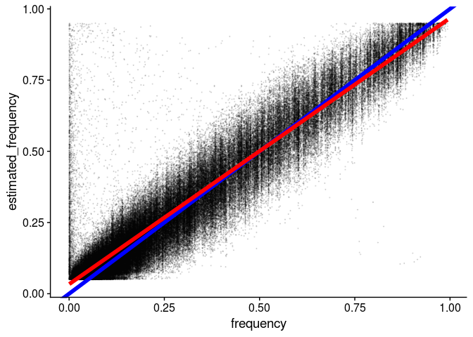
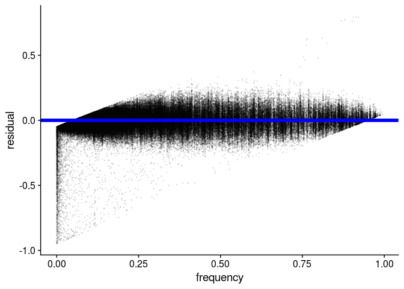

Simulation workflow
================

``` r
library(tidyverse)
```

    ## ── Attaching packages ──────────────────────────────────────────────────────────────── tidyverse 1.2.1 ──

    ## ✔ ggplot2 3.2.1     ✔ purrr   0.3.2
    ## ✔ tibble  2.1.3     ✔ dplyr   0.8.3
    ## ✔ tidyr   1.0.0     ✔ stringr 1.4.0
    ## ✔ readr   1.3.1     ✔ forcats 0.4.0

    ## ── Conflicts ─────────────────────────────────────────────────────────────────── tidyverse_conflicts() ──
    ## ✖ dplyr::filter() masks stats::filter()
    ## ✖ dplyr::lag()    masks stats::lag()

``` r
library(cowplot)
```

    ## 
    ## ********************************************************

    ## Note: As of version 1.0.0, cowplot does not change the

    ##   default ggplot2 theme anymore. To recover the previous

    ##   behavior, execute:
    ##   theme_set(theme_cowplot())

    ## ********************************************************

Create a shell script to run SLiM with nohup
--------------------------------------------

``` r
shell_script <- "#!/bin/bash
REP_ID=$1
# Create output directory
if [ ! -d /workdir/lcwgs-simulation/sim/rep_$REP_ID ]; then
  mkdir /workdir/lcwgs-simulation/sim/rep_$REP_ID
fi
# Run SLiM 
/programs/SLiM-3.3/bin/slim \\
  -d REP_ID=$REP_ID  \\
  -d MUTATION_RATE=2e-7 \\
  -d REC_RATE=1e-8 \\
  -d CHR_LENGTH=30000000 \\
  -d POP_SIZE=1000 \\
  -d SAMPLE_SIZE=200 \\
  -d \"OUT_PATH='/workdir/lcwgs-simulation/sim/'\" \\
  -d \"BurninFilename='Burnin.txt'\" \\
  /workdir/lcwgs-simulation/slim_scripts/burnin.slim"
write_lines(shell_script, "../shell_scripts/burnin.sh")
```

Run the shell script for SLiM simulation on server
--------------------------------------------------

``` bash
for k in {1..10}; do
  nohup bash /workdir/lcwgs-simulation/shell_scripts/burnin.sh $k > '/workdir/lcwgs-simulation/nohups/burnin_'$k'.nohup' &
done
```

Create a shell script to run ART with nohup
-------------------------------------------

``` r
shell_script <-"#!/bin/bash
REP_ID=$1
OUT_DIR='/workdir/lcwgs-simulation/sim/rep_'$REP_ID'/'
for i in {1..200}; do
  echo '>rep_'$REP_ID > $OUT_DIR'temp_for_art.fasta'
  tail -n 1 $OUT_DIR'derived_'$i'.fasta' >> $OUT_DIR'temp_for_art.fasta'
  /workdir/programs/art_bin_MountRainier/art_illumina \\
  -ss HS25 \\
  -sam \\
  -i $OUT_DIR'temp_for_art.fasta' \\
  -p \\
  -na \\
  -l 150 \\
  -f 10 \\
  -m 500 \\
  -s 75 \\
  -o 'derived_'$i
samtools view -bS -F 4 $OUT_DIR'derived_'$i'.sam' > $OUT_DIR'derived_'$i'.bam'
rm $OUT_DIR'derived_'$i'.sam'
done"
write_lines(shell_script, "../shell_scripts/run_art.sh")
```

Run the shell script for ART simulation on server
-------------------------------------------------

``` bash
for k in {1..10}; do
  nohup bash /workdir/lcwgs-simulation/shell_scripts/run_art.sh $k > '/workdir/lcwgs-simulation/nohups/run_art_'$k'.nohup' &
done
```

Merge, sort, and subsample bam files
------------------------------------

``` r
shell_script <-"#!/bin/bash
REP_ID=$1
OUT_DIR='/workdir/lcwgs-simulation/sim/rep_'$REP_ID'/'
for k in {1..100}; do
  l=$(($k+100))
  ## merge
  samtools merge $OUTDIR'sample_'$k'.bam' \\
  $OUTDIR'derived_'$k'.bam' \\
  $OUTDIR'derived_'$l'.bam'
  ## sort
  samtools sort -o $OUTDIR'sample_'$k'_sorted.bam' $OUTDIR'sample_'$k'.bam'
  ## subsample
  samtools view \\
  -s 0.05 \\
  -b $OUTDIR'sample_'$k'_sorted.bam' \\
  > $OUTDIR'sample_'$k'_sorted_1x.bam'
  ## delete intermediate files
  #rm $OUTDIR'derived_'$k'.bam' 
  #rm $OUTDIR'derived_'$j'.bam' 
  rm $OUTDIR'sample_'$k'.bam' 
done"
write_lines(shell_script, "../shell_scripts/merge_sort_subsample.sh")
```

Run the shell script for merging, sorting, and subsampling
----------------------------------------------------------

``` bash
for k in {1..10}; do
  nohup bash /workdir/lcwgs-simulation/shell_scripts/merge_sort_subsample.sh $k > '/workdir/lcwgs-simulation/nohups/merge_sort_subsample_'$k'.nohup' &
done
```

Make bam lists
--------------

``` r
for (i in 1:50){
  if (i==1){
    write_lines(paste0("/workdir/lcwgs-simulation/sim/rep_1/sample_", i, "_sorted_1x.bam"), "../sim/rep_1/bam_list_50_1x.txt")
  } else {
    write_lines(paste0("/workdir/lcwgs-simulation/sim/rep_1/sample_", i, "_sorted_1x.bam"), "../sim/rep_1/bam_list_50_1x.txt", append = T)
  }
}
```

Make the ancestral fasta file to have the same header
-----------------------------------------------------

``` bash
for REP_ID in 1; do
  OUT_DIR='/workdir/lcwgs-simulation/sim/rep_'$REP_ID'/'
  echo '>rep_'$REP_ID > $OUT_DIR'ancestral_new.fasta'
  tail -n 1 $OUT_DIR'ancestral.fasta' >> $OUT_DIR'ancestral_new.fasta'
  samtools faidx $OUT_DIR'ancestral_new.fasta'
done
```

Get shell script for SNP calling
--------------------------------

``` r
## Note that I used -doMajorMinor 5, using the ancestral sequence to determine major and minor alleles
shell_script <-"#!/bin/bash
BASE_DIR='/workdir/lcwgs-simulation/sim/rep_1/'
/workdir/programs/angsd0.931/angsd/angsd \\
-b $BASE_DIR'bam_list_50_1x.txt' \\
-anc $BASE_DIR'ancestral_new.fasta' \\
-out $BASE_DIR'bam_list_50_1x' \\
-dosaf 1 -GL 1 -doGlf 2 -doMaf 1 -doMajorMinor 5 -doPost 1 -doVcf 1 \\
-doCounts 1 -doDepth 1 -dumpCounts 1 -doIBS 1 -makematrix 1 -doCov 1 \\
-P 32 -SNP_pval 1e-6 \\
-setMinDepth 25 -setMaxDepth 100 -minInd 25 -minQ 20 -minMaf 0.05 \\
>& /workdir/lcwgs-simulation/nohups/snp_calling_rep_1_bam_list_50_1x.log"
write_lines(shell_script, "../shell_scripts/snp_calling_rep_1_bam_list_50_1x.sh")
```

Run the shell script for SNP calling
------------------------------------

``` bash
nohup bash /workdir/lcwgs-simulation/shell_scripts/snp_calling_rep_1_bam_list_50_1x.sh > /workdir/lcwgs-simulation/nohups/snp_calling_rep_1_bam_list_50_1x.nohup &
```

Analysis
--------

### Read mutation file

``` r
mutations <- read_delim("../sim/rep_1/mutations.txt", delim = " ", col_names = F) %>%
  select(7:13) %>%
  transmute(position=X7+1, frequency=X12/2000, base=X13) %>%
  arrange(position)
head(mutations, n=20)
```

    ## # A tibble: 20 x 3
    ##    position frequency base 
    ##       <dbl>     <dbl> <chr>
    ##  1       16    0.003  C    
    ##  2       21    0.0365 A    
    ##  3       25    0.0065 G    
    ##  4      150    0.0015 G    
    ##  5      274    0.01   G    
    ##  6      292    0.0185 C    
    ##  7      383    0.484  T    
    ##  8      407    0.871  A    
    ##  9      421    0.0005 C    
    ## 10      482    0.001  A    
    ## 11      490    0.0235 T    
    ## 12      530    0.119  T    
    ## 13      534    0.0015 C    
    ## 14      574    0.16   A    
    ## 15      707    0.0005 C    
    ## 16      708    0.0025 C    
    ## 17      794    0.005  T    
    ## 18      841    0.01   C    
    ## 19      939    0.0025 G    
    ## 20      953    0.16   C

### Read maf estimation

``` r
maf <- read_tsv("../sim/rep_1/bam_list_50_1x.mafs.gz") %>%
  mutate(estimated_frequency=knownEM)

joined_frequency <- inner_join(mutations, maf, by="position")

joined_frequency %>%
  ggplot(aes(x=frequency, y=estimated_frequency)) +
  geom_point(alpha=0.1, size=0.2) +
  geom_abline(slope = 1, intercept = 0, color="blue", size=2) +
  geom_smooth(method="lm", color="red", size=2, se = F) +
  theme_cowplot()
```



``` r
joined_frequency %>%
  mutate(residual=frequency-estimated_frequency) %>%
  ggplot(aes(x=frequency, y=residual)) +
  geom_point(alpha=0.1, size=0.2) +
  geom_abline(slope = 0, intercept = 0, color="blue", size=2) +
  theme_cowplot()
```


