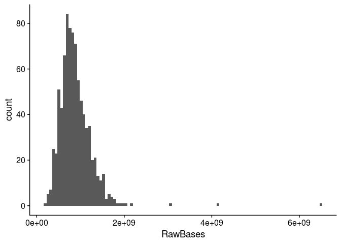

Simulation workflow for neutral simulation with uneven input across individuals
================

-   [Neutral simulation with uneven input across individuals](#neutral-simulation-with-uneven-input-across-individuals)
    -   [Get the distribution of sequencing output across individuals from some of our project](#get-the-distribution-of-sequencing-output-across-individuals-from-some-of-our-project)
        -   [Greenland cod](#greenland-cod)
        -   [smallmouth bass](#smallmouth-bass)
        -   [silverside](#silverside)
    -   [Get a matrix of ways to subsample](#get-a-matrix-of-ways-to-subsample)
    -   [Merge, sort, and subsample bam files](#merge-sort-and-subsample-bam-files)
    -   [Run the shell script for merging, sorting, and subsampling](#run-the-shell-script-for-merging-sorting-and-subsampling)
    -   [Make bam lists](#make-bam-lists)
    -   [Copy ancestral fasta file from `neutral_sim`](#copy-ancestral-fasta-file-from-neutral_sim)
    -   [Get shell script for SNP calling](#get-shell-script-for-snp-calling)
    -   [Run the shell script for SNP calling](#run-the-shell-script-for-snp-calling)

``` r
library(tidyverse)
library(cowplot)
library(readxl)
library(truncnorm)
```

Neutral simulation with uneven input across individuals
=======================================================

Get the distribution of sequencing output across individuals from some of our project
-------------------------------------------------------------------------------------

Here, we use three projects in which we pooled sample by molarity to get a sense of the variance in sequencing output across individuals. Let's assume that there is no variance across individuals in adapter content, mapping rate, and duplication rate, and only account for the variance in raw sequencing output.

### Greenland cod

``` r
read_count <- read_tsv("/workdir/cod/greenland-cod/sample_lists/count_merged.tsv") %>%
  filter(str_detect(batch, "&", T)) %>%
  select(raw_bases)
summary(read_count$raw_bases)
```

    ##      Min.   1st Qu.    Median      Mean   3rd Qu.      Max. 
    ## 3.823e+05 4.522e+08 7.776e+08 8.971e+08 1.238e+09 5.152e+09

``` r
sd(read_count$raw_bases)/mean(read_count$raw_bases)
```

    ## [1] 0.6761015

``` r
ggplot(read_count, aes(x=raw_bases)) +
  geom_histogram(bins=100) +
  theme_cowplot()
```


### smallmouth bass

``` r
read_count <- read_tsv("/workdir/smallmouth//sample_lists/fastq_count_lane_1_nextera.tsv") %>%
  select(raw_bases)
summary(read_count$raw_bases)
```

    ##      Min.   1st Qu.    Median      Mean   3rd Qu.      Max. 
    ## 1.654e+08 2.921e+08 4.035e+08 4.867e+08 5.889e+08 2.025e+09

``` r
sd(read_count$raw_bases)/mean(read_count$raw_bases)
```

    ## [1] 0.6098886

``` r
ggplot(read_count, aes(x=raw_bases)) +
  geom_histogram(bins=100) +
  theme_cowplot()
```


### silverside

``` r
read_count <- read_excel("../misc/QC_Stats_By_Library_Therkildsen_and_Palumbi.xlsx", sheet = 2) %>%
  select(Sample_ID, RunLane, RawBases) %>%
  filter(str_detect(RunLane, "ReSeq", T), str_detect(RunLane, "Nextera1", T)) %>%
  group_by(Sample_ID) %>% 
  filter(n()==1) %>%
  ungroup()
summary(read_count$RawBases)
```

    ##      Min.   1st Qu.    Median      Mean   3rd Qu.      Max. 
    ## 1.767e+08 6.598e+08 8.225e+08 8.811e+08 1.051e+09 6.479e+09

``` r
sd(read_count$RawBases)/mean(read_count$RawBases)
```

    ## [1] 0.4393949

``` r
ggplot(read_count, aes(x=RawBases)) +
  geom_histogram(bins=100) +
  theme_cowplot()
```



Get a matrix of ways to subsample
---------------------------------

It seems that in the best case scenario, the distribution of raw sequencing output follows a normal distribution with a standard deviation ~40% of its mean.

We will therefore use a truncated normal distribution with mean of 1, standard deviation of 0.4, and a fixed sum, to generate the coverage of each individual.

``` r
## define the funciton to generate truncated normal distribution with fixed sum
rtruncnorm_fixed_sum <- function(n, a, b, mean, sd) {
  vec <- rtruncnorm(n, a, b, mean, sd)
  vec/sum(vec)*mean*n
}
## generate individual coverages and write these in tsv format
for (sample_size in c(5, 10, 20, 40, 80, 160)) {
  set.seed(1)
  coverage <- rtruncnorm_fixed_sum(sample_size, 0, 2, 1, 0.4)
  coverage_matrix <- tibble(coverage_0.25=coverage/4, coverage_0.5=coverage/2, coverage_1=coverage, coverage_2=coverage*2, coverage_4=coverage*4, coverage_8=coverage*8)
  write_tsv(coverage_matrix, paste0("../neutral_sim_uneven_input/rep_1/misc/coverage_matrix_", sample_size, ".tsv"), col_names = F)
}
```

Merge, sort, and subsample bam files
------------------------------------

``` r
shell_script <-"#!/bin/bash
REP_ID=$1
IN_DIR='/workdir/lcwgs-simulation/neutral_sim/rep_'$REP_ID'/'
OUT_DIR='/workdir/lcwgs-simulation/neutral_sim_uneven_input/rep_'$REP_ID'/'
N_CORE_MAX=28

## subsample
COUNT=0
for i in {5,10,20,40,80,160}; do
  for k in $(seq 1 $i); do
    ROW_INDEX=$k
    COL_INDEX=0
    for j in {0.25,0.5,1,2,4,8}; do
      COL_INDEX=$(( COL_INDEX + 1 ))
      COVERAGE=`cat $OUT_DIR'misc/coverage_matrix_'$i'.tsv' | head -n $ROW_INDEX | tail -n 1 | cut -f $COL_INDEX`
      echo $COVERAGE
      samtools view \\
      -s `awk -v j=$COVERAGE 'BEGIN { print j / 20 }'` \\
      -b $IN_DIR'bam/sample_'$k'_sorted.bam' \\
      > $OUT_DIR'bam/sample_'$k'_sorted_'$i'_'$j'x.bam' &
      COUNT=$(( COUNT + 1 ))
      if [ $COUNT == $N_CORE_MAX ]; then
        wait
        COUNT=0
      fi
    done
  done
done"
write_lines(shell_script, "../shell_scripts/subsample_neutral_sim_uneven_input.sh")
```

Run the shell script for merging, sorting, and subsampling
----------------------------------------------------------

``` bash
for k in 1; do
  nohup bash /workdir/lcwgs-simulation/shell_scripts/subsample_neutral_sim_uneven_input.sh $k > '/workdir/lcwgs-simulation/nohups/subsample_neutral_sim_uneven_input_'$k'.nohup' &
done
```

Make bam lists
--------------

``` r
for (coverage in c(0.25,0.5,1,2,4,8)){
  for (sample_size in c(5,10,20,40,80,160)){
    for (i in 1:sample_size){
      if (i==1){
        write_lines(paste0("/workdir/lcwgs-simulation/neutral_sim_uneven_input/rep_1/bam/sample_", i, "_sorted_", sample_size, "_", coverage, "x.bam"), paste0("../neutral_sim_uneven_input/rep_1/sample_lists/bam_list_", sample_size, "_", coverage, "x.txt"))
      } else {
        write_lines(paste0("/workdir/lcwgs-simulation/neutral_sim_uneven_input/rep_1/bam/sample_", i, "_sorted_", sample_size, "_", coverage, "x.bam"), paste0("../neutral_sim_uneven_input/rep_1/sample_lists/bam_list_", sample_size, "_", coverage, "x.txt"), append = T)
      }
    }
  }
}
```

Copy ancestral fasta file from `neutral_sim`
--------------------------------------------

``` bash
cp /workdir/lcwgs-simulation/neutral_sim/rep_1/slim/* /workdir/lcwgs-simulation/neutral_sim_uneven_input/rep_1/slim/
samtools faidx /workdir/lcwgs-simulation/neutral_sim_uneven_input/rep_1/slim/ancestral.fasta
```

Get shell script for SNP calling
--------------------------------

``` r
## Note that I used -doMajorMinor 5, using the ancestral sequence to determine major and minor alleles
shell_script <-"#!/bin/bash
BASE_DIR=${1:-/workdir/lcwgs-simulation/neutral_sim/rep_1/}
N_CORE_MAX=28

## SNP calling
COUNT=0
for COVERAGE in {0.25,0.5,1,2,4,8}; do
  for SAMPLE_SIZE in {5,10,20,40,80,160}; do
    /workdir/programs/angsd0.931/angsd/angsd \\
    -b $BASE_DIR'sample_lists/bam_list_'$SAMPLE_SIZE'_'$COVERAGE'x.txt' \\
    -anc $BASE_DIR'slim/ancestral.fasta' \\
    -out $BASE_DIR'angsd/bam_list_'$SAMPLE_SIZE'_'$COVERAGE'x' \\
    -GL 1 -doGlf 2 -doMaf 1 -doMajorMinor 5 \\
    -doCounts 1 -doDepth 1 -dumpCounts 3 \\
    -P 1 -SNP_pval 1e-6 -rmTriallelic 1e-6 \\
    -setMinDepth 2 -minInd 1 -minMaf 0.0005 -minQ 20 &
    COUNT=$(( COUNT + 1 ))
    if [ $COUNT == $N_CORE_MAX ]; then
      wait
      COUNT=0
    fi
  done
done"
write_lines(shell_script, "../shell_scripts/snp_calling_neutral_sim.sh")
```

Run the shell script for SNP calling
------------------------------------

``` bash
nohup bash /workdir/lcwgs-simulation/shell_scripts/snp_calling_neutral_sim.sh \
/workdir/lcwgs-simulation/neutral_sim_uneven_input/rep_1/ \
> '/workdir/lcwgs-simulation/nohups/snp_calling_neutral_sim_uneven_input_1.nohup' &
```

It turns out that popoolation2 only does simple allele count to estimate allele frequency, so we will not use it for the simulation of pool-seq and wills simply use the allele counts outputted by ANGSD.
