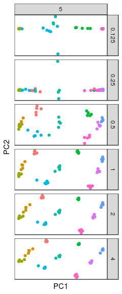
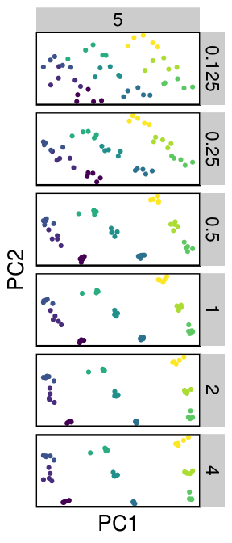

Simulation workflow for two dimensional spatial populations with a
longer chromosome and associated PCA results
================

  - [Two dimensional spatial
    populations](#two-dimensional-spatial-populations)
      - [Create a shell script to run SLiM with
        nohup](#create-a-shell-script-to-run-slim-with-nohup)
      - [Run the shell script for SLiM simulation on
        server](#run-the-shell-script-for-slim-simulation-on-server)
      - [Create a shell script to run ART with
        nohup](#create-a-shell-script-to-run-art-with-nohup)
      - [Run the shell script for ART simulation on
        server](#run-the-shell-script-for-art-simulation-on-server)
      - [Merge, sort, and subsample bam
        files](#merge-sort-and-subsample-bam-files)
      - [Run the shell script for merging, sorting, and
        subsampling](#run-the-shell-script-for-merging-sorting-and-subsampling)
      - [Make bam lists](#make-bam-lists)
      - [Index the ancestral fasta
        file](#index-the-ancestral-fasta-file)
      - [Get shell script for SNP
        calling](#get-shell-script-for-snp-calling)
      - [Run the shell script for SNP
        calling](#run-the-shell-script-for-snp-calling)
      - [Get shell script for writing SNP
        lists](#get-shell-script-for-writing-snp-lists)
      - [Run shell script to get SNP
        list](#run-shell-script-to-get-snp-list)
      - [Get shell script for PCA](#get-shell-script-for-pca)
      - [Run the shell script for PCA](#run-the-shell-script-for-pca)
      - [PCA with PCAngsd](#pca-with-pcangsd)
          - [Generate PCA tables](#generate-pca-tables)
          - [Plot PCA](#plot-pca)
      - [PCA with covMat](#pca-with-covmat)
          - [Plot PCA](#plot-pca-1)

``` r
library(tidyverse)
library(cowplot)
library(knitr)
library(RcppCNPy)
library(scales)
library(ggrepel)
library(MASS)
```

# Two dimensional spatial populations

## Create a shell script to run SLiM with nohup

``` r
shell_script <- "#!/bin/bash
REP_ID=$1
# Create output directory
if [ ! -d /workdir/lcwgs-simulation/spatial_pop_sim_longer_chr ]; then
  mkdir /workdir/lcwgs-simulation/spatial_pop_sim_longer_chr
fi
if [ ! -d /workdir/lcwgs-simulation/spatial_pop_sim_longer_chr/rep_$REP_ID ]; then
  mkdir /workdir/lcwgs-simulation/spatial_pop_sim_longer_chr/rep_$REP_ID
  cd /workdir/lcwgs-simulation/spatial_pop_sim_longer_chr/rep_$REP_ID
  mkdir angsd
  mkdir bam
  mkdir fasta
  mkdir fastq
  mkdir sample_lists
  mkdir slim
fi
# Run SLiM 
/workdir/programs/SLiM_build/slim \\
  -d REP_ID=$REP_ID  \\
  -d MUTATION_RATE=20e-8 \\
  -d REC_RATE=50e-8 \\
  -d CHR_LENGTH=300000000 \\
  -d META_POP_SIDE=3 \\
  -d POP_SIZE=500 \\
  -d MIGRATION_RATE=0.002 \\
  -d SAMPLE_SIZE=5 \\
  -d \"OUT_PATH='/workdir/lcwgs-simulation/spatial_pop_sim_longer_chr/'\" \\
  /workdir/lcwgs-simulation/slim_scripts/spatial_pop_sim.slim"
write_lines(shell_script, "../shell_scripts/spatial_pop_sim_longer_chr.sh")
```

## Run the shell script for SLiM simulation on server

``` bash
for k in 1; do
  nohup bash /workdir/lcwgs-simulation/shell_scripts/spatial_pop_sim_longer_chr.sh $k > '/workdir/lcwgs-simulation/nohups/spatial_pop_sim_longer_chr_'$k'.nohup' &
done
```

## Create a shell script to run ART with nohup

``` r
shell_script <-"#!/bin/bash
REP_ID=$1
OUT_DIR_BASE=$2
OUT_DIR=$OUT_DIR_BASE'rep_'$REP_ID'/'
N_CORE_MAX=18
## Generate sam files
COUNT=0
for i in {1..5}; do
  for j in {1..9}; do
    for k in {1..2}; do
      /workdir/programs/art_bin_MountRainier/art_illumina \\
      -ss HS25 \\
      -sam \\
      -i $OUT_DIR'fasta/p'$j'_sample'$i'_genome'$k'.fasta' \\
      -p \\
      -na \\
      -l 150 \\
      -f 10 \\
      -m 500 \\
      -s 75 \\
      -rs $(($REP_ID*10000+$i)) \\
      -o $OUT_DIR'bam/p'$j'_sample'$i'_genome'$k &
      COUNT=$(( COUNT + 1 ))
      if [ $COUNT == $N_CORE_MAX ]; then
        wait
        COUNT=0
      fi
    done
  done
done
wait
## Generate bam files
COUNT=0
for i in {1..5}; do
  for j in {1..9}; do
    for k in {1..2}; do
      samtools view -bS -F 4 $OUT_DIR'bam/p'$j'_sample'$i'_genome'$k'.sam' \\
      > $OUT_DIR'bam/p'$j'_sample'$i'_genome'$k'.bam' &
      COUNT=$(( COUNT + 1 ))
      if [ $COUNT == $N_CORE_MAX ]; then
        wait
        COUNT=0
      fi
    done
  done
done
wait
## Sort bam files
for i in {1..5}; do
  for j in {1..9}; do
    for k in {1..2}; do
      rm $OUT_DIR'bam/p'$j'_sample'$i'_genome'$k'.sam'
      mv $OUT_DIR'bam/p'$j'_sample'$i'_genome'$k'1.fq' $OUT_DIR'fastq/'
      mv $OUT_DIR'bam/p'$j'_sample'$i'_genome'$k'2.fq' $OUT_DIR'fastq/'
    done
  done
done"
write_lines(shell_script, "../shell_scripts/art_spatial_pop_sim_longer_chr.sh")
```

## Run the shell script for ART simulation on server

``` bash
for k in 1; do
  nohup bash /workdir/lcwgs-simulation/shell_scripts/art_spatial_pop_sim_longer_chr.sh $k '/workdir/lcwgs-simulation/spatial_pop_sim_longer_chr/' > '/workdir/lcwgs-simulation/nohups/art_spatial_pop_sim_longer_chr_'$k'.nohup' &
done
```

## Merge, sort, and subsample bam files

``` r
shell_script <-"#!/bin/bash
REP_ID=$1
OUT_DIR_BASE=$2
OUT_DIR=$OUT_DIR_BASE'rep_'$REP_ID'/'
N_CORE_MAX=42
## merge
COUNT=0
for k in {1..5}; do
  for i in {1..9}; do
    samtools merge $OUT_DIR'bam/p'$i'_sample'$k'.bam' \\
    $OUT_DIR'bam/p'$i'_sample'$k'_genome1.bam' \\
    $OUT_DIR'bam/p'$i'_sample'$k'_genome2.bam' &
    COUNT=$(( COUNT + 1 ))
    if [ $COUNT == $N_CORE_MAX ]; then
      wait
      COUNT=0
    fi
  done
done
wait
## sort
COUNT=0
for k in {1..5}; do
  for i in {1..9}; do
    samtools sort -o $OUT_DIR'bam/p'$i'_sample'$k'_sorted.bam' $OUT_DIR'bam/p'$i'_sample'$k'.bam' &
    COUNT=$(( COUNT + 1 ))
    if [ $COUNT == $N_CORE_MAX ]; then
      wait
      COUNT=0
    fi
  done
done
wait
## subsample
COUNT=0
for j in {0.125,0.25,0.5,1,2,4}; do
  for k in {1..5}; do
    for i in {1..9}; do
      samtools view \\
      -s `awk -v j=$j 'BEGIN { print j / 20 }'` \\
      -b $OUT_DIR'bam/p'$i'_sample'$k'_sorted.bam' \\
      > $OUT_DIR'bam/p'$i'_sample'$k'_sorted_'$j'x.bam' &
      COUNT=$(( COUNT + 1 ))
      if [ $COUNT == $N_CORE_MAX ]; then
       wait
       COUNT=0
      fi
    done
  done
done
wait
## delete intermediate files
for k in {1..5}; do
  for i in {1..9}; do
    #rm $OUT_DIR'bam/p'$i'_sample'$k'_genome1.bam' 
    #rm $OUT_DIR'bam/p'$i'_sample'$k'_genome2.bam' 
    rm $OUT_DIR'bam/p'$i'_sample'$k'.bam'
  done
done"
write_lines(shell_script, "../shell_scripts/merge_sort_subsample_spatial_pop_sim_longer_chr.sh")
```

## Run the shell script for merging, sorting, and subsampling

``` bash
for k in 1; do
  nohup bash /workdir/lcwgs-simulation/shell_scripts/merge_sort_subsample_spatial_pop_sim_longer_chr.sh $k '/workdir/lcwgs-simulation/spatial_pop_sim_longer_chr/' > '/workdir/lcwgs-simulation/nohups/merge_sort_subsample_spatial_pop_sim_longer_chr_'$k'.nohup' &
done
```

## Make bam lists

``` r
make_bam_lists <- function(basedir){
  i=1
  for (population in 1:9) {
    for (coverage in c(0.125,0.25,0.5,1,2,4)){
      for (sample_size in c(5)){
        for (i in 1:sample_size){
          if (i==1){
            write_lines(paste0(basedir, "bam/p", population, "_sample", i, "_sorted_", coverage, "x.bam"), paste0(basedir, "sample_lists/bam_list_p", population, "_", sample_size, "_", coverage, "x.txt"))
          } else {
            write_lines(paste0(basedir, "bam/p", population, "_sample", i, "_sorted_", coverage, "x.bam"), paste0(basedir, "sample_lists/bam_list_p", population, "_", sample_size, "_", coverage, "x.txt"), append = T)
          }
          if (i==1 & population==1){
            write_lines(paste0(basedir, "bam/p", population, "_sample", i, "_sorted_", coverage, "x.bam"), paste0(basedir, "sample_lists/bam_list_", sample_size, "_", coverage, "x.txt"))
          } else {
            write_lines(paste0(basedir, "bam/p", population, "_sample", i, "_sorted_", coverage, "x.bam"), paste0(basedir, "sample_lists/bam_list_", sample_size, "_", coverage, "x.txt"), append = T)
          }
        }
      }
    }
  }
}
make_bam_lists("/workdir/lcwgs-simulation/spatial_pop_sim_longer_chr/rep_1/")
```

## Index the ancestral fasta file

``` bash
for REP_ID in 1; do
  OUT_DIR='/workdir/lcwgs-simulation/spatial_pop_sim_longer_chr/rep_'$REP_ID'/'
  samtools faidx $OUT_DIR'slim/ancestral.fasta'
done
```

## Get shell script for SNP calling

After some experimentation, it turns out that a MAF filter is very
important to have.

``` r
## Note that I used -doMajorMinor 5, using the ancestral sequence to determine major and minor alleles
shell_script <-"#!/bin/bash
REP_ID=$1
OUT_DIR_BASE=$2
BASE_DIR=$OUT_DIR_BASE'rep_'$REP_ID'/'
N_JOB_MAX=8
COUNT=0
for SAMPLE_SIZE in 5; do
  for COVERAGE in {0.125,0.25,0.5,1,2,4}; do
    ## SNP calling
    /workdir/programs/angsd0.931/angsd/angsd \\
    -b $BASE_DIR'sample_lists/bam_list_'$SAMPLE_SIZE'_'$COVERAGE'x.txt' \\
    -anc $BASE_DIR'slim/ancestral.fasta' \\
    -out $BASE_DIR'angsd/bam_list_'$SAMPLE_SIZE'_'$COVERAGE'x' \\
    -GL 1 -doGlf 2 -doMaf 1 -doMajorMinor 5 \\
    -doCounts 1 -doDepth 1 -dumpCounts 1 \\
    -doIBS 2 -makematrix 1 -doCov 1 \\
    -P 5 -SNP_pval 1e-6 -rmTriallelic 1e-6 \\
    -setMinDepth 2 -minInd 1 -minMaf 0.05 -minQ 20 &
    ## Submit two jobs at a time
    COUNT=$(( COUNT + 1 ))
    if [ $COUNT == $N_JOB_MAX ]; then
     wait
     COUNT=0
    fi
  done
done"
write_lines(shell_script, "../shell_scripts/snp_calling_spatial_pop_sim_longer_chr.sh")
```

## Run the shell script for SNP calling

``` bash
nohup bash /workdir/lcwgs-simulation/shell_scripts/snp_calling_spatial_pop_sim_longer_chr.sh 1 '/workdir/lcwgs-simulation/spatial_pop_sim_longer_chr/' \
> /workdir/lcwgs-simulation/nohups/snp_calling_spatial_pop_sim_longer_chr.nohup &
```

## Get shell script for writing SNP lists

``` r
shell_script <-"#!/bin/bash
REP_ID=$1
OUT_DIR_BASE=$2
BASE_DIR=$OUT_DIR_BASE'rep_'$REP_ID'/'
N_JOB_MAX=42
COUNT=0
## Create SNP lists
for SAMPLE_SIZE in 5; do
  for COVERAGE in {0.125,0.25,0.5,1,2,4}; do
    gunzip -c $BASE_DIR'angsd/bam_list_'$SAMPLE_SIZE'_'$COVERAGE'x.mafs.gz' | cut -f 1,2,3,4 | tail -n +2 > \\
    $BASE_DIR'angsd/global_snp_list_bam_list_'$SAMPLE_SIZE'_'$COVERAGE'x.txt' &
    ## Submit a certain number of jobs at a time
    COUNT=$(( COUNT + 1 ))
    if [ $COUNT == $N_JOB_MAX ]; then
     wait
     COUNT=0
    fi
  done
done
wait
COUNT=0
## Index the SNP lists
for SAMPLE_SIZE in 5; do
  for COVERAGE in {0.125,0.25,0.5,1,2,4}; do
    /workdir/programs/angsd0.931/angsd/angsd sites index \\
    $BASE_DIR'angsd/global_snp_list_bam_list_'$SAMPLE_SIZE'_'$COVERAGE'x.txt' &
    ## Submit a certain number of jobs at a time
    COUNT=$(( COUNT + 1 ))
    if [ $COUNT == $N_JOB_MAX ]; then
     wait
     COUNT=0
    fi
  done
done"
write_lines(shell_script, "../shell_scripts/get_snp_list_spatial_pop_sim_longer_chr.sh")
```

## Run shell script to get SNP list

``` bash
bash /workdir/lcwgs-simulation/shell_scripts/get_snp_list_spatial_pop_sim_longer_chr.sh 1 '/workdir/lcwgs-simulation/spatial_pop_sim_longer_chr/'
```

## Get shell script for PCA

``` r
shell_script <-"#!/bin/bash
REP_ID=$1
OUT_DIR_BASE=$2
BASE_DIR=$OUT_DIR_BASE'rep_'$REP_ID'/'
for SAMPLE_SIZE in 5; do
  for COVERAGE in {0.125,0.25,0.5,1,2,4}; do
      ## Run PCAngsd
      python2 /workdir/programs/pcangsd/pcangsd.py \\
      -beagle $BASE_DIR'angsd/bam_list_'$SAMPLE_SIZE'_'$COVERAGE'x.beagle.gz' \\
      -minMaf 0.05 \\
      -threads 16 \\
      -iter 200 \\
      -maf_iter 200 \\
      -o $BASE_DIR'angsd/pcagnsd_bam_list_'$SAMPLE_SIZE'_'$COVERAGE'x'
  done
done"
write_lines(shell_script, "../shell_scripts/run_pcangd_spatial_pop_sim_longer_chr.sh")
```

## Run the shell script for PCA

``` bash
nohup bash /workdir/lcwgs-simulation/shell_scripts/run_pcangd_spatial_pop_sim_longer_chr.sh 1 '/workdir/lcwgs-simulation/spatial_pop_sim_longer_chr/' \
> /workdir/lcwgs-simulation/nohups/run_pcangd_spatial_pop_sim_longer_chr.nohup &
```

## PCA with PCAngsd

### Generate PCA tables

``` r
i=1
for (coverage in c(0.125,0.25,0.5,1,2,4)){
  for (sample_size in 5){
    pop_label <- read_lines(paste0("../spatial_pop_sim_longer_chr/rep_1/sample_lists/bam_list_",sample_size,"_",coverage,"x.txt")) %>%
      str_extract('p[1-9]')
    ## Read covariance matrix
    cov_matrix <- npyLoad(paste0("../spatial_pop_sim_longer_chr/rep_1/angsd/pcagnsd_bam_list_",sample_size,"_",coverage,"x.cov.npy")) %>%
      as.matrix()
    ## Perform eigen decomposition
    e <- eigen(cov_matrix)
    e_value<-e$values
    x_variance<-e_value[1]/sum(e_value)*100
    y_variance<-e_value[2]/sum(e_value)*100
    e_vector <- as.data.frame(e$vectors)[,1:5]
    pca_table <- bind_cols(pop_label=pop_label, e_vector) %>%
      transmute(population=pop_label, PC1=rescale(V1, c(-1, 1)), PC2=rescale(V2, c(-1, 1)), PC3=rescale(V3, c(-1, 1)), PC4=rescale(V4, c(-1, 1)), PC5=rescale(V5, c(-1, 1)), coverage=coverage, sample_size=sample_size)
    ## Bind PCA tables and DAPC tables for all sample size and coverage combinations
    if (i==1){
      pca_table_final <- pca_table
    } else {
      pca_table_final <- bind_rows(pca_table_final,pca_table)
    }
    i=i+1
  }
}
```

### Plot PCA

#### PC1 vs. PC2

``` r
ggplot(pca_table_final,aes(x=PC1, y=PC2, color=population)) +
  geom_point() +
  facet_grid(coverage~sample_size, scales="free") +
  theme_bw() +
  theme(panel.grid = element_blank(),
        axis.text = element_blank(),
        axis.ticks = element_blank(),
        legend.position  = "none")
```

<!-- -->

## PCA with covMat

``` r
i=1
for (coverage in c(0.125,0.25,0.5,1,2,4)){
  for (sample_size in c(5)){
    pop_label <- read_lines(paste0("../spatial_pop_sim_longer_chr/rep_1/sample_lists/bam_list_",sample_size,"_",coverage,"x.txt")) %>%
      str_extract('p[1-9]')
    ## Read covariance matrix
    cov_matrix <- read_tsv(paste0("../spatial_pop_sim_longer_chr/rep_1/angsd/bam_list_",sample_size,"_",coverage,"x.covMat"), col_names = F) %>%
      as.matrix() %>%
      .[,-(sample_size*9+1)]
    cov_matrix[is.na(cov_matrix)]<- median(cov_matrix, na.rm = T)
    ## Perform eigen decomposition
    e <- eigen(cov_matrix)
    e_value<-e$values
    x_variance<-e_value[1]/sum(e_value)*100
    y_variance<-e_value[2]/sum(e_value)*100
    e_vector <- as.data.frame(e$vectors)[,1:5]
    pca_table <- bind_cols(pop_label=pop_label, e_vector) %>%
      transmute(population=pop_label, PC1=rescale(V1, c(-1, 1)), PC2=rescale(V2, c(-1, 1)), PC3=rescale(V3, c(-1, 1)), PC4=rescale(V3, c(-1, 1)), PC5=rescale(V5, c(-1, 1)), coverage=coverage, sample_size=sample_size)
    ## Bind PCA tables and DAPC tables for all sample size and coverage combinations
    if (i==1){
      pca_table_final <- pca_table
    } else {
      pca_table_final <- bind_rows(pca_table_final,pca_table)
    }
    i=i+1
  }
}
```

Note: there are more NAs in these covariance matrices compared to the
covariance matrices generated from PCAngsd.

### Plot PCA

#### PC1 vs. PC2

``` r
pca_table_final_summary <- group_by(pca_table_final, population, coverage, sample_size) %>%
  summarise(pc1_mean = mean(PC1), pc2_mean = mean(PC2)) %>%
  ungroup() %>%
  pivot_wider(names_from = population, values_from = c(pc1_mean, pc2_mean)) %>%
  transmute(coverage = coverage, sample_size = sample_size, invert_pc1 = pc1_mean_p1 > pc1_mean_p9, invert_pc2 = pc2_mean_p3 < pc2_mean_p7)
## Flip PC1 and PC2 axes when needed 
pca_table_final_flipped <- left_join(pca_table_final, pca_table_final_summary, 
                                     by=c("coverage", "sample_size")) %>%
  mutate(PC1 = ifelse(invert_pc1==TRUE, -PC1, PC1),
         PC2 = ifelse(invert_pc2==TRUE, -PC2, PC2))
ggplot(pca_table_final_flipped,aes(x=PC1, y=PC2, color=population)) +
  geom_point() +
  scale_color_viridis_d() +
  facet_grid(coverage~sample_size, scales="free") +
  theme_cowplot() +
  theme(text = element_text(size=20),
        panel.grid = element_blank(),
        axis.text = element_blank(),
        axis.ticks = element_blank(),
        axis.line = element_blank(),
        panel.border = element_rect(colour = "black", fill=NA, size=1),
        legend.position="none")
```

<!-- -->
